# MITRIXO — MASTER COMPANY PORTFOLIO & CAPABILITIES LEDGER
> **Document Status:** Launch-Ready (Instagram Launch & Enterprise Pitch)
> **Author:** MITRIXO Engineering & Creative Studio
> **Date:** June 2026

---

## 1. EXECUTIVE BRAND POSITIONING
**MITRIXO** is an elite, high-fidelity **Enterprise Software House, SaaS Product Studio, & Creative Lab**. We design and engineer premium digital infrastructure, custom IoT/hardware integrations, advanced AI-native architectures, and highly immersive spatial frontends.

By incorporating the visual design mastery of **Mitry Visuals**, we bridge the gap between extreme engineering performance (C++, C#, MQTT, low-latency audio) and premium interactive design (Three.js, React Three Fiber, custom shader animations, glassmorphism UI).

### Brand Pitch Matrix
* **What We Build:** Bespoke Enterprise CRMs, real-time IoT control panels, AI-powered automation pipelines, audio processing utilities, interactive 3D visualizations, and custom CMS structures.
* **Our Philosophy:** "Engineering without compromises; aesthetics that captivate."
* **Primary Target Verticals:** Aviation, Fitness & Luxury Retail, Industrial B2B Showrooms, Facility Management, and Travel Tech.

---

## 2. THE MITRIXO TECH STACK MATRIX
Here is a consolidated overview of our production capabilities, backed by active, verified codebase releases.

| Layer | Technologies & Tools |
| :--- | :--- |
| **Languages** | TypeScript, JavaScript, Python, C++, C#, HTML5, CSS4 |
| **Frontend Frameworks** | Next.js 15/16 (App Router), React 18/19, Vite 7, Dear ImGui, WPF |
| **Styling & Motion** | CSS4, TailwindCSS v4, Framer Motion, Canvas API, Three.js, React Three Fiber, WebGL |
| **Backend & Database** | Supabase, Firebase (Firestore, Realtime DB, Auth, Storage), Deno, Node.js, Express, Nginx |
| **IoT & Low-Level Protocols** | MQTT, SSH Tunneling, Home Assistant Integration, Windows Multimedia WinMM APIs, Serial Relays |
| **AI & LLM Integrations** | Gemini API (`gemini-3.5-flash`, `@google/genai`), Whisper Speech-to-Text, Model Context Protocol (MCP) |
| **Third-Party APIs** | Paymob (Credit/Instapay checkout), Stripe (Live/Sandbox), Resend, Zoho Mail, Formspree |
| **OS & Scripting** | PowerShell (UAC elevation scripting), Bash, Python-Docx / Python-PPTX XML parsers |

---

## 3. CORE COMMERCIAL OFFERINGS (What We Can Deliver)
Based on our verified portfolio, MITRIXO is fully capable of selling, designing, and deploying the following solutions:

1. **Bespoke Enterprise CRMs & Portals**
   * High-security, role-based CRM hubs with client-side privacy gates, custom ID generation counters, transactional payment records, contract PDF auto-fill, and webhook-driven leads ingestion pipelines.
2. **IoT-Enabled Middleware & Physical Controls**
   * Real-time hardware integration (e.g. MQTT smart locker control panels), zero-login PWAs, auto-pulsing relay controls to guard physical hardware, and automated checkout releases.
3. **High-End 3D Visual Storefronts & Interactive Media**
   * Luxury product ateliers with 3D product visualizers, custom layout engines, interactive audio oscillators, and scroll-linked canvas animations.
4. **AI-Native Software & Pipelines**
   * Conversational roleplay agents, meteorological decoders (METAR/TAF to JSON), Model Context Protocol (MCP) servers for local health data sharing, and custom LLM-based text rewriting/anti-detection pipelines.
5. **System Optimization & Automation Tools**
   * Deep Windows registry cleaners, direct audio-driver delay calibrations (ring buffers, crossovers), and document-to-presentation builders (.docx to .pptx conversions).

---

## 4. DETAILED PROJECT CATALOG (26 Audited Professional Projects)
Below is the complete, unabridged technical documentation of every professional system engineered by our studio.


================================================================================
### PROJECT: ALPHA-CALESTHENICS-NEW-WEBSITE
File Path Source: C:\Users\Mi5a\.gemini\config\skills\alpha-calesthenics-new-website\SKILL.md
================================================================================

# Alpha Calisthenics Website & Dashboard

## 1️⃣ Purpose & Scope
- **Purpose**: Alpha Calisthenics is a professional bodyweight fitness coaching platform. The system serves as a web hub and billing gateway for users to subscribe to premium calisthenics packages supervised directly by Coach Akram.
- **Core Features**:
  - **Multilingual Landing Page**: A custom-designed landing page offering bilingual options (English & Arabic) detailing training methodologies, FAQs, transformations gallery, and subscription options.
  - **Secure Authentication**: Integrated client-side Google Authentication using Firebase Auth.
  - **Personalized Athlete Dashboard**: Dynamic dashboard interface displaying program statuses, metrics, workout milestones, and access to download a free foundational PDF guide.
  - **Intensive Onboarding Flow**: A 3-step configuration wizard capturing biometric details (age, weight, height), calisthenics performance baselines (max push-ups, pull-ups, target goals), and video file form checks.
  - **Cloud Media Auditing**: Integrated file uploading of form-check videos (up to 500MB on server/200MB on client) through Express API endpoints directly to client-specific subfolders on Google Drive.
  - **Billing & Subscription Management**: Credit card payments handled via Paymob API integration, featuring secure transaction verification hooks and a developer sandbox mock-payment bypass.
  - **Coach's Mission Control**: A dedicated, protected admin console listing active clients, tracking deliverable completions, and assigning direct training app links, drive folders, and chat links.

## 2️⃣ Technology Stack & Dependencies
- **Core Languages**: TypeScript, HTML, CSS.
- **Frontend Stack & Libraries**:
  - **React 19**: Responsive client architecture.
  - **Vite & TypeScript**: Client builder and compilation typing checks.
  - **Tailwind CSS v4 & Motion**: Styled utility transitions and animations.
  - **React Router DOM (v7)**: Client-side URL paths and page states.
  - **Lucide React**: Vector layouts icons.
- **Backend Stack & Libraries**:
  - **Node.js & Express (v5)**: REST API services layer.
  - **Multer**: Multi-part video form parser.
  - **Google APIs Client Library (`googleapis`)**: Google Drive API interactions.
  - **Firebase Admin SDK**: Remote document reads/updates and custom admin token claims.
  - **Axios**: Network client for Paymob payment integrations.
- **Database & Storage Services**:
  - **Firebase Firestore**: Realtime document database.
  - **Firebase Authentication**: Third-party Google SSO.
  - **Google Drive Storage**: Archiving raw video submissions.

## 3️⃣ Project Structure & Key Files
### Key Source Directory Structures
- `/src`: Holds the Vite React application.
- `/server/src`: Express API backend services.
- `/server/scripts`: Offline administrative utilities.

### Source Files & Key Symbols Map
| File Path | Purpose / Description | Key Symbols (Classes, Functions, Constants) |
| --- | --- | --- |
| `src/App.tsx` | Front-end page router and initialization shell. | `App`, `AppContent` |
| `src/contexts/AuthContext.tsx` | Manages auth states, SSO actions, and Firestore profile synchronization. | `AuthProvider`, `useAuth`, `signInWithGoogle`, `logout` |
| `src/contexts/LanguageContext.tsx` | Localization control for translation strings and persistent preferences. | `LanguageProvider`, `useLanguage`, `t` |
| `src/components/Checkout.tsx` | Handshakes token state with the API to request checkout gateways. | `Checkout`, `handlePayment`, `handleMockPayment` |
| `src/components/Dashboard.tsx` | Athlete portal showcasing workouts, baseline metrics, and drive folders. | `Dashboard` |
| `src/components/Onboarding.tsx` | Multi-step biometric audit and video verification submission flow. | `Onboarding`, `handleSubmit` |
| `src/components/admin/AdminDashboard.tsx` | Lists subscribed clients and active program compilation metrics. | `AdminDashboard` |
| `src/components/admin/ClientProfile.tsx` | Profile review panel to assign custom routines, WhatsApp, and drive links. | `ClientProfile`, `handleSaveAdminData` |
| `src/components/admin/AdminRoute.tsx` | Route guard that checks claims to block non-admins. | `AdminRoute` |
| `server/src/server.ts` | Backend listener startup entry point. | `PORT` |
| `server/src/app.ts` | Sets up CORS policies, JSON parsers, and API route attachments. | `app`, `allowedOrigins` |
| `server/src/routes/payment.ts` | Hosts endpoint targets for payment handshakes, webhook updates, and mocks. | `verifyHmac` |
| `server/src/services/paymob.service.ts` | Direct client mapping of Paymob orders and token registration calls. | `PaymobService`, `PaymobBillingData` |
| `server/src/routes/assessment.ts` | API definition for upload limits and file filters. | `router` |
| `server/src/controllers/assessmentController.ts` | Manages server uploads, Drive folder creations, and deletes local temp cache. | `uploadAssessmentVideo` |
| `server/src/services/driveService.ts` | Direct Drive API interactions for folders and range-based streaming proxies. | `findOrCreateFolder`, `uploadVideoToDrive`, `streamVideoFromDrive` |
| `server/scripts/setAdminClaim.ts` | CLI helper script for setting custom token admin properties on Firebase Auth profiles. | `setAdmin` |
| `firestore.rules` | Security schema for read/write checks across collections. | `isAuthenticated`, `isOwner`, `isAdmin`, `isValidUser`, `isValidAssessment` |

## 4️⃣ Setup, Commands & Scripts
### Installation
1. **Frontend dependencies**:
   ```bash
   npm install
   ```
2. **Backend dependencies**:
   ```bash
   cd server
   npm install
   ```

### Running Locally
- Run client and server concurrently from the root folder:
  ```bash
  npm run dev
  ```
- Run client only (port 3000):
  ```bash
  npm run dev:client
  ```
- Run backend server only:
  ```bash
  npm run dev:server
  ```

### Build & Production Compile
- **Client Bundle**:
  ```bash
  npm run build
  ```
- **Server Compilation**:
  ```bash
  cd server
  npm run build
  ```

### Administrative Scripts
- Assign admin privileges to a user via email or UID:
  ```bash
  cd server
  npx ts-node scripts/setAdminClaim.ts <email-or-uid>
  ```

### Environmental Configuration
Configure variables in environment configuration files (`.env` in client/server directories) or hosting dashboards:

#### Frontend Configurations (`.env`)
- `VITE_BACKEND_URL`: Absolute API backend server URL (e.g. `http://localhost:4000` or Render URL).
- `VITE_API_URL`: Absolute API endpoint base.

#### Backend Configurations (`server/.env`)
- `PORT`: Server execution port (default `4000`).
- `NODE_ENV`: Process deployment environment (`development` / `production`).
- `FIREBASE_ADMIN_JSON`: Firebase service account credentials parsed as JSON (overrides local key file).
- `GOOGLE_APPLICATION_CREDENTIALS`: Local path to Google API JSON key (defaults to `./google-credentials.json`).
- `GOOGLE_DRIVE_ROOT_FOLDER_ID`: Parent directory folder ID where all athlete files are stored.
- `PAYMOB_API_KEY`: API Key for Paymob API authentication.
- `PAYMOB_INTEGRATION_ID`: Paymob card integration identifier.
- `PAYMOB_IFRAME_ID`: Paymob checkout iframe template ID.
- `PAYMOB_HMAC_SECRET`: HMAC Secret for validating payment status webhooks.
- `ALLOWED_ORIGIN`: Approved CORS client address.

## 5️⃣ Architecture & Key Workflows
### System Architecture Diagram
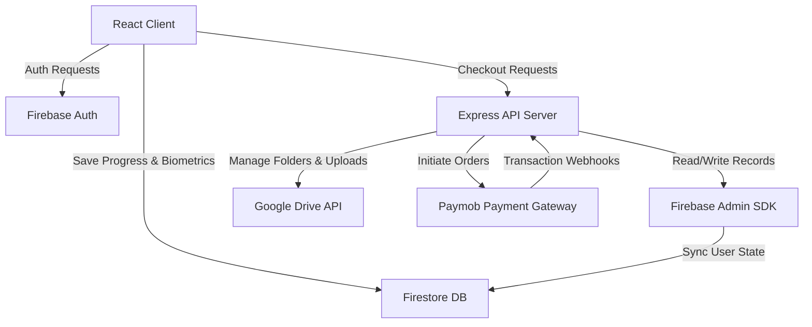

### Key Workflows
1. **Onboarding Form Check Video Flow**:
   - The user fills out biometrics and selects a local video file (validated by client to be <200MB, server <500MB).
   - React app sends file via POST request to `/api/assessment/upload`, attaching the user's Firebase token.
   - Express backend verifies token using Firebase Admin.
   - Server checks if the user has an existing `driveFolderId` in Firestore; if not, it calls Google Drive to create a folder (`Client - ${userId}`) and stores it.
   - The video is streamed to the user's Drive folder. The local temp file is purged.
   - Assessment metadata and the Drive link are saved in Firestore under the `assessments` collection.

2. **Secure Paymob Checkout Flow**:
   - User initiates checkout from `/checkout`.
   - Backend calls Paymob Auth, registers the order, and returns a Paymob iframe checkout URL.
   - Backend stores a `pendingPayment` payload under the user's Firestore document.
   - User is redirected to Paymob's Visa/Mastercard portal.
   - On completion, Paymob fires an HTTP webhook to `/api/payment/webhook`.
   - Server validates the HMAC signature, searches Firestore for `pendingPayment.orderId == order.id`, elevates the matched user's role to `paid_client`, and cleans up the pending record.

## 6️⃣ Limitations & Constraints
- **File Upload Limits**: Frontend limits uploads to ~200MB. The backend allows up to 500MB via Multer. Uploading very large files on slow connections can trigger HTTP timeouts.
- **Google Drive Rate Limits**: Uploads rely directly on standard service account limits. Heavy concurrency can lead to API throttling.
- **Layout Localization Constraints**: Text values toggle between English and Arabic, but the document direction (`dir`) is deliberately forced LTR to prevent layout breakage, meaning the alignment does not mirror LTR/RTL.
- **CORS Config**: CORS configuration restricts calls to specified origins (`localhost` for dev, Netlify URL for production). Ensure `ALLOWED_ORIGIN` matches target hosts.

================================================================================
### PROJECT: ATPLVECTOR
File Path Source: C:\Users\Mi5a\.gemini\config\skills\atplvector\SKILL.md
================================================================================

# ATPL Vector

## 1️⃣ Purpose & Scope
- **Overview**: ATPL Vector is an advanced, high-fidelity aviation theory preparation platform designed to help student pilots master the demanding EASA Airline Transport Pilot License (ATPL) and Private Pilot License (PPL) syllabus.
- **Problem Solved**: EASA ATPL examinations require memorizing and understanding thousands of complex learning objectives (LOs) across 14 subjects, which traditionally rely on dry textbooks. ATPL Vector solves this by providing interactive learning modules, 3D simulations, real-time calculators, practice quizzes, and an integrated custom AI tutor.
- **Target Audience**: Student pilots pursuing EASA or regional ATPL/CPL/PPL licenses, cadet pilots (specifically tailored modules for EgyptAir Cadet prep), flight instructors, and aviation enthusiasts.
- **Core Features**:
  - **Dynamic Course Tracks**: Dual-track configuration allowing users to toggle between PPL, ATPL, or BOTH study modes, reshaping dashboards and trackers.
  - **Syllabus Progress & Rating**: Interactive hierarchical syllabus viewer based on official learning objectives, allowing students to rate their mastery (1-5 stars) and calculate progress percentage.
  - **Custom AI Tutor**: Powered by Gemini 2.5 Flash (`@google/genai`), supporting live conversational ATC scenario roleplays (standard ICAO phraseology), automatic weather decoder (METAR/TAF to structured JSON), and instant query answers.
  - **Interactive Labs & Visualizers**: High-fidelity tools including:
    - *Aerofoil Geometry & Forces of Flight*: Interactive angle of attack, drag, lift coefficients.
    - *Hold Entry Visualizer*: Dynamic holding pattern selector (Direct, Teardrop, Parallel entries) based on heading.
    - *Altimeter & VSI Labs*: Interactive pressure/temperature simulation demonstrating instrument errors.
    - *MCDU/Cockpit Simulators*: Practical practice interfaces simulating actual flight deck displays.
    - *Cargo Loading & Load Sheets*: Visual center of gravity (CG) and MAC calculators for Mass & Balance (031).
  - **Drag-and-Drop Exam Planner**: Visual scheduler to plan exams, allocate subjects across sittings, and check plan viability (days remaining, target daily questions).
  - **Gamification Engine**: Experience points (XP), learning streaks, levels, and unlockable achievements based on study time and quiz performance.
  - **Admin Dashboard**: Comprehensive user moderation tool, bulk user activations/invitations, testimonials manager, and usage analytics.
  - **Access Security**: Advanced concurrency checks preventing sharing accounts by validating unique `current_device_id` per session using real-time Firestore snapshots.

## 2️⃣ Technology Stack & Dependencies
- **Core Languages**: TypeScript, HTML, CSS.
- **Frameworks & Core Libraries**:
  - **React 19**: Frontend UI rendering engine.
  - **Vite 6**: Fast frontend development server and bundler.
  - **Framer Motion 12**: Smooth UI transitions, animations, and modular slider movements.
  - **Recharts 3**: Interactive charts for Brayton cycle, payload-range diagrams, lift-drag curves, and study analytics.
  - **Lucide React 0.561**: Icon library.
- **Development Tools & Building**:
  - **Vite PWA Plugin**: Implements Progressive Web App functionalities, local service workers, and assets caching up to 10MB to accommodate heavy 3D elements offline.
  - **Capacitor CLI 5**: Provides cross-platform native wrapper configurations for iOS and Android deployment.
- **AI Integration**:
  - **Google GenAI SDK (`@google/genai` v1.33.0)**: Used for `gemini-2.5-flash` model invocation.
- **Database & Identity Providers**:
  - **Clerk Auth (`@clerk/clerk-react`)**: Primary Identity Provider (IdP) for sign-in/up.
  - **Firebase Client SDK (`firebase` v12.12.1)**: Authentication syncing + Google Firestore. Firestore is configured with offline local cache persistence (`persistentLocalCache` and `persistentMultipleTabManager` for multi-tab support).
  - **Local Storage**: Fallback for offline support and guests.

## 3️⃣ Project Structure & Key Files
The directory structure organizes components by ATPL subject code and contains database, routing, and context wrappers at the root.

| File Path | Purpose / Description | Key Symbols (Classes, Functions, Constants) |
| --- | --- | --- |
| `App.tsx` | The root component; handles Clerk/Firebase Auth sync, concurrent device prevention, study timer, and view routing. | `App`, `activeTimer`, `syncAuthWithFirebase`, `checkDeviceSession` |
| `index.tsx` | App bootstrapper wrapping the layout with ClerkProvider. | `PUBLISHABLE_KEY`, `root.render` |
| `types.ts` | Global interfaces, types, and route view definitions. | `View`, `User`, `QuizQuestion`, `CourseMode`, `LearningObjective` |
| `vite.config.ts` | Vite configuration including PWA configurations, aliases, Cairo build stamp, and vendor chunks separation. | `manualChunks`, `VitePWA`, `buildStamp` |
| `lib/firebase.ts` | Firebase initialization with root collection wrappers prefixing `atpl_` for safety. | `db`, `auth`, `collection`, `doc`, `getSiteUrl` |
| `services/gemini.ts` | Interacts with the Gemini model for weather decoding, quiz generation, and ATC simulations. | `generateQuizQuestion`, `generateRoleplayResponse`, `explainWeather` |
| `services/syllabusService.ts` | Utilities to parse, traverse, and flatten raw syllabus hierarchical trees. | `getUseSyllabusForSubject`, `getAllLOsForSubject`, `SyllabusNode` |
| `config/routes.ts` | Lazy-loaded routes mapping `View` enums to React components. | `routes` |
| `config/subjectRoutes.ts` | Configurations for ATPL subject titles, icons, and themes. | `SUBJECT_CONFIGS` |
| `context/CourseModeContext.tsx` | React Context for switching between ATPL, PPL, or BOTH modes. | `CourseModeProvider`, `useCourseMode` |
| `context/GamificationContext.tsx` | Manages XP, streaks, level calculation, and achievement updates. | `GamificationProvider`, `useGamification` |
| `aviation-mcp/src/index.ts` | Custom Model Context Protocol server (`easa-regulation-ai`) for regulatory document search and operational minima calculations. | `search_easa_regulations`, `calculate_operational_minima`, `server` |

## 4️⃣ Setup, Commands & Scripts
### Installation
Install the root dependencies:
```powershell
npm install
```
If building or working on the MCP server:
```powershell
cd aviation-mcp
npm install
```

### Running Locally
To launch the Vite development server locally (accessible on port 3000):
```powershell
npm run dev
```
To run the custom MCP server locally via stdio:
```powershell
cd aviation-mcp
npm run build
npm start
```

### Build & Deploy
To compile the static production assets (saved in `/dist`):
```powershell
npm run build
```
To build and sync native assets with Capacitor (for iOS/Android):
```powershell
npm run ionic:build
```
To preview the compiled build locally:
```powershell
npm run preview
```
To publish the application onto GitHub Pages:
```powershell
npm run deploy
```

### Environmental Configuration
Create a `.env` file in the root directory. Required parameters include:
- `VITE_FIREBASE_API_KEY`: API Key for Firebase Client SDK.
- `VITE_FIREBASE_AUTH_DOMAIN`: Auth domain for Firebase redirects.
- `VITE_FIREBASE_PROJECT_ID`: Target Firebase Project identifier.
- `VITE_FIREBASE_STORAGE_BUCKET`: Storage bucket URL for static files.
- `VITE_FIREBASE_MESSAGING_SENDER_ID`: Project sender ID.
- `VITE_FIREBASE_APP_ID`: Web app ID configuration.
- `VITE_CLERK_PUBLISHABLE_KEY`: Clerk authentication publishable key.
- `CLERK_SECRET_KEY`: Clerk backend auth key.
- `VITE_API_KEY`: API Key for Google Gemini API (`gemini-2.5-flash`).
- `VITE_SITE_URL`: Root site domain URL (e.g. `http://atplvector.com` or `localhost:3000`).

## 5️⃣ Architecture & Key Workflows
### High-Level Data Flow
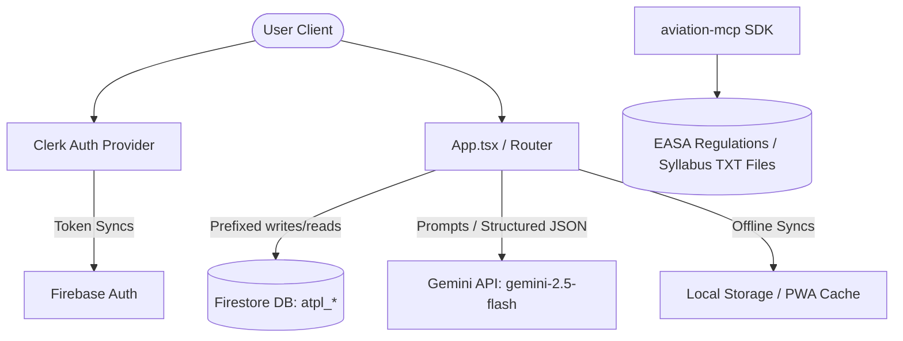

### Key Workflows
1. **Authentication and Session Syncing**:
   - The user signs in through Clerk.
   - `App.tsx` listens to Clerk session changes and issues a sign-in operation to Firebase Auth.
   - Upon sign-in, the user's Firestore profile (`atpl_profiles/{uid}`) is created/updated.
   - A Firestore listener watches for the active session's `current_device_id`. If a different device logs in, the active session is immediately logged out.
2. **Offline Mode and PWA Cache**:
   - Service worker caches static assets, JSON syllabus, and 3D files.
   - Firestore queries operate with local cache persistence. Multi-tab transactions sync via the tab manager.
3. **AI Generation & ATC Roleplay**:
   - Users select ATC radio practice in Communications (090).
   - System prompts establish standard ATC instructions acting as the controller. The pilot replies using raw text, which Gemini grades and reacts to using realistic ICAO transcripts.

## 6️⃣ Limitations & Constraints
- **Device Lock Rules**: Users cannot log in on multiple devices concurrently. The system actively logs out previous active sessions.
- **Asset Size Limitation**: Heavy interactive labs utilizing Spline 3D renders or complex SVGs require broad memory resources. Vite PWA glob limits are capped to 10MB.
- **Firebase Root Prefixes**: To prevent collection collisions during the migration, all document and collection requests are wrapped to prepend `atpl_`. Direct Firestore requests must account for this schema renaming.
- **API Rate Limits**: Generative AI tools (weather decoding, quiz generator) are subject to Google GenAI API rate limits. Fallbacks return raw mock responses in case of failure.

================================================================================
### PROJECT: AUTODESK WINDOWS FIXER
File Path Source: C:\Users\Mi5a\.gemini\config\skills\autodesk-windows-fixer\SKILL.md
================================================================================

# Autodesk Windows Fixer & Cleaner

## 1️⃣ Purpose & Scope
- **Overview**: Autodesk Windows Fixer & Cleaner is an advanced automated utility designed to completely purge a Windows system of all Autodesk software remnants, licensing configurations, registry clutter, and background services. It addresses situations where standard uninstallation fails, licensing loops occur, or system registry paths block fresh software reinstalls.
- **Target Audience**: Windows users, developers, and system administrators troubleshooting corrupt Autodesk installations.
- **Core Features**:
  - **Auto-Elevation**: Checks for administrative access upon execution and automatically prompts for elevated user privileges (UAC).
  - **Modern WPF UI**: Built with a sleek dark-mode, semi-transparent glassmorphism layout, featuring floating dash background elements and active progress bars.
  - **Process & Service Termination**: Targets and terminates stubborn background processes (e.g., `AdskLicensing*`, `RemoveODIS*`) and stops registered system services (e.g., `AdskLicensingService`, `Autodesk Access Service Host`).
  - **ODIS Silent Removal**: Executes the native Autodesk On-Demand Install Service uninstaller silently.
  - **Deep Directory Purge**: Recursively removes leftover files across `Program Files`, `ProgramData`, `AppData` (Local and Roaming), and FLEXnet licensing stores.
  - **Registry Scrubber**: Purges HKLM/HKCU registry keys, cleans up phantom uninstall entries, and unblocks installers in Image File Execution Options (IFEO).
  - **Live Log Output**: Includes an integrated console textbox displaying real-time feedback of the scrubbing progress.

## 2️⃣ Technology Stack & Dependencies
- **Core Languages**: PowerShell, XAML (WPF)
- **Frameworks & Core Libraries**:
  - Windows Presentation Foundation (WPF) for the graphical interface.
  - `.NET Framework` base class libraries (`PresentationFramework`, `System.Drawing`, `System.Xml`, `System.Diagnostics`).
- **Development & Build Tools**:
  - `ps2exe` PowerShell module (v1.0.0+) for wrapping/compiling script assets and layout configuration into a standalone executable application.
- **Databases & Stores**:
  - Windows Registry (HKLM, HKCU)
  - Local NTFS Filesystem

## 3️⃣ Project Structure & Key Files
Below is the directory hierarchy and the functional layout of the project:

```
C:\Users\Mi5a\autodesk windows fixer/
├── assets/
│   ├── banner.png
│   ├── icon.ico
│   └── icon.png
├── Autodesk-Fixer.exe
├── Build-AutoWatch.bat
├── Build-Once.bat
├── Clean-Autodesk-Launcher.bat
├── Clean-Autodesk.ps1
├── build.ps1
└── test-ui.ps1
```

| File Path | Purpose / Description | Key Symbols (Classes, Functions, Constants) |
| --- | --- | --- |
| `Clean-Autodesk.ps1` | The core script defining the WPF XML interface, UI message pumping mechanics, process termination list, folder purging paths, and registry cleaner commands. | `Update-UI`, `Wait-UI`, `$xaml`, `LogMsg`, `$processesToStop`, `$servicesToStop`, `$directoriesToRemove`, `$registryPaths`, `$uninstallPaths` |
| `build.ps1` | The build automation pipeline that checks for and installs `ps2exe`, converts `icon.png` to a multi-resolution `icon.ico` using byte streams, and invokes binary compilation. Includes an optional file system watch loop. | `Build-App`, `param([switch]$Watch)` |
| `Clean-Autodesk-Launcher.bat` | Launcher batch wrapper that executes the raw PowerShell GUI without showing the background cmd command console. | N/A |
| `Build-Once.bat` | Initiates a single compilation run of the build pipeline script to compile the executable. | N/A |
| `Build-AutoWatch.bat` | Runs the compiler in filesystem watch mode, automatically rebuilding the executable binary as code changes are saved. | N/A |
| `test-ui.ps1` | Utility test file designed to verify parent-child element width metrics in WPF containers. | N/A |
| `Autodesk-Fixer.exe` | Pre-compiled standalone portable GUI executable file requiring Administrator access. | N/A |

## 4️⃣ Setup, Commands & Scripts

### Installation
1. Clone or download the repository directory structure to a local path.
2. The compilation process requires the `ps2exe` module, which will automatically download and install from the PowerShell Gallery upon running the build script.

### Running Locally
- **Method 1: Executable**: Launch `Autodesk-Fixer.exe` (requires Administrator elevation).
- **Method 2: Batch Launcher**: Run `Clean-Autodesk-Launcher.bat` to execute the PowerShell UI script silently.
- **Method 3: PowerShell CLI**: Execute the script directly from an elevated terminal:
  ```powershell
  powershell -ExecutionPolicy Bypass -File .\Clean-Autodesk.ps1
  ```

### Compiling and Bundling
- **Single Build**:
  ```powershell
  powershell -ExecutionPolicy Bypass -File .\build.ps1
  ```
  *(Alternatively, double-click `Build-Once.bat`)*
- **Watch/Development Mode**: Runs the script in watch mode to automatically rebuild when `Clean-Autodesk.ps1` is modified:
  ```powershell
  powershell -ExecutionPolicy Bypass -File .\build.ps1 -Watch
  ```
  *(Alternatively, double-click `Build-AutoWatch.bat`)*

### Verification and Testing
- To run layout validation checks:
  ```powershell
  powershell -ExecutionPolicy Bypass -File .\test-ui.ps1
  ```

### Environmental Configuration
- No external `.env` configuration files are required. The script extracts environment paths (such as `%ProgramFiles%`, `%ProgramData%`, `%APPDATA%`, `%LOCALAPPDATA%`, and `%TEMP%`) dynamically from the host operating system.

## 5️⃣ Architecture & Key Workflows

### High-level Design & Data Flow
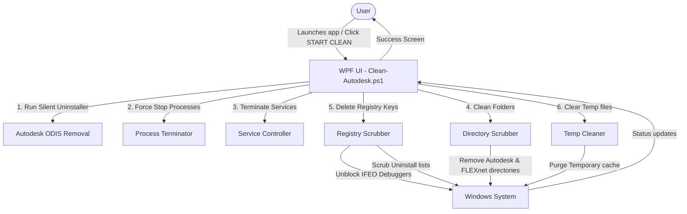

### Key Workflows & Algorithm Details
1. **Glassmorphic Animation and Render Thread Pumping**:
   To prevent the WPF UI thread from freezing during the sequence of blocking system calls (deletions, registry searches, process kills), the script defines `Update-UI` using `DispatcherFrame`:
   ```powershell
   function Update-UI {
       $dispatcher = [System.Windows.Threading.Dispatcher]::CurrentDispatcher
       $frame = New-Object System.Windows.Threading.DispatcherFrame
       $action = [System.Action[System.Windows.Threading.DispatcherFrame]] {
           param($f) $f.Continue = $false
       }
       $dispatcher.BeginInvoke([System.Windows.Threading.DispatcherPriority]::Background, $action, $frame) | Out-Null
       [System.Windows.Threading.Dispatcher]::PushFrame($frame)
   }
   ```
   This is periodically called alongside `Wait-UI` (which is a helper utilizing a `Stopwatch` loop combined with `Start-Sleep`) to keep the progress indicators updating fluidly.

2. **Registry Scrubber & IFEO Unblocking**:
   The script iterates over Image File Execution Options subkeys to locate any configurations where the installer has a `Debugger` property matching the word `"Blocked"`, and strips it:
   ```powershell
   $subKeys = Get-ChildItem -Path "HKLM:\SOFTWARE\Microsoft\Windows NT\CurrentVersion\Image File Execution Options"
   foreach ($key in $subKeys) {
       $debugger = Get-ItemProperty -Path $key.PSPath -Name "Debugger"
       if ($debugger.Debugger -match "Blocked") {
           Remove-ItemProperty -Path $key.PSPath -Name "Debugger"
       }
   }
   ```
   It also loops through registry uninstall locations (`Uninstall\*` keys in HKLM, HKLM-WOW6432Node, and HKCU) to locate any application entry matching `"Autodesk"`, retrieving its path dynamically and executing a force delete using CMD's `reg delete`.

3. **Dynamic Icon Compiler**:
   The build pipeline contains custom .NET byte writing code to output a valid multi-resolution `.ico` structure. It sets up the `ICONDIR` header and the `ICONDIRENTRY` block specifying a 256x256 image with 32-bit color depth, appends raw PNG stream bytes from `icon.png`, and writes the binary file directly.

## 6️⃣ Limitations & Constraints
- **Destructive Deletion**: This utility is destructive and will completely remove working Autodesk products. It is designed only for fresh-start scenarios or troubleshooting unresolvable installations.
- **Operating System Restriction**: The script relies directly on Windows-specific components (Registry structure, UAC verification APIs, cmd command line utilities, and .NET WPF libraries). It is incompatible with macOS or Linux systems.
- **Antivirus False Positives**: Due to performing administrative process termination, folder pruning, registry manipulation, and packaging via `ps2exe`, compiled executables may be flagged by overzealous antivirus scanners. Running the raw `.ps1` code provides a transparent bypass.

================================================================================
### PROJECT: COPTIC-PASCHA-GUIDE
File Path Source: C:\Users\Mi5a\.gemini\config\skills\coptic-pascha-guide\SKILL.md
================================================================================

# Coptic Pascha Guide

## 1️⃣ Purpose & Scope
- **Overview**: The Coptic Pascha Guide is an interactive, trilingual digital companion designed to guide users through Coptic Orthodox Holy Week (Pascha) services. It hosts structured liturgical readings, hymns, psalms, and prophecies for each day and hour of Holy Week.
- **Audience**: Coptic Orthodox parishioners, deacons, and clergy seeking to follow services on their mobile or desktop devices.
- **Core Features**:
  - **Trilingual Readings**: Parallel columns displaying English (NKJV/KJV), Coptic (Unicode/transliterated), and Arabic (Amiri font with proper diacritics) readings simultaneously.
  - **Interactive Day & Hour Schedules**: Dynamic schedules allowing users to toggle between Day and Night (Eve) hours for the 9 days of Holy Week (from Palm Sunday to Easter Sunday).
  - **Global Dark Mode**: Unified theme switching via React Context that updates body classes and Tailwind variables.
  - **Deacon Mode**: Liturgical highlights and blue badges for deacon-specific hymns and gospels to assist deacons during services.
  - **Enhanced Font Scaling**: Accessibility adjustments including `SM`, `BASE`, `LG`, and `XL` text modes (ranging up to 36px for high legibility).
  - **Bible Search**: Direct search integration using the `https://bible-api.com` API for looking up arbitrary Old and New Testament passages.
  - **Liturgical Prayers & Hymns**: A bilingual collection of common prayers (Pascha Hour prayers, Litanies, Golgotha, etc.) organized in collapsible accordions.
  - **Data Rebuilding Utilities**: JavaScript/ESM scripts to parse raw text and regenerate data TS modules from extracted PDF contents.

## 2️⃣ Technology Stack & Dependencies
- **Core Languages**: TypeScript, HTML, CSS, JavaScript (ESM)
- **Frontend Framework**: React 19 + Vite 6
- **Routing**: React Router DOM v7 (SPA routing)
- **Styling**: Tailwind CSS v4 (using CSS variables, `@theme`, `@layer base`, `@layer components`)
- **Icons**: Lucide React
- **Animations**: Motion (framer-motion)
- **External API**: `https://bible-api.com` (NKJV/KJV bible translation search)
- **Development/Build Tools**: Vite 6, TypeScript Compiler (tsc), tsx
- **Data Generation Tools**: `pdf-parse`, `pdfjs-dist` (for PDF text extraction)

## 3️⃣ Project Structure & Key Files
### Folder Hierarchy
- `src/`: Core React application files.
  - `components/`: Reusable components (e.g., `Navigation.tsx`).
  - `pages/`: Page containers (`Home.tsx`, `DayView.tsx`, `Bible.tsx`, `Prayers.tsx`).
  - `data/`: Liturgical readings data.
    - `days/`: Individual typescript files representing each Holy Week day.
    - `types.ts`: TypeScript interfaces for content schema.
    - `paschaData.ts`: Legacy/fallback readings database.
  - `App.tsx`: Main React component.
  - `index.css`: Tailwind configuration and custom components.
  - `main.tsx`: App mount point.
- `public/`: Static asset storage. Contains `.htaccess` for SPA routing on Apache.
- Root files: Build configuration, dependencies, and data pipeline scripts.

### Key Files Map
| File Path | Purpose / Description | Key Symbols (Classes, Functions, Constants) |
| --- | --- | --- |
| [src/App.tsx](file:///C:/Users/Mi5a/Desktop/coptic-pascha-guide/src/App.tsx) | App root, settings context, global theme switcher, text scaling logic, and settings drawer. | `AppSettingsContext`, `useAppSettings`, `App`, `Sidebar`, `fontSizeClasses` |
| [src/components/Navigation.tsx](file:///C:/Users/Mi5a/Desktop/coptic-pascha-guide/src/components/Navigation.tsx) | Header bar navigation, trilingual date displays, day tabs switcher, share page handler. | `Navigation`, `days`, `handleShare` |
| [src/pages/DayView.tsx](file:///C:/Users/Mi5a/Desktop/coptic-pascha-guide/src/pages/DayView.tsx) | Primary reading display page. Implements trilingual columns, hour selection, search query filtering, and deacon mode highlighting. | `DayView`, `handleCopy`, `handleShare`, `handlePlay` |
| [src/pages/Home.tsx](file:///C:/Users/Mi5a/Desktop/coptic-pascha-guide/src/pages/Home.tsx) | App home page dashboard. Lists all Holy Week days, guide info, and how-to guides. | `Home`, `dayIds` |
| [src/pages/Bible.tsx](file:///C:/Users/Mi5a/Desktop/coptic-pascha-guide/src/pages/Bible.tsx) | Interacts with external bible api. Lists books of the bible and provides quick access tabs to key Holy Week bible passages. | `Bible`, `searchBible`, `holyWeekReadings` |
| [src/pages/Prayers.tsx](file:///C:/Users/Mi5a/Desktop/coptic-pascha-guide/src/pages/Prayers.tsx) | Displays standard Pascha prayers, litanies, and hymns in a bilingual (EN/AR) collapsible accordion. | `Prayers`, `prayerCategories` |
| [src/data/types.ts](file:///C:/Users/Mi5a/Desktop/coptic-pascha-guide/src/data/types.ts) | Type declarations for the liturgical data structure schema. | `ContentItem`, `HourData`, `DayData` |
| [src/data/days/index.ts](file:///C:/Users/Mi5a/Desktop/coptic-pascha-guide/src/data/days/index.ts) | Central aggregator that exports all day data structures. | `paschaDays` |
| [generate-data-v2.mjs](file:///C:/Users/Mi5a/Desktop/coptic-pascha-guide/generate-data-v2.mjs) | Data generation script that parses `pdf-extracted-text.txt` using page ranges, extracts Coptic/Arabic/English readings, and outputs day `.ts` modules. | `normalizeArabic`, `extractLanguageSegments`, `parseHourContent`, `extractArabicBlocks`, `extractCopticBlocks` |
| [rebuild-data.mjs](file:///C:/Users/Mi5a/Desktop/coptic-pascha-guide/rebuild-data.mjs) | Legacy or light-weight data rebuilding script that translates ASCII representations of Coptic characters to Unicode. | `copticMap`, `toUnicode`, `rebuild` |
| [extract_pdf.js](file:///C:/Users/Mi5a/Desktop/coptic-pascha-guide/extract_pdf.js) | PDF parser script using `pdf-parse` to convert the source Holy Week PDF into raw text files. | `pdf` |
| [vite.config.ts](file:///C:/Users/Mi5a/Desktop/coptic-pascha-guide/vite.config.ts) | Vite build setup. Defines HMR behavior and client-side env variables (like `process.env.GEMINI_API_KEY`). | `defineConfig` |

## 4️⃣ Setup, Commands & Scripts
### Installation
Install the project dependencies locally:
```bash
npm install
```

### Running Locally
To launch the Vite development server locally:
```bash
npm run dev
```
*(Runs on http://localhost:3000 by default)*

### Building for Production
To build static production-ready files in the `/dist` directory:
```bash
npm run build
```

### Type Checking & Linting
Run TypeScript compiler check without emitting files:
```bash
npm run lint
```

### Data Regeneration Pipeline
To extract the source PDF and rebuild the day TS modules, perform the following:
1. Extract text from the PDF:
   ```bash
   node extract_pdf.js
   ```
2. Parse the extracted text and output data modules:
   ```bash
   node generate-data-v2.mjs
   ```

### Environmental Configuration
Configure variables in a `.env.local` or `.env` file:
- `GEMINI_API_KEY` (string): Optional, injected into client context (leftover/unused in current codebase, but expected by Vite define config).
- `APP_URL` (string): The URL where the application is hosted.

## 5️⃣ Architecture & Key Workflows
### High-Level Design
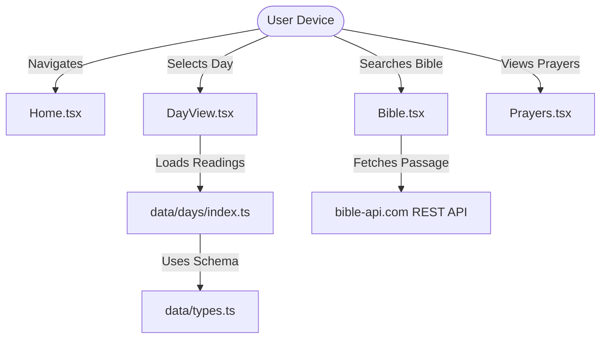

### Context & State Workflows
- **App Settings**: Global configurations are managed in `App.tsx` through `AppSettingsContext`, providing context variables down the component tree.
  - **Theme Selection**: Saves current setting ('light' | 'dark') to `localStorage` and toggles the `.dark` class on the `document.documentElement` to transition Tailwind variables.
  - **Text Scaling**: Translates scale levels (`SM`, `BASE`, `LG`, `XL`) to font utility classes like `text-sm`, `text-lg`, `text-2xl`, and `text-4xl`.
  - **Deacon Mode**: A boolean switch that wraps certain `GOSPEL` and `HYMN` elements with a special border class (`border-pascha-blue/40 bg-pascha-blue/5`) and appends a `DEACON READS` badge.
  - **Hour Quick Navigation**: The sidebar maps sections and hours. Selecting an hour scrolls the page view smoothly to the matching ref tag (e.g., `data-ref={item.ref}`).

### Data Pipeline Flow
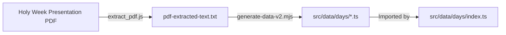

## 6️⃣ Limitations & Constraints
- **Unused Gemini Integration**: Dependencies include `@google/genai` and config defines `process.env.GEMINI_API_KEY`, but the current application is client-only and does not use any Gemini models.
- **Offline Mode**: Currently lacks a service worker; hence, users require an internet connection to fetch Bible passages (from `bible-api.com`) and resources if they aren't pre-cached.
- **Audio Simulation**: The "Listen to Audio" buttons currently simulate chant playbacks and do not stream actual audio files yet.
- **Arabic Rendering**: Extracted Arabic PDF text may have occasional minor diacritical alignment issues, which the custom `normalizeArabic` regex tries to address.

================================================================================
### PROJECT: DEC-MILESTONE-TRACKER-1
File Path Source: C:\Users\Mi5a\.gemini\config\skills\dec-milestone-tracker-1\SKILL.md
================================================================================

# DEC Milestone Tracker & Activity Monitoring System

## 1️⃣ Purpose & Scope
- **Operational Dashboard & Venture Management:** Provides real-time overview of active projects, tasks, attendance, and financials for engineers, admins, and partners (clients).
- **Silent Time & Application Usage Tracker:** Background Windows C# process (`desktop-tracker`) silently monitors foreground window titles and idle periods. Automatically posts app usage logs and time entries to Supabase to analyze context switching and deep work metrics.
- **Milestone & Billing Engine:** Monitors engineering milestones, tracks financial indicators and risks, generates PDF invoices, and tracks payment clearances.
- **Client & client Portal:** High-level executive view for clients allowing milestone approval/revision flagging, operational feed tracking, and mock 3D IFC visualizer rendering.
- **Integrations:** Handles email synchronization and compositions with Zoho Mail over custom Vite/Nginx proxies, and legacy Bill of Quantities (BOQ) mapping.

## 2️⃣ Technology Stack & Dependencies
- **Frontend Stack:** React 19 (App Router patterns with React Router Dom v7), TypeScript, Vite 7, TailwindCSS 3.4 (with customized dark/neon-orange grid interfaces).
- **Backend Stack:** Supabase (PostgreSQL database with Row Level Security, Custom SQL Roles Helper functions, Trigger mappings, and Realtime WebSocket notifications subscription).
- **Silent Desktop Tracker:** C# console application compiled on-the-fly via Microsoft .NET Framework compilation tools (`csc.exe`). It tracks foreground focus titles via Win32 `user32.dll` APIs and calls Supabase REST APIs asynchronously using native OS utility `curl.exe`.
- **Integrations:**
  - Zoho Mail client API integrating Zoho accounts OAuth and mailboxes.
  - Legacy Bill of Quantities Viewer: Static HTML client parsing excel sheets (`XLSX`, `.xlsx`, `.xls`, `.csv`), local progress storage (`boqMemory_v5`), `jspdf` + `jspdf-autotable` exporting.
- **Primary Dependencies:**
  - `@supabase/supabase-js` (database interface)
  - `recharts` (performance/heatmap charting)
  - `framer-motion` (animations)
  - `exceljs` and `file-saver` (excel generation)
  - `html2canvas`, `jspdf`, `jspdf-autotable` (PDF invoices and reports compilation)

## 3️⃣ Project Structure & Key Files
The following table maps key files and folders in the workspace:

| File Path | Purpose / Description | Key Symbols (Classes, Functions, Constants) |
| --- | --- | --- |
| `src/context/AuthContext.tsx` | Manages user session state, signout timer, auth timeouts, and user roles (`admin` \| `engineer` \| `client`). | `AuthContext`, `AuthProvider`, `useAuth`, `checkIdleTimeout` |
| `src/context/DataContext.tsx` | Main DB interface. Defines table schema mappers, handles cache reloading, and maps live WebSocket subscriptions. | `DataContext`, `DataProvider`, `useData`, `TABLE_CONFIGS`, `realtimeSubscription` |
| `src/context/LanguageContext.tsx` | Manages En/Ar translations and toggles document alignment direction (RTL/LTR). | `LanguageContext`, `LanguageProvider`, `useLanguage` |
| `src/lib/supabase.ts` | Configures Supabase client. Overrides Navigator Lock API and enforces 15-second request timeouts for cloud resiliency. | `supabase`, `customFetch` |
| `src/lib/zoho.ts` | Helper client to integrate Zoho accounts OAuth, fetch messages, download attachments, and send mails. | `ZohoClient`, `getAccessToken`, `fetchFolders`, `sendMail` |
| `src/utils/appCategorization.ts` | Categories foreground active window titles logged by desktop tracker into operational types. | `categorizeApp`, `DEEP_WORK_PROGRAMS`, `COMMUNICATION_PROGRAMS` |
| `src/utils/languageUtils.ts` | Splits inline bilingual field values (e.g. `English (Arabic)`) according to selected display language. | `getLocalizedText` |
| `desktop-tracker/tracker.cs` | C# silent time tracker. Monitors user inactivity, foreground software titles, offline caching, and watches folders for deliverable exports. | `Program`, `IsWorkProgramActive`, `GetIdleTimeMs`, `SupabaseRequest`, `SetupDeliverableWatcher` |
| `desktop-tracker/install.bat` | Windows batch setup file. Prompts user for engineer roster index, writes persistent `config.cs`, compiles tracker, and registers invisible VBS Startup bootstrapper. | `INSTALL_DIR`, `csc.exe`, `WindowsSystemHost.vbs` |
| `public/boq-viewer.html` | Legacy standalone HTML/jQuery site hub. Parses CAD/BOQ variances, loads/saves local `.dec` JSONs, generates variance analysis PDFs. | `boqMemory_v5`, `DataTable`, `jsPDF` |
| `nginx.conf` | Web server reverse proxy configuration. Routes local Zoho mail and account URLs to remote Zoho servers to bypass CORS limitations. | `server`, `location /zoho-accounts`, `location /zoho-mail` |
| `supabase/setup_rls.sql` | First-stage database schema definition. Sets up RLS, defines `is_admin()` SQL checking, and registers auth user creation trigger. | `is_admin()`, `handle_new_user()`, `on_auth_user_created` |
| `supabase/setup_rls_all_tables.sql` | Second-stage database security. Configures explicit row level security policies for all tables, restricting engineers to their own rows. | `attendance`, `milestones`, `tasks`, `leave_requests`, `time_entries` |

## 4️⃣ Setup, Commands & Scripts
Document how to install, build, run, and test the project:
- **Installation:**
  - **Web Portal UI:** Run `npm install` inside the project root directory.
  - **Desktop Windows Tracker:** Run `desktop-tracker/install.bat` on the target Windows machine. Select the target engineer from the command prompt roster.
- **Running locally:**
  - **Web Portal UI:** Run `npm run dev` to start the local Vite server.
  - **Desktop Windows Tracker:** Automatically starts on system boot via the configured `WindowsSystemHost.vbs` script. Can be manually launched by executing `WindowsSystemHost.exe` located inside `%APPDATA%/DecTracker`.
- **Testing & Formatting:**
  - **Linter Check:** Run `npm run lint`.
  - **Build Production Assets:** Run `npm run build`. This automatically triggers `scripts/generate-version.mjs` to cache-bust frontend resources.
- **Environmental Configuration:**
  - Required `.env` variables for web application compilation:
    - `VITE_SUPABASE_URL`: Supabase project endpoint.
    - `VITE_SUPABASE_ANON_KEY`: Supabase project anonymous token.
    - `VITE_ZOHO_CLIENT_ID`: Zoho Client ID used for Zoho accounts OAuth.
    - `VITE_ZOHO_CLIENT_SECRET`: Secret token for Zoho mail access.
    - `VITE_ZOHO_REDIRECT_URI`: OAuth callback URL.

## 5️⃣ Architecture & Key Workflows
- **Synchronized Live Operational Feed:**
  - The C# tracker (`WindowsSystemHost.exe`) runs silently in background.
  - Every 10 seconds, it queries foreground active window title and checks user idle time via Win32.
  - If a state change occurs (e.g. active program changed), it computes duration and triggers `curl.exe` to POST a log entry to Supabase's `app_usage_log`.
  - The React portal maintains a realtime WebSocket subscription on `app_usage_log` via `DataContext.tsx`. The moment an entry is posted, it is pushed to the client browser, updating the `LiveOperationsMonitor` component in real-time.
- **Offline Resiliency Caching:**
  - If `curl` REST transmission fails (e.g. network drops), the desktop tracker writes the transmission body into `unsent.queue`.
  - Every 1 minute, the tracker attempts to flush the offline log queue. Logs are processed sequentially to preserve temporal order.
- **Zoho CORS Proxy Bypass:**
  - Zoho accounts do not permit client-side OAuth API calls from arbitrary domain hosts due to CORS restrictions.
  - To bypass this, the local Vite config (for dev) and Nginx `nginx.conf` (for production) establish reverse proxy routes (`/zoho-accounts` and `/zoho-mail`) that redirect client requests to Zoho's official endpoints transparently.

## 6️⃣ Limitations & Constraints
- **Platform Dependencies:**
  - The desktop tracker (`desktop-tracker`) is tightly bound to **Windows OS** because it relies on standard Win32 assembly imports (`user32.dll` and `kernel32.dll`) to resolve active window handles and last input intervals. It cannot execute on macOS or Linux.
  - Compilation of the tracker requires a local .NET compiler (`csc.exe`) typically bundled under `C:\Windows\Microsoft.NET\Framework(64)\v4.0.30319\`.
- **Network Resiliency:**
  - Cloud Run/container UI rendering might trigger browser UI locks if the database connection hangs. To address this, the Supabase client overrides custom fetches with a strict 15-second abort timeout and disables the Navigator Lock API.
- **Offline Buffer:**
  - If the Windows desktop tracker remains offline for an extended duration, it buffers logs locally in a flat text file `unsent.queue` in the app directory. Highly volatile if the directory is manually wiped.

================================================================================
### PROJECT: EGYGRAFX
File Path Source: C:\Users\Mi5a\.gemini\config\skills\egygrafx\SKILL.md
================================================================================

# EGYGRAFX B2B Platform

## 1️⃣ Purpose & Scope
The **EGYGRAFX B2B Platform** is a serverless lead generation asset designed to transition the company's online presence from a product-heavy directory listing of printing specs into an intent-driven, matchmaker showroom for industrial large-format printing solutions. The core system matches machinery, inks, media paper rolls, and calendering systems to capture buyers' business needs.

### Target Audience
Industrial print house managers, textile factory owners, signage shops, packaging manufacturers, and specialty printing firms in Egypt and the Middle East.

### Core Features
- **Interactive Matchmaker**: Bento-grid UI showcasing 9 distinct application sectors (e.g., Home Textile, T-Shirts, Carpets, Signage, Wall Coverings) to filter hardware and compatible consumables.
- **Dynamic Parameter Configurator**: Sliders to customize widths, upgrade printhead counts, adjust production hours, and estimate simulated output profiles.
- **Operational ROI Modeler**: Variable margin calculator supporting currency conversions (EGP, USD, SAR, AED), direct printing cost breakdowns (ink, media, overhead), gross profit metrics, and CapEx payback timelines.
- **Lead Capture & Proposal Booklet**: Instant pre-qualified RFQ submission form that compiles a custom client quote booklet in a printable, toner-optimized A4 layout.
- **Headless CMS Desk**: Secure locks for managing inventory models, adjusting pricing tiers, viewing lead streams, and auditing terminal logs.
- **PDF Compilation Engine**: Command-line ReportLab Python compiler that generates print-ready proposal PDFs in full dark mode.

## 2️⃣ Technology Stack & Dependencies
The project uses a two-fold technical stack: a **local React staging prototype** and a **production serverless architecture plan**.

### React Staging Prototype Stack
- **Core Languages**: JavaScript (ES6+), HTML5, CSS3
- **Frameworks & Libraries**: React 19, Tailwind CSS v4
- **Build Tools**: Vite 5, ESLint 10, PostCSS
- **State Management**: React Context API (`AppContext`) with simulated logs, Firestore, and Clerk states.

### Production Target Stack
- **Framework**: Next.js 14+ (App Router, dynamic folders with ISR static caching)
- **Authentication**: Clerk (Admin, Marketeer, Copywriter roles)
- **Database**: Firebase Firestore (NoSQL relational tables for dynamic fleet mapping)
- **Email Service**: Resend API (for transactional hot lead sheets and PDF delivery)

### Python PDF Compilation Engine
- **Language**: Python 3.x
- **Libraries**: ReportLab (layout, canvas, page formatting flowables)

## 3️⃣ Project Structure & Key Files
### Directory Layout
```
H:\EGYGRAFX
├── src/                      # Staging React application source
│   ├── components/           # View components and layout items
│   ├── context/              # Context providers for global state
│   ├── App.jsx               # Entry component and dynamic metadata
│   ├── main.jsx              # React app mounting script
│   └── index.css             # Tailwind v4 directives and print overrides
├── pdf/                      # PDF compilation workspace
│   ├── compile_proposal.py   # ReportLab PDF compiler script
│   └── *.pdf / *.txt         # Output proposals and raw text assets
├── package.json              # Project dependencies and run commands
├── vite.config.js            # Vite compilation parameters
└── *.html                    # Prototype preview pages
```

### Key Source Files Map
| File Path | Purpose / Description | Key Symbols (Classes, Functions, Constants) |
| --- | --- | --- |
| [src/App.jsx](file:///H:/EGYGRAFX/src/App.jsx) | Handles main tab navigation, dynamic SEO meta updates, and preloader mounts. | `MainAppContent`, `App` |
| [src/context/AppContext.jsx](file:///H:/EGYGRAFX/src/context/AppContext.jsx) | Global state provider managing mock Firestore database, lead registry, supplier records, price edits, and terminal logs. | `AppContext`, `AppProvider`, `useApp`, `initialDatabase`, `initialLeads`, `initialSuppliers` |
| [src/components/PortalView.jsx](file:///H:/EGYGRAFX/src/components/PortalView.jsx) | B2B Portal containing the 9 application grids, fleet specs selectors, consumables matching, RFQ submission, and Cairo demo booking. | `PortalView`, `generateProposalId`, `handleLeadSubmit`, `handleDemoSubmit` |
| [src/components/RoiCalculatorView.jsx](file:///H:/EGYGRAFX/src/components/RoiCalculatorView.jsx) | Cost-sheet modeler calculating direct ink/paper costs, gross margins, and investment recovery timelines. | `RoiCalculatorView`, `rates`, `monthlyGrossProfit`, `paybackMonths`, `formatCurrency` |
| [src/components/AdminCmsView.jsx](file:///H:/EGYGRAFX/src/components/AdminCmsView.jsx) | CMS CRM dashboard for price configuration, lead tracking, event logging, and programmatic Google SEO previews. | `AdminCmsView`, `handleAuthSubmit`, `handlePriceUpdateSubmit`, `allMachines` |
| [src/components/PresentationView.jsx](file:///H:/EGYGRAFX/src/components/PresentationView.jsx) | Slide deck viewer for the client proposal, summarizing branding goals, customer stories, sitemaps, and milestones. | `PresentationView`, `slides`, `prevSlide`, `nextSlide` |
| [src/components/Header.jsx](file:///H:/EGYGRAFX/src/components/Header.jsx) | Top sticky navigation bar featuring the rebrand logo, application menu buttons, tagline, and staging sync status. | `Header`, `tabs` |
| [src/components/Footer.jsx](file:///H:/EGYGRAFX/src/components/Footer.jsx) | Bottom layout showing sitemap links, visual rebrand details, commercial contract payments, and copyrights. | `Footer`, `currentYear` |
| [src/components/Preloader.jsx](file:///H:/EGYGRAFX/src/components/Preloader.jsx) | Animated preloader showing organic loading steps representing system modules, inks, and CMS streaming. | `Preloader`, `STAGES` |
| [pdf/compile_proposal.py](file:///H:/EGYGRAFX/pdf/compile_proposal.py) | Compiles the client proposal into a styled, dual-column A4 PDF matching the Mitry Visuals style. | Python script using ReportLab |

## 4️⃣ Setup, Commands & Scripts
### Install Node Dependencies
Initialize local npm dependencies for Vite and Tailwind:
```bash
npm install
```

### Local Dev Server
Run the React staging prototype locally:
```bash
npm run dev
```

### Build Staging Assets
Compile production-ready static assets:
```bash
npm run build
```

### Preview Local Builds
Serve the compiled static build locally:
```bash
npm run preview
```

### Python PDF Compiler Compilation
Ensure ReportLab is installed:
```bash
pip install reportlab
```
Regenerate the dark-mode proposal PDF:
```bash
python pdf/compile_proposal.py
```
Copy and sync the output proposal file to client delivery folders:
```bash
python -c "import shutil; shutil.copy('pdf/Egygrafx_Proposal_MV-2026-085_final.pdf', 'pdf/Egygrafx_Proposal_MV-2026-085 (1).pdf')"
```

## 5️⃣ Architecture & Key Workflows
### B2B Matchmaker Workflow
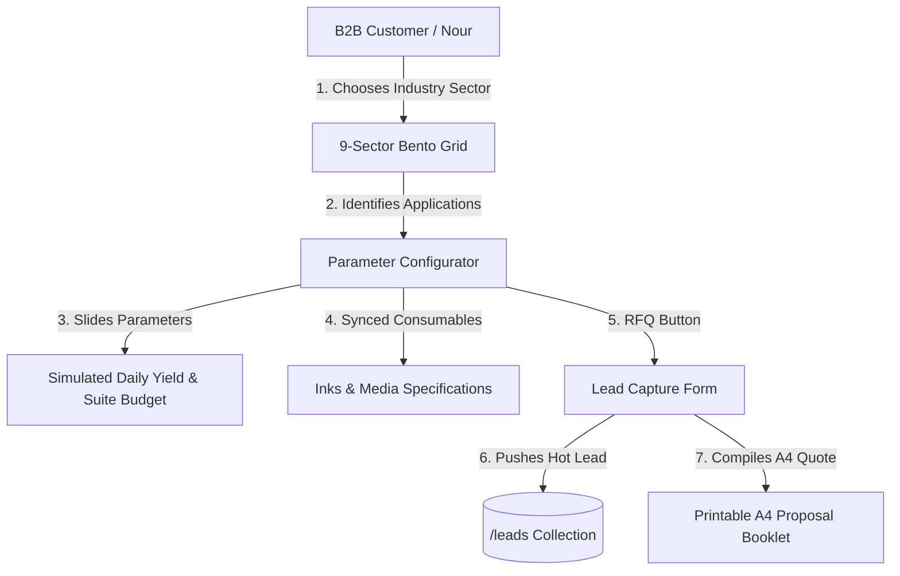

### Operational ROI Calculation Formulas
The ROI Modeler calculates direct cost profiles and payback times in the selected local currency (rates relative to 1 USD: USD=1.0, EGP=48.0, SAR=3.75, AED=3.67):
- **Direct Ink Cost/sqm**: 
  $$\text{Direct Ink Cost} = \left(\frac{\text{Ink Draw (ml)}}{1000}\right) \times \text{Ink Cost per L}$$
- **Direct Overhead/sqm**: 
  $$\text{Direct Overhead} = \frac{\text{Hourly Overhead}}{\text{Average Printing Speed (sqm/h)}}$$
- **Total Cost/sqm**: 
  $$\text{Total Direct Cost} = \text{Media Cost/sqm} + \text{Direct Ink Cost} + \text{Direct Overhead}$$
- **Gross Margin Ratio**: 
  $$\text{Gross Margin Ratio (\%)} = \left(\frac{\text{Selling Price} - \text{Total Direct Cost}}{\text{Selling Price}}\right) \times 100$$
- **Monthly Gross Profit**: 
  $$\text{Monthly Gross Profit} = (\text{Selling Price} - \text{Total Direct Cost}) \times \text{Daily Vol} \times 30$$
- **Payback Period (Months)**: 
  $$\text{Payback Period} = \frac{\text{Machinery CapEx Investment}}{\text{Monthly Gross Profit}}$$

### CMS Synchronicity & Programmatic SEO Workflow
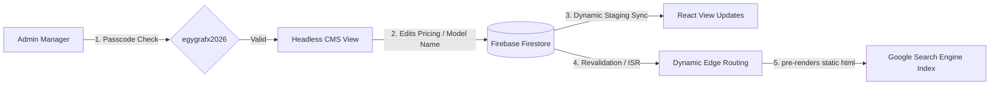

## 6️⃣ Limitations & Constraints
- **Passcode Authentication**: The staging environment uses a hardcoded passcode (`egygrafx2026`) in `AdminCmsView.jsx` as a sandbox mock for Clerk Authentication.
- **No Swirl Logo Rule**: The brand guidelines strictly forbid overlapping curves or infinity loops forming a sphere. Only use the typography-only serif logo `EGYGRAFX.` or its typographic equivalents.
- **ReportLab PDF Dependency**: Generating the PDF requires a Python environment with ReportLab installed. Coordinates, font mappings, and margins are hardcoded in `compile_proposal.py` for standard A4 pages.
- **Toner Saver Print Overrides**: When printing, CSS overrides force a white background (`#ffffff`), strip dark panels, and hide high-resolution imagery/lightboxes (`.print-machinery-hide`) to prevent expensive toner exhaustion.
- **Commercial Valuation Gate**: Project payment milestones are locked at exactly **$900.00 USD** (VAT/tax exempt) split into 3 equal increments of $300.00.
- **Sliders Boundary Warning**: If daily printing volume over print speed exceeds 24 hours in `RoiCalculatorView.jsx`, a validation warning will trigger indicating a need for parallel print lines.

================================================================================
### PROJECT: FAA TEST GUIDE QUESTION BANK
File Path Source: C:\Users\Mi5a\.gemini\config\skills\faa-test-guide-question-bank\SKILL.md
================================================================================

# FAA Test Guide Question Bank

## 1️⃣ Purpose & Scope
- **Overview:** The **FAA Test Guide Question Bank** is an interactive web-based study and quiz application designed for pilot candidates preparing for their FAA Knowledge Exams (PPL, IR, and CPL). It was created for the Egyptian Aviation Academy.
- **Core Features:**
  - **License Selection:** Supports Private Pilot License (PPL), Instrument Rating (IR), and Commercial Pilot License (CPL).
  - **Dynamic Practice Sessions:** Questions are grouped into chapters/modules with interactive option cards, instant correct/incorrect audio feedback (SFX), and motivational confetti.
  - **Detailed Explanations:** Explains the correct answer with relevant references and textbook explanations after a candidate submits their choice.
  - **Progress Persistence & Cloud Sync:** Keeps track of answered and incorrect questions using `localStorage`. If a student signs in with Google, progress syncs automatically with a Firebase Firestore database.
  - **Incorrect Question Review:** Offers an dedicated review mode for going over incorrectly answered questions.
  - **Figure & Diagram Support:** Integrates FAA supplement figure graphics directly into questions that reference them.

## 2️⃣ Technology Stack & Dependencies
- **Frontend App:**
  - **Framework/Language:** React 18.3 (TypeScript), Vite 5.4 (bundler & HMR)
  - **Styling:** CSS variables, custom glassmorphism design system (`App.css`, `index.css`)
  - **Icons:** `lucide-react`
  - **Rewards/Effects:** `react-confetti-explosion`
  - **Audio Engine:** HTML5 Audio API wrapper (`src/utils/sfx.ts`)
  - **Web Server:** Nginx (configured for single-page routing in Docker)
- **Database & Auth:**
  - **Firebase Auth:** Google Sign-In provider
  - **Firebase Firestore:** Persists the main `questions` collections and `/users/{uid}/progress` documents
- **Data Scraping & Migration Pipelines:**
  - **Python:** Uses `PyMuPDF` (`fitz` library) to parse and render text columns and extract figures from source PDFs
  - **NodeJS:** Uses the `firebase-admin` SDK to wash, clean, and seed Firestore with batched JSON uploads

## 3️⃣ Project Structure & Key Files
### Key Directories
- `pilot-test-guide/`: Root directory of the Vite-React SPA.
- `pilot-test-guide/src/components/`: Modular React components for landing layouts, navigation, and questions.
- `cleaned/`: Output folder for sanitized JSON question banks.
- `scripts/`: Python and Node scripts used to parse, clean, and migrate PDFs/JSON data.
- `scratch/`: Diagnostic tools and verification scripts.

### Key Files Mapping
| File Path | Purpose / Description | Key Symbols (Classes, Functions, Constants) |
| --- | --- | --- |
| `pilot-test-guide/src/App.tsx` | Main application view and router; manages license mode selection and coordinates firestore questions fetching. | `App`, `getChapters`, `pplChapterTitles` |
| `pilot-test-guide/src/types.ts` | Shared TypeScript type definitions for the question bank structure. | `Question`, `TestMode` |
| `pilot-test-guide/src/hooks/useTestProgress.ts` | custom hook coordinating progress loading, local storage operations, and firestore syncing. | `useTestProgress`, `resetChapterProgress`, `resetAllProgress` |
| `pilot-test-guide/src/components/QuestionView.tsx` | UI container for single-question quizzes, keyboard inputs (A/B/C/D, Arrow keys), figure displays, and navigation controls. | `QuestionView` |
| `pilot-test-guide/src/components/LandingView.tsx` | Homepage showing overall test statistics, license selection cards, chapter breakdowns, and reset/review options. | `LandingView` |
| `pilot-test-guide/src/lib/firebase.ts` | Firebase Client SDK initializer. | `db`, `auth`, `googleProvider` |
| `extract_cpl.py` | Python script that uses column coordinates to extract CPL questions and explanations from PDF. | `extract_cpl`, `collect_columns`, `parse_questions` |
| `parse_v2.py` | Python script that extracts PPL questions from the Jeppesen Private Pilot guide PDF. | `extract_ppl`, `collect_columns`, `parse_questions` |
| `scripts/clean_questions.js` | Node script to fix OCR corruption, strip page header leaks, deduplicate, and assign human-readable categories. | `cleanString`, `cleanOptions`, `processBank` |
| `scripts/extract_figures.py` | Extracts question-referenced diagram figures from the PPL PDF and renders them to `.jpg` assets. | `build_figure_page_map`, `get_referenced_figures`, `render_page` |
| `scripts/upload_to_firestore.js` | Uses Firebase Admin SDK to seed database collection `questions` with batched writes. | `uploadBank`, `run` |
| `pilot-test-guide/firestore.rules` | Security rules defining read-only permission for questions and owner-only read/writes on progress subcollections. | Firestore Rules |
| `Dockerfile` | Multi-stage build runner using node-alpine to build the Vite bundle and nginx-alpine to serve it. | Docker build |

## 4️⃣ Setup, Commands & Scripts
### 1. Data Scraping & Database Seeding
First, ensure you have the raw source PDFs in the project root:
- `Jeppesen Private Pilot Test Guide.pdf`
- `Commercial Airmen Knowledge Test Guide 2021.pdf`

Set up Python & Node dependencies:
```bash
pip install PyMuPDF
cd pilot-test-guide && npm install && cd ..
```

Run text extraction:
```bash
python parse_v2.py
python extract_cpl.py
```

Clean and sanitize JSON outputs:
```bash
node scripts/clean_questions.js
```

Extract Referenced Figures:
```bash
python scripts/extract_figures.py
```

Ensure your Firebase service account key JSON is placed in the root directory under the name: `faa-test-guide-v2-firebase-adminsdk-fbsvc-c82363f3e7.json`.
Seed the Firestore Database:
```bash
node scripts/upload_to_firestore.js
```

### 2. Frontend Development & Build
Navigate to the frontend folder:
```bash
cd pilot-test-guide
```

- **Run Dev Server:** `npm run dev` (Runs the Vite local dev server at `http://localhost:5173`)
- **Build Production Assets:** `npm run build` (Compiles TS and outputs static build to `/dist`)
- **Lint Codebase:** `npm run lint`

### 3. Docker Deployment
To package the app into a portable container:
```bash
docker build -t faa-test-guide .
docker run -p 8080:8080 -e PORT=8080 faa-test-guide
```

## 5️⃣ Architecture & Key Workflows
### High-Level Data Flow
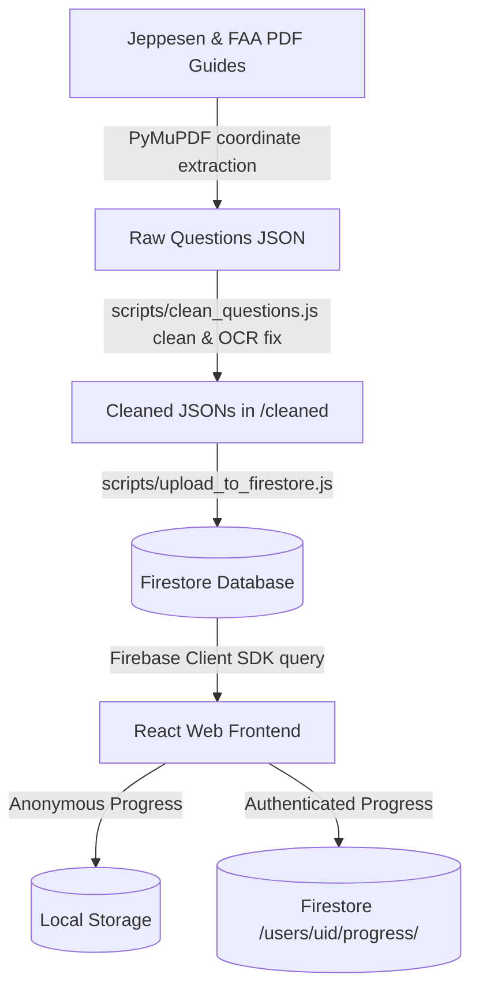

### OCR Correction Strategy
The extraction pipeline uses a mapping table in `scripts/clean_questions.js` (`OCR_FIXES`) to correct frequent scanner errors resulting from bad PDF reads:
- Corrects `l` (lowercase L) misread as `1` (e.g., `Airp1ane` $\to$ `Airplane`, `tl1e` $\to$ `the`, `weatl1er` $\to$ `weather`).
- Fixes compound OCR artifacts (e.g., `v;eather` $\to$ `weather`, `Ma~imun1` $\to$ `Maximum`).
- Truncates question bleed by stopping explanations whenever a pattern matching a new question code (like `\s{2,}\d+-\d+\s+PLT\d+`) is detected.

## 6️⃣ Limitations & Constraints
- **IR PDF Fallback:** There is no dedicated Instrument Rating PDF in the repository. Currently, `extract_ir.py` falls back to the Commercial Airmen Test Guide, meaning CPL and IR question banks are largely duplicate. To fix this, `Instrument Airmen Knowledge Test Guide.pdf` must be added and parsed.
- **Service Account Key Dependency:** Seeding and migration tools depend on a hardcoded file path to `faa-test-guide-v2-firebase-adminsdk-fbsvc-c82363f3e7.json` in the root directory. If this key is missing, seeding will fail.
- **Firebase Rule Expiration Warning:** The default wildcard write rule expired on `2026-05-14`. The app now relies fully on structured collection-level rules. Any custom collections created will be rejected unless added explicitly in `firestore.rules`.

================================================================================
### PROJECT: FEASIBILTY STUDY
File Path Source: C:\Users\Mi5a\.gemini\config\skills\feasibility-study\SKILL.md
================================================================================

# Feasibility Study Platform (TAQA Madinat Zayed Facilities)

## 1️⃣ Purpose & Scope
This project is an interactive feasibility study platform designed for **TAQA Distribution (TQD)** by **Dar Al Khalij Engineering Consultancy LLC (DEC)**. Its main goal is to evaluate and compare two development pathways for the aging Madinat Zayed facilities:
- **Option 1: Comprehensive Refurbishment (The "Band-Aid")**: A high-risk, invasive, and costly attempt to rehabilitate the 30-year-old structures, which suffer from a documentation vacuum (no as-built drawings) and fail to meet modern Abu Dhabi Civil Defense (ADCD) and Department of Transport (DOT) parking regulations.
- **Option 2: Demolition & Reconstruction (The "Clean Slate")**: A predictable, value-driven new build that unifies scattered buildings, expands occupancy capacity from 150 to 250, ensures native ADCD and UAE building code compliance, achieves Department of Energy (DOE) sustainability targets, and guarantees a 50+ year asset lifespan.

The platform provides:
1. **Interactive Commercial Dashboard (`commercial`)**: Allows real-time modeling of design fees, refurbishment sunk costs, and site supervision staffing rates, demonstrating that Option 1 is a sunk-cost fallacy.
2. **Polished Executive Presentation (`presentation`)**: A single-page scroll-guided presentation built with Framer Motion, detailing the technical dilemmas, technical scorecards, financials, and the consultant's final verdict.
3. **Voice Transcripts & Resources**: Original source voice messages and Whisper-based Python transcribing scripts summarizing site assessments and client requirements.

## 2️⃣ Technology Stack & Dependencies
- **Core Languages**: TypeScript, Python (transcribing scripts), HTML/CSS.
- **Frontend Frameworks & Libraries**:
  - React 19.2.4
  - Next.js 16.2.7 (App Router)
  - Framer Motion 12.40.0 (for smooth UI animations and page transitions)
  - Lucide React 1.17.0 (for standard UI vector icons)
- **Styling**: Tailwind CSS v4 (configured with `@tailwindcss/postcss`)
- **Transcription**: Python 3.x, OpenAI API (Whisper) for audio translation.
- **State Management & Persistence**: Client-side state persistence using browser `localStorage` (active presets, selected phases, cost inputs).
- **Database/Storage**: None (static files & local storage calculations).

## 3️⃣ Project Structure & Key Files
### Folder Hierarchy Overview
```
feasibility-study/
├── commercial/             # Next.js interactive cost modeling app
│   ├── src/
│   │   ├── app/            # Layout, CSS, and main page entry
│   │   └── components/     # Cost modeling components (supervision matrix, charts)
│   └── package.json
├── presentation/           # Next.js polished executive presentation app
│   ├── src/
│   │   ├── app/            # Main single-page scroll entry
│   │   └── components/     # UI components (DEC logo)
│   └── package.json
├── transcribe.py           # Audio transcription script using Whisper API
├── transcripts.txt         # Transcribed voice memo notes and assessments
└── *.pdf                   # Site visit reports, BOQ and EOI source documents
```

### Key Source Files & Responsibilities
| File Path | Purpose / Description | Key Symbols (Classes, Functions, Constants) |
| --- | --- | --- |
| `commercial/src/app/page.tsx` | Main coordinator page for the commercial cost calculator. Coordinates state variables for design fees, refurbishment costs, and active supervision staffing. | `Home` (main component) |
| `commercial/src/components/SupervisionMatrix.tsx` | Interactive matrix of 14 supervision roles, rates, duration, and allocations. Supports custom adjustments and preset loading. | `SupervisionMatrix`, `DEFAULT_ROLES` (RoleData array), `PRESET_SCENARIOS`, `copyCSVToClipboard` |
| `commercial/src/components/RefurbishmentFees.tsx` | Breakdown panel of Option 1 (Refurbishment) costs, dividing them into sunk/preliminary costs vs actual design value. | `RefurbishmentFees`, `INITIAL_SECTIONS` |
| `commercial/src/components/DesignFees.tsx` | Input panel for Option 2 (New Build) design fees calculation based on Built-Up Area (BUA) and rate per sqm. | `DesignFees` |
| `commercial/src/components/CostComparisonChart.tsx` | Visual chart comparing Pathway 1 vs Pathway 2 using stacked segments. Highlights the financial delta and savings. | `CostComparisonChart` |
| `commercial/src/components/SummaryCards.tsx` | Top bento grid highlighting total design costs, risk assessment, total supervision costs, and the value-add ratio. | `SummaryCards`, `AnimatedNumber` |
| `presentation/src/app/page.tsx` | Single-page scroll-guided presentation container including Overview, Summary, Dilemma, Pathways, Scorecard, and Verdict. | `Presentation`, `scrollTo` |
| `transcribe.py` | Python script that uses OpenAI's Whisper model to transcribe voice messages. | `transcribe_audio` |

## 4️⃣ Setup, Commands & Scripts
### 1. Web Applications (Commercial & Presentation)
Both `commercial` and `presentation` are Next.js projects and share the same commands.

**Installation**:
Run this command from inside the `commercial/` or `presentation/` subdirectory:
```powershell
npm install
```

**Running locally**:
To start the Next.js development server:
```powershell
npm run dev
```
- Commercial application will host on [http://localhost:3000](http://localhost:3000) (or next available port).
- Presentation application can be launched similarly on a secondary port.

**Building for Production**:
```powershell
npm run build
```

**Linting**:
```powershell
npm run lint
```

### 2. Transcription Utility
**Installation**:
Ensure Python 3.x is installed and install dependency:
```powershell
pip install openai
```
**Environment Configuration**:
Set up your OpenAI API key in your system environment:
- Windows (PowerShell): `$env:OPENAI_API_KEY="your-api-key"`
- Windows (CMD): `set OPENAI_API_KEY="your-api-key"`

**Execution**:
Run the script to transcribe local audio recordings (e.g. `.mp3`, `.wav`):
```powershell
python transcribe.py
```

## 5️⃣ Architecture & Key Workflows
### High-Level Architectural Flow
The user interacts entirely with Next.js SPA clients. Cost calculations are triggered in-memory, updating state down the component tree.
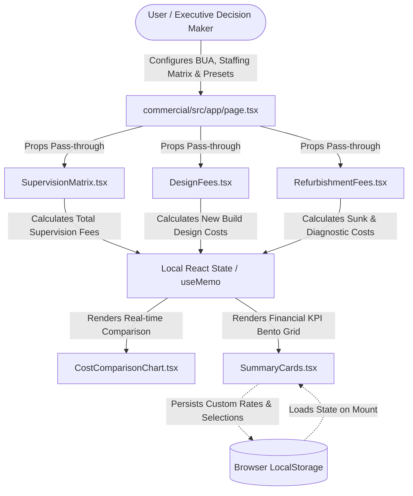

### Key Workflows
1. **Financial Pathway Comparison**:
   - The user inputs Built-Up Area (BUA) and base design rates under Option 2.
   - Refurbishment costs are adjusted to show "sunk costs" (forensic concrete diagnostics, etc.).
   - The tool compares Option 1 total vs. Option 2 total, demonstrating the cost-savings delta.
2. **Site Supervision Staffing Matrix**:
   - The user selects presets (Standard, Fast-Track, Complex) to dynamically adjust duration and allocations for 14 staff members.
   - The user can adjust individual parameters, which flags the scenario state as "custom".
   - The user exports the structured table data as CSV to the clipboard.

## 6️⃣ Limitations & Constraints
- **Client-Side Storage**: All cost modifications and matrix updates rely on browser `localStorage` and client-side React states. Changes do not persist to a database or sync across multiple sessions.
- **Specific Regulatory Alignment**: Calculations are customized to Dubai/Abu Dhabi policies (e.g., ADCD life-safety compliance, Estidama Pearl certifications, Department of Transport parking requirements).
- **Next.js Version Constraints**: Built with Next.js v16.2.7, which contains dependencies on React 19 features. Upgrading or modifying dependencies should be done with care due to newer router conventions.

================================================================================
### PROJECT: GAMENEG BRAND
File Path Source: C:\Users\Mi5a\.gemini\config\skills\gameneg-brand\SKILL.md
================================================================================

# GΛMÉN Premium Storefront

## 1️⃣ Purpose & Scope
- **Concept:** GΛMÉN Premium Storefront is an interactive luxury retail storefront built for presenting hand-carved wooden bow ties and custom wooden timepieces.
- **Key Audience:** Customers looking for high-end, modern, and sustainably sourced wooden accessories.
- **Core Features:**
  - **3D Product Visualizer:** Displays custom-designed accessories using interactive 3D model previews or 360-degree floating animations.
  - **Dynamic Unboxing Sequence:** Preloaded sequence player displaying a box opening from a sealed container to reveal the accessory using spring-based emergence transitions.
  - **Shared Database Isolation:** Implements collection namespacing to share a single Firebase project safely with other applications (e.g., Strike Gym CRM).
  - **Admin Dashboard:** Enables CRUD operations on products catalog, newsletter campaigns, and customer order management.
  - **Real-Time Telemetry:** Monitors storefront navigation events, user traffic, and geographical stats.

## 2️⃣ Technology Stack & Dependencies
- **Frontend Core:** React 19, TypeScript, React Router Dom (v7), Tailwind CSS v4, Motion (Framer Motion), Lucide Icons.
- **3D Rendering Stack:** Three.js, React Three Fiber (R3F), `@react-three/drei`, `@react-three/postprocessing`.
- **Backend Services:** Firebase Firestore, Firebase Authentication, Firebase Storage, Firebase Trigger Email Extension.
- **Image Processing / Utilities:** Python (Pillow, Rembg library).
- **Hosting / Deploy Core:** Nginx, Docker.

## 3️⃣ Project Structure & Key Files

### Project Folder Hierarchy
```
C:\Users\Mi5a\GamenEG-Brand/
├── src/
│   ├── components/
│   │   ├── canvas/          # Three.js R3F Canvas and Shaders
│   │   └── ...              # UI Layout Components (Navbar, Unboxing, Cart)
│   ├── context/             # Global Providers (Auth, Cart, Products)
│   ├── pages/               # Pages & Admin Sub-folders
│   └── lib/                 # Core Integration Client Hooks & APIs
├── public/                  # Static assets (images, unboxing frames)
├── firestore.rules          # Security bounds
├── sync-rules.cjs           # Cross-project rules synchronization utility
├── bg_remove.py             # BFS flood-fill background isolation script
├── remove_bg.py             # rembg automated background remover
└── vite.config.ts           # Bundler config
```

### Key Source Files & Responsibilities
| File Path | Purpose / Description | Key Symbols (Classes, Functions, Constants) |
| --- | --- | --- |
| `src/lib/firebase.ts` | Configures and exports Firebase instance modules. | `db`, `auth`, `storage` |
| `src/lib/firestore.ts` | Handles all query calls to namespaced Firestore collections. | `saveOrder`, `getProducts`, `subscribeToNewsletter`, `logTrafficEvent` |
| `src/context/CartContext.tsx` | Manages shopping cart state, persistence in localStorage, and coupons. | `CartProvider`, `useCart`, `addItem`, `applyCoupon` |
| `src/context/ProductsContext.tsx` | Provides storefront catalog, falling back to local static data on DB error. | `ProductsProvider`, `useProductsContext`, `getProductBySlug` |
| `src/context/AdminAuthContext.tsx` | Handles authentication, restricting admin actions to verified email domains. | `AdminAuthProvider`, `useAdminAuth`, `login`, `isAdmin` |
| `src/components/UnboxingExperience.tsx` | Manages frame preloader sequence and hover-to-zoom emergent product views. | `UnboxingExperience`, `FRAMES`, `productVariants` |
| `src/components/canvas/BowTieModel.tsx` | Procedural math mesh generator creating 3D geometries, materials, and explode transforms. | `BowTieModel`, `createLeftWingGeometry`, `engravedWoodMaterial` |
| `src/components/canvas/BowTieElement.tsx` | Animation controller binding scroll state to 3D rotation and floating animations. | `BowTieElement` |
| `src/components/canvas/OptimizedCanvas.tsx` | Thin wrapper around Canvas pausing context when offscreen to conserve GPU resources. | `OptimizedCanvas` |
| `src/components/canvas/CinematicEffects.tsx` | Applies post-processing bloom glow and vignette shading to the WebGL context. | `CinematicEffects` |
| `firestore.rules` | Security rules checking payload schemas and enforcing data namespaces. | `isAdmin()`, `gamen_orders`, `gamen_products`, `gamen_mail` |
| `sync-rules.cjs` | Automatically detects and copies the newest `firestore.rules` across local projects. | `projectDefinitions`, `resolveProjectDir`, `main` |
| `bg_remove.py` | Python script to strip white background from images using BFS flood-fill. | `build_alpha_mask`, `bfs_component`, `remove_background` |
| `remove_bg.py` | Python script to extract high-quality assets using the `rembg` library. | `images_to_process` |

## 4️⃣ Setup, Commands & Scripts
- **Installation:**
  ```bash
  npm install
  ```
- **Running Locally:**
  ```bash
  npm run dev
  ```
- **Building Project:**
  ```bash
  npm run build
  ```
- **Deploying Storefront (GitHub Pages):**
  ```bash
  npm run deploy
  ```
- **Deploying Firestore Rules Only:**
  ```bash
  firebase deploy --only firestore:rules
  ```
- **Running Firestore Rules Sync:**
  ```bash
  node sync-rules.cjs
  ```
- **Running Python Background Cleaners:**
  ```bash
  pip install Pillow rembg
  python bg_remove.py
  python remove_bg.py
  ```

- **Environmental Configuration:**
  Configured via `.env.local` / `.env` variables:
  - `GEMINI_API_KEY`: API authentication key for Gemini queries.
  - `APP_URL`: The domain location where the storefront is hosted.
  - `VITE_PAYMOB_API_KEY`: Secret API key for Paymob card payment processing.
  - `VITE_PAYMOB_INTEGRATION_ID`: Integration identifier for card checkouts.
  - `VITE_PAYMOB_IFRAME_ID`: Webpage frame ID for Paymob.
  - `VITE_PAYMOB_USE_MOCK`: Set to `"true"` to enable client-side sandbox payment simulation.

## 5️⃣ Architecture & Key Workflows
- **Namespaced Collection Prefixing:** 
  To safely share the single Firebase Project (`faa-test-guide-v2`) with Strike CRM, the codebase prefixes all Firestore collections:
  - Products -> `gamen_products`
  - Orders -> `gamen_orders`
  - Mail Queue -> `gamen_mail`
  - Subscriptions -> `gamen_subscribers`
  - Telemetry logs -> `gamen_traffic`
- **Telemetry Flow:** 
  The client fires `logTrafficEvent()` on page routes and custom actions. It fetches the user's geo-location details from `ipapi.co/json` (with Egyptian cities as standard fallbacks if rate-limited) and logs the entry to `gamen_traffic`.
- **Preloading Pipeline:** 
  To eliminate white frame flicker, both the 16 unboxing sequence images (`FRAMES`) and the target product's high-res image are loaded simultaneously via JavaScript `Image` object listeners before the emergence animation is triggered.
- **Procedural 3D Mesh Generation:**
  Instead of heavy static glTF files, `BowTieModel.tsx` generates left/right wings and knot geometry dynamically at runtime utilizing parametric mathematical calculations, reducing loading payloads significantly.

## 6️⃣ Limitations & Constraints
- **Database Rules Sync:** The `sync-rules.cjs` script operates with hardcoded absolute directories configured specifically for the developer's computer. It will bypass syncing if these directories do not exist.
- **Admin Authentication Gate:** Administrative access and dashboard credentials are hardcoded to match authenticated emails: `michaelmitry13@gmail.com` or `admin@gamen.eg`.
- **API Geolocation Dependency:** Storefront visitor mapping relies on `https://ipapi.co/json/`. If the lookup is rate-limited, the system defaults to Egyptian cities.

================================================================================
### PROJECT: GAMENEG-BRAND
File Path Source: C:\Users\Mi5a\.gemini\config\skills\gameneg-brand-folder\SKILL.md
================================================================================

# GAMÉN Luxury Brand Landing Page

## 1️⃣ Purpose & Scope
- **GAMÉN** (L'élégance taillée en bois) is a luxury brand landing page designed to showcase hand-crafted, high-end wooden bow ties with elegant Egyptian-themed brass monograms and centerpieces.
- The project serves as an immersive, highly interactive product experience web application, utilizing advanced web animations and synchronized ambient sound design to engage users.
- Core features include:
  - **Loading Overlay**: An elegant 2.5-second brand introduction screen before displaying the landing page.
  - **Interactive Atelier**: A 3D-tilting customization section where users can preview different brass centerpiece designs (GAMÉN Signature, Pharaoh Seal, Eye of Horus) mounted on a premium wooden bowtie.
  - **Timeline-based Origin Story**: A scroll-synced walkthrough showing the selection, carving, and polishing stages of production accompanied by immersive audio effects.
  - **Horizontal-Scrolling Showcase**: A sideways scroll flow presenting the collection models.
  - **Precision Deconstruction**: A deconstructed 3D layer explosion separating the bowtie into its core components (wood grain body, brass centerpiece emblem, and signature logo marker) with parallax descriptions.
  - **Interactive Unboxing Ritual**: A 3D unboxing animation where scrolling slides off the packaging ribbon, lifts and rotates the lid, and raises the product container.
  - **Acquisition Catalog**: An e-commerce grid displaying product specifications, custom category filters, pricing, and purchase interactions.

## 2️⃣ Technology Stack & Dependencies
- **Core Languages**: TypeScript (React application logic), Python (asset preprocessing).
- **Frontend Framework & Tooling**:
  - **React 19**: Rendering library for component state, hooks, and lifecycle management.
  - **Vite 6**: Rapid development server and bundling engine.
- **Styling**:
  - **Tailwind CSS v4**: Utility-first CSS using the new CSS-native configuration style (`@theme` variables for warm cream, deep walnut, champagne gold, espresso, taupe, etc.).
- **Animations**:
  - **motion/react** (formerly Framer Motion): Physics-based springs, 3D rotations, and scroll-linked viewport transitions.
- **Iconography**:
  - **lucide-react**: Clean, stroke-customized icons for navigation and actions.
- **Audio Integration**: Native HTML5 Audio API linked to scroll transitions.
- **Python Utilities**:
  - **Pillow (PIL)**: Used by preprocessing scripts for computer-vision-based background subtraction, edge feathering, and color analysis.

## 3️⃣ Project Structure & Key Files
The source code is structured as follows:
- **`Images/`**: Contains raw JPEG assets and processed transparent PNGs.
- **`src/components/`**: Modular presentation and interaction components.
- **`src/`**: Entrypoints, styles, and shared configuration.

| File Path | Purpose / Description | Key Symbols (Classes, Functions, Constants) |
| --- | --- | --- |
| `src/main.tsx` | Standard React application entry point. | `createRoot` |
| `src/App.tsx` | Root component managing the global loading state, scroll tracking, and structural layout. | `App` |
| `src/brandAssets.ts` | Central directory importing and organizing processed asset paths. | `brandAssets` |
| `src/index.css` | Global styles importing Tailwind, specifying Baskerville/Inter font families, custom theme tokens, and animations like light sweeps. | `@theme`, `.animate-light-sweep` |
| `src/components/ScrollProgress.tsx` | Renders a fixed top bar showing visual scroll completion on the page. | `ScrollProgress` |
| `src/components/Navbar.tsx` | Dynamic header that shifts colors and applies backdrop filters as the user scrolls. | `Navbar` |
| `src/components/LoadingScreen.tsx` | Displays a synchronized introductory logo and animation for 2.5 seconds. | `LoadingScreen` |
| `src/components/HeroSection.tsx` | Features full-screen title cards and a mouse-responsive 3D-tilting central product badge. | `HeroSection` |
| `src/components/AtelierExperience.tsx` | Allows interactive switching between models with cursor-tracking 3D tilt adjustments. | `AtelierExperience`, `pieces` |
| `src/components/OriginSection.tsx` | Implements scroll-triggered text-transitions and synchronized audio clips for the crafting steps. | `OriginSection`, `steps` |
| `src/components/CollectionsSection.tsx` | Standardizes a horizontal scroll-track using coordinate translation. | `CollectionsSection`, `collections` |
| `src/components/DetailsSection.tsx` | Coordinates a multi-layer exploded animation breaking down wood grain, emblem, and signature logo layers. | `DetailsSection` |
| `src/components/HeritageSection.tsx` | Provides narrative context on the cultural themes (Pharaoh Seal, Eye of Horus). | `HeritageSection`, `symbols` |
| `src/components/RitualSection.tsx` | Handles ribbon translation, lid rotation, and container elevation during unboxing. | `RitualSection`, `glints` |
| `src/components/AcquisitionSection.tsx` | Shows the product inventory grid with interactive hover buttons and pricing cards. | `AcquisitionSection`, `products` |
| `src/components/BrandWordmark.tsx` | Standardized brand text rendering featuring a custom lambda monogram `GΛMÉN`. | `BrandWordmark` |
| `bg_remove.py` | Command-line tool using PIL to flood-fill background pixels and find enclosed cavities for bow-tie transparency processing. | `build_alpha_mask`, `remove_background`, `bfs_component` |
| `inspect_pixels.py` | Developer diagnostic helper to scan image color ranges and optimize background removal thresholds. | Center strip scans, narrow bridge scans |

## 4️⃣ Setup, Commands & Scripts
### Installation
1. Install Node.js dependencies:
   ```bash
   npm install
   ```
2. (Optional) Install Python image processing dependencies:
   ```bash
   pip install Pillow
   ```

### Running Locally
- Run the local Vite dev server (binds on port 3000):
  ```bash
  npm run dev
  ```
- Build the project for production:
  ```bash
  npm run build
  ```
- Preview the production build:
  ```bash
  npm run preview
  ```

### Developer Scripts
- Clear build files and temporary configurations:
  ```bash
  npm run clean
  ```
- Typecheck TypeScript code:
  ```bash
  npm run lint
  ```
- Run image background removal script:
  ```bash
  python bg_remove.py
  ```

### Environmental Configuration
Configure variables in a `.env.local` file (modeled from `.env.example`):
- `GEMINI_API_KEY`: API credentials required for integrations with Google Gemini models.
- `APP_URL`: Target URL where the app is hosted (used for relative links, OAuth callbacks, and backend proxies).
- `DISABLE_HMR`: If set to `true`, halts hot-reloads and file-watching loops (used to conserve CPU cycles inside cloud IDE frames).

## 5️⃣ Architecture & Key Workflows
### Mouse/Cursor Tracking Workflow
For elements that tilt dynamically as the mouse moves:
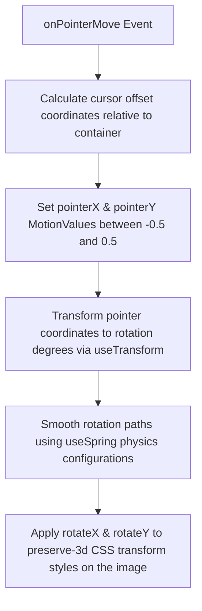

### Unboxing Animation Workflow
Scrolling progress changes values which trigger transitions in the box packaging:
- **`0.08` to `0.32`**: Ribbon shifts vertical coordinates and fades out.
- **`0.18` to `0.52`**: Lid lifts upward along the Y-axis and rotates back on the X-axis.
- **`0.34` to `0.85`**: Product expands inside the box and shifts coordinates to the center.
- **`0.72` to `0.90`**: Call-to-action text overlay fades into view.

### Sound FX Playback Loop
- Sound is initialized globally but remains muted until user engagement (click/hover) flags browser autoplay compliance.
- The `useMotionValueEvent` hook listens to scroll markers:
  - Scroll position between `0.2` and `0.5` triggers chisel loop.
  - Scroll position between `0.5` and `0.8` triggers sanding/polishing loop.
  - Crossing `0.25` on unboxing triggers lid-release audio once.

## 6️⃣ Limitations & Constraints
- **Autoplay Restriction**: Audio clips require an initial user click or hover to gain playback permissions in modern web browsers.
- **Hardware Acceleration**: Heavy 3D rotations, opacity transforms, and parallax scroll handlers require modern GPU rendering; low-end mobile devices might notice stuttering or frame rate drops.
- **HMR Blocking**: Watchers and hot module replacement options will be inactive if the container environment overrides default properties with `DISABLE_HMR=true`.

================================================================================
### PROJECT: GOOFY-FRANKLIN
File Path Source: C:\Users\Mi5a\.gemini\config\skills\goofy-franklin\SKILL.md
================================================================================

# Goofy Franklin

## 1️⃣ Purpose & Scope
- **Overview**: goofy-franklin is a newly initialized, empty Git repository workspace. It serves as a blank template or starting directory for future development tasks.
- **Core Features**:
  - Initialized with Git version control (initial commit `0633bd0`).
  - Clean state ready for codebase scaffolding.

## 2️⃣ Technology Stack & Dependencies
- **Core Languages**: None (workspace is currently empty).
- **Frameworks & Libraries**: None.
- **Development Tools**: Git (version control).
- **Database / Storage**: None.

## 3️⃣ Project Structure & Key Files
The directory structure currently contains only Git metadata:
```
goofy-franklin/
└── .git/
```

| File Path | Purpose / Description | Key Symbols (Classes, Functions, Constants) |
| --- | --- | --- |
| None | The workspace does not contain any code files yet. | N/A |

## 4️⃣ Setup, Commands & Scripts
- **Installation**: N/A (no dependencies configured yet).
- **Running locally**: N/A.
- **Testing**: N/A.
- **Environmental Configuration**: No environment variables or configuration files are required.

## 5️⃣ Architecture & Key Workflows
- **High-level Design**: There is no active architecture or data flow, as the workspace contains no code files or scripts.
- **Workflow**: Developers can clone/open this repository and begin scaffolding the codebase from scratch.

## 6️⃣ Limitations & Constraints
- The repository is completely empty, containing only a `.git` folder and an empty initial commit.
- No development stack, build files, or architecture is currently configured.

================================================================================
### PROJECT: INZAN-ATHLETICS-PLATFORM
File Path Source: C:\Users\Mi5a\.gemini\config\skills\inzan-athletics-platform\SKILL.md
================================================================================

# INZAN Athletics Platform

## 1️⃣ Purpose & Scope
- **Overview:** INZAN Athletics Platform is an elite, high-performance fitness management platform designed and developed by Michael Mitry. It provides integrated, role-based portals for gym members, trainers, nutritionists, kitchen staff, and administrators under a premium design system featuring glassmorphism and ambient glow effects.
- **Core Portals & Features:**
  - **User App (`/`):** A mobile-first member interface featuring an AI Recovery Coach (analyzing heart rate and strain), class scheduling, pre/post workout meal ordering, a wearable device metric tracker ("The Zone"), and a gamified "Athletic Passport" badge system. Includes a mandatory legal liability waiver gate.
  - **Admin Hub (`/admin`):** A desktop-first command center containing an IoT facility zone controller (temperature, light, audio), a predictive retention engine flagging at-risk members, class attendance forecasts, scatter-plots comparing coach performance, and auto-ordering kitchen inventory alerts.
  - **Coach App:** A specialized dashboard for trainers to track upcoming meetings, schedule 1-on-1 and trial sessions, review client profiles, and view earnings.
  - **Nutritionist App:** A portal for nutritionists to compute body fat, BMI, and muscle mass, draft custom meal plans, set daily calorie/macro targets, and schedule consultations.
  - **Kitchen Display System (KDS):** A real-time, tablet-optimized order ticketing board enabling kitchen staff to track pending receipts and update preparation status.
  - **Membership & Billing:** Integrated Stripe billing portal featuring Standard, Premium, and Elite membership tiers.

## 2️⃣ Technology Stack & Dependencies
- **Core Languages:** TypeScript, JavaScript, HTML, CSS.
- **Frontend Stack:** React 19, Vite 6, and React Router v7.
- **Styling & Animations:** Tailwind CSS v4, Lucide React icons, and Motion (Framer Motion).
- **Charts:** Recharts (Scatter plots, area charts, heatmaps).
- **Database & Services:** Firebase (Auth & Firestore) as the main backend, with Supabase Deno Edge Functions utilized for automated email receipts, push notifications, hourly reminders, and Stripe webhooks.
- **Payments:** Stripe JS integration for checkout flows.
- **AI Integrations:** Google Gemini SDK (`@google/genai`) for recovery and attendance insights.
- **Testing & Tools:** Vitest unit test runner, Happy DOM / JSDom environment, and better-sqlite3.

## 3️⃣ Project Structure & Key Files
### Directory Hierarchy
- **`/src/components/`**: Modular components grouped by role (`admin`, `coach`, `nutritionist`, `user`, `shared`, `common`).
- **`/src/context/`**: Global states (`AuthContext`, `FitnessContext`, `KitchenContext`, `AdminContext`, `DataContext`, `BrandingContext`).
- **`/src/lib/`**: External services (`firebase.ts`, `stripe.ts`, `NotificationService.ts`).
- **`/src/pages/`**: Main entry portals representing different applications/routing segments.
- **`/src/utils/`**: Utilities including translation (`i18n.ts`), wearable sync simulation, and calendar event exports.
- **`/supabase/`**: Edge functions hosted inside a local Supabase workspace structure.
- **`/design-system/`**: Master design language markdown rules.

### Key Source Files & Responsibilities
| File Path | Purpose / Description | Key Symbols (Classes, Functions, Constants) |
| --- | --- | --- |
| `src/lib/firebase.ts` | Custom Firestore compatibility shim translating Supabase query syntax to Firestore operations. | `FirestoreQueryBuilder`, `firebase`, `supabase` (alias) |
| `src/context/DataContext.tsx` | Main state coordinator linking Auth, Fitness, Kitchen, and Admin sub-contexts. | `DataProvider`, `useData`, `DataContextType` |
| `src/context/AuthContext.tsx` | Auth state tracker. Forces immune admin role for `michaelmitry13@gmail.com`. | `AuthProvider`, `useAuth`, `mapProfileToMember` |
| `src/context/FitnessContext.tsx` | Coordinates classes, bookings, attendance logs, freeze requests, and PT packages. | `FitnessProvider`, `useFitness`, `bookClass`, `renewMembership` |
| `src/context/KitchenContext.tsx` | Manages food/drink inventory items and member kitchen order records. | `KitchenProvider`, `useKitchen`, `placeOrder` |
| `src/context/AdminContext.tsx` | Coordinates settings, transactions, facility health zones, and maintenance logging. | `AdminProvider`, `useAdmin`, `updateSettings` |
| `src/pages/UserApp.tsx` | Bounded member dashboard with bottom navigation, simulated mobile view, and waiver gate. | `UserApp`, `handleSignWaiver` |
| `src/pages/AdminHub.tsx` | Admin desktop sidebar layout which lazy-loads distinct view blocks. | `AdminHub`, `handleCreateEntity` |
| `src/pages/CoachApp.tsx` | Portal for coaches to manage schedules, sessions, and earnings. | `CoachApp`, `renderContent` |
| `src/pages/NutritionistApp.tsx` | Portal for nutritionists to manage assessments and meal plans. | `NutritionistApp` |
| `src/pages/KDSApp.tsx` | Kitchen Display System managing ticket queues and status transitions. | `KDSApp`, `activeOrders` |
| `src/utils/WearableIntegrationManager.ts` | Simulated health sync connector (Garmin, Whoop, Apple, Oura). | `WearableIntegrationManager`, `fetchLatestData` |
| `src/utils/CalendarSyncApi.ts` | Generates and exports `.ics` calendar files for appointments. | `generateIcsContent`, `downloadIcsFile` |
| `seed_platform.ts` | Bootstrapping seed script for default profiles, classes, inventory, and goals. | `SEED_DATA`, `seed` |

## 4️⃣ Setup, Commands & Scripts
- **Installation:**
  ```bash
  npm install
  ```
- **Running Locally:**
  ```bash
  npm run dev
  ```
- **Build Production Bundle:**
  ```bash
  npm run build
  ```
- **Type Checking & Linting:**
  ```bash
  npm run lint
  ```
- **Testing:**
  ```bash
  npm run test
  ```
- **Deploying to Surge:**
  ```bash
  npm run deploy
  ```
- **Manual Scanning:**
  ```bash
  npm run manual:update
  ```
- **Environmental Configuration (`.env`):**
  - `VITE_FIREBASE_API_KEY`: API key for Firebase console.
  - `VITE_FIREBASE_AUTH_DOMAIN`: Project authorization domain.
  - `VITE_FIREBASE_PROJECT_ID`: Identifier for Firebase project.
  - `VITE_FIREBASE_STORAGE_BUCKET`: URL of the storage bucket.
  - `VITE_FIREBASE_MESSAGING_SENDER_ID`: Sender identifier.
  - `VITE_FIREBASE_APP_ID`: Web app registration identifier.
  - `VITE_FIREBASE_MEASUREMENT_ID`: Google Analytics tracking ID.
  - `GEMINI_API_KEY` *(Optional)*: Access token for Google Gemini AI features.
  - `APP_URL` *(Optional)*: Base URL for verification links.

## 5️⃣ Architecture & Key Workflows
- **Workflow 1: Routing and Role Segregation:**
  When a user logs in, `AuthContext` retrieves their role metadata from their profile database record. In `App.tsx`, a `ProtectedRoute` intercepts navigation and routes users according to their permissions: admins to `/admin`, coaches to the Coach App, nutritionists to the Nutritionist App, pending registrations to `PendingApprovalPage`, and members to the simulated mobile `UserApp` dashboard.
- **Workflow 2: The Firebase-Supabase Compatibility Shim:**
  To reduce code changes during migration, a custom query builder (`FirestoreQueryBuilder` in `firebase.ts`) acts as an adapter. It exposes fluent chain methods like `.from()`, `.select()`, `.eq()`, `.match()`, and `.update()` that look like Supabase SQL queries but map internally to Firebase Firestore documents and collections.
- **Workflow 3: Membership Checkout and Webhooks:**
  When a user selects a membership tier (Standard, Premium, Elite), the frontend initializes a Stripe checkout session. Once completed, a Stripe webhook redirects to a Supabase Edge Function (`stripe-webhook`) or redirect route, updating the user's `membership_status` to `"active"` and updating their profile `membership_tier` in the database.
- **Workflow 4: Offline PWA Service Worker:**
  `index.html` registers a service worker (`sw.js`). PWA manifest features configured in `manifest.json` configure offline caching patterns, app icons, theme colors, and loading configurations.

## 6️⃣ Limitations & Constraints
- **UI Bounds:** The member portal (`UserApp`) is constrained to a `max-w-md` container to simulate a mobile app on desktop monitors. Scaling behavior might degrade outside expected resolution thresholds.
- **Shim Limitations:** The Firebase-Supabase shim translates queries naively. Complex SQL joins, relational operators, or trigger-based realtime events are not natively supported and must be custom-shimmed or handled client-side.
- **Immune Owner Entity:** The developer's identity (`michaelmitry13@gmail.com`) is protected by hardcoded immunities in `AuthContext` and `FitnessContext` to prevent deletion or administrative role updates.

================================================================================
### PROJECT: INZANLOCKERBOOTSTRAP
File Path Source: C:\Users\Mi5a\.gemini\config\skills\inzanlockerbootstrap\SKILL.md
================================================================================

# Inzan Locker Bootstrap Middleware

## 1️⃣ Purpose & Scope
- **Overview**: A middleware bridge connecting gym member smartphones (via cellular LTE/5G data) and kiosk terminal scanners to physical lockers room doors. It resolves alphanumeric naming schemes and eliminates standard username/password logins for gym members.
- **Problem Solved**: Bypasses gym firewall restrictions for incoming mobile requests by tunneling MQTT payloads over a secure outbound connection, preventing relay solenoid burnouts, and automating locker occupancy management.
- **Core Features**:
  - **Zero-Login PWA Client**: Enables immediate locker interaction and automatic credentials caching via `localStorage`.
  - **Reception Desk Panel**: Administrative UI console for monitoring, manual locker assignment/release, maintenance switches, and runtime configuration overrides.
  - **Auto-Pulsing Solenoid Guard**: Prevents coil burnout by automatically turning Home Assistant switch relays OFF 2 seconds after triggering them ON.
  - **Check-out Integration**: Automatically vacates locker occupancy via integrations like turnstile checkouts.
  - **Apple Wallet Pass Integration**: Signs and generates official Apple Wallet pass files (`.pkpass`) containing a QR code message of the assignment token.
  - **Secure Outbound SSH Tunneling**: Establishes local-to-cloud connections dynamically through Pinggy/Bore proxies.

## 2️⃣ Technology Stack & Dependencies
- **Core Languages**: Node.js (JavaScript), Python (terminal scanner emulator), Bash / Windows Batch scripts.
- **Backend & Libraries**: Express (web framework), CORS, dotenv, SQLite3 (storage adapter), MQTT (broker client), passkit-generator (Apple Pass compiler), bcryptjs, and jsonwebtoken (JWT).
- **Frontend & Assets**: HTML5, CSS, vanilla JavaScript, and `html5-qrcode` library for real-time camera scanning.
- **Database / Cache**: SQLite (`lockers.db` file) with tables for locker configuration, member directories, session logs, and settings overrides. Local client storage (`localStorage`) is used on smartphones to cache session credentials.

## 3️⃣ Project Structure & Key Files
| File Path | Purpose / Description | Key Symbols (Classes, Functions, Constants) |
| --- | --- | --- |
| `server.js` | Express web server containing all client/reception REST API endpoints, geofence validations, rate limit checks, settings hot-reloads, and MQTT client manager. | `config`, `loadSettingsFromDb()`, `connectMQTT()`, `authorizeReception()`, `logAccess()`, `triggerLockerUnlock()`, `getDistance()` |
| `database.js` | Database interface, schema migration checks, table initialization, and mock data/locker configuration seeding. | `dbReady`, `initializeDatabase()`, `createTablesAndSeed()`, `seedLockers()`, `seedMembers()` |
| `lockers_config.json` | Metadata configurations mapping all 68 physical lockers (M1–M34, F1–F34) to their Home Assistant relays, protocols, and initial statuses. | Static JSON configuration array |
| `run_tunnel.js` | Secure tunneling runner script that launches an SSH daemon routing a public Pinggy domain to the local MQTT broker. | `startTunnel()`, `sshProcess` |
| `tunnel_config.json` | JSON configuration parameters containing Pinggy authorization tokens and local broker credentials. | Configuration JSON keys |
| `setup_startup.js` | Dynamic utility creating VBS scripts (Windows Startup Folder) or LaunchAgents (macOS) to run `run_tunnel.js` in the background on system boot. | Plist XML templates, VBScript content |
| `public/index.html` | Gym member PWA dashboard client application containing gender self-service allocation, camera QR scanner, geofenced activation button, and Apple Wallet download interface. | `state`, `initApp()`, `unlockLocker()`, `downloadAppleWalletPass()`, `startCameraScanner()` |
| `public/reception.html` | Reception desk panel to monitor active lockers, issue/release allocations, enable/disable maintenance, generate bypass overrides, and manage MQTT/port settings. | Reception Dashboard frontend scripts |
| `public/terminal.html` | Front desk terminal simulator to scan, allocate, and vacate locker sessions via barcodes/passes. | Terminal scan client scripts |
| `scripts/daily_cleanup.js` | Cron-like cleanup script scheduled daily at 2 AM to vacate and expire active locker assignments. | Database queries and update triggers |
| `scripts/generate-certs.js` | Automation script that uses OpenSSL to generate CA and server keys/certificates for secure SSL/TLS communication. | `checkOpenSSL()`, `generateCertificates()` |
| `scripts/terminal_engine.py` | Python command-line utility to emulate physical barcode scans at the gym kiosk. | `main()`, `UUID_REGEX` |
| `migrations/001_init_gym_locker.sql` | SQL migration file containing initial schema definition queries. | SQL schemas |

## 4️⃣ Setup, Commands & Scripts
- **Installation**:
  ```bash
  npm install
  ```
- **Running Locally**:
  - Launch Express Server (development watch mode):
    ```bash
    npm run dev
    ```
  - Launch Tunnel Client ( Pinggy SSH proxy ):
    ```bash
    node run_tunnel.js
    ```
  - Launch Terminal Scan Simulator (Python stdin reader):
    ```bash
    python scripts/terminal_engine.py
    ```
- **Testing**:
  Runs assertions for databases, auto-vacation hooks, and token generation using Node's native test runner (requires Node v18+):
  ```bash
  node --test
  ```
- **Environmental Configuration**:
  Create a `.env` file containing the following variables:
  - `PORT`: Server listening port (default `3000`).
  - `RECEPTION_PIN`: Security PIN code authorizing administrative desk endpoints (default `1234`).
  - `MQTT_BROKER`: Broker server address (e.g. `mqtt://broker.inzanathletics.com`).
  - `MQTT_PORT`: Connection TCP port of the broker (default `1883`).
  - `MQTT_USER`: MQTT username credential.
  - `MQTT_PASSWORD`: MQTT password credential.
  - `MQTT_TOPIC_TEMPLATE`: Command topic string format (e.g. `gym/lockers/{id}/command`).
  - `BASE_URL`: Public URL of the server (e.g. `https://inzan-locker-middleware-xyz.run.app`).
  - `JWT_SECRET`: Signature secret string for client access tokens.
  - `APPLE_PASS_TYPE_IDENTIFIER`, `APPLE_TEAM_IDENTIFIER`, `APPLE_WWDR_CERT_PATH`, `APPLE_PASS_CERT_PATH`, `APPLE_PASS_KEY_PATH`, `APPLE_PASS_KEY_PASSWORD`: Credentials and files required for signing Apple Wallet passes.
  - `TURNSTILE_API_KEY`: Expected authentication header key validating physical checkout gates.

## 5️⃣ Architecture & Key Workflows
- **High-Level Design**:
  ```
  [Gym Member (5G/LTE PWA)] -> [Google Cloud Run Hosting (Public HTTPS)]
                                                 |
                                                 v
                                       [lockers.db (SQLite)]
                                                 |
                                                 v (MQTT command over TCP Tunnel)
                                    [Pinggy / Bore Secure Proxy]
                                                 |
                                                 v
                                   [Local MQTT Broker (Private IP)]
                                                 |
                                                 v
                                    [Physical Locker Room Relays]
  ```
- **Geofence Proximity Check**:
  Calculates the distance in meters between user GPS coordinates (`lat`, `lon`) and the gym location coordinates (`GYM_LAT = 30.046123, GYM_LON = 31.483873`) using the Haversine formula:
  $$d = 2R \arcsin\left(\sqrt{\sin^2\left(\frac{\Delta \phi}{2}\right) + \cos(\phi_1)\cos(\phi_2)\sin^2\left(\frac{\Delta \lambda}{2}\right)}\right)$$
  If the computed distance exceeds `50` meters, the unlock command is rejected to guarantee physical presence.
- **Coil Burnout Guard**:
  When triggering an `aywana` relay, the backend publishes `"ON"` to the Home Assistant command topic, and schedules a `setTimeout` to publish `"OFF"` exactly 2 seconds later. This prevents drawing continuous high current through the solenoids.
- **Reception Configuration Updates**:
  Staff updating system configurations from `/reception.html` trigger database settings replacement. The server dynamically reloads variables in memory, ends the current MQTT connection socket, and establishes a new client instance without requiring application container restarts.

## 6️⃣ Limitations & Constraints
- **Ephemeral Storage**: SQLite databases are local to the Cloud Run container file system. Scale-downs to zero or service deployments will reset database state to default seeds. For production durability, move settings/allocations to external stores (e.g., Cloud SQL or Firestore).
- **Proximity Requirement**: Members must share browser geolocation coordinates and be within 50m of the gym coordinates to unlock a locker. Front desk administrators can generate temporary 60-second override codes for users with GPS issues.
- **Tunnel Dependency**: If the local tunneling background task is terminated, public cloud requests will fail to reach the local private broker. Ensure the daemon runs continuously via Windows/macOS background service scripts.

================================================================================
### PROJECT: JOYFUL-MENDEL
File Path Source: C:\Users\Mi5a\.gemini\config\skills\joyful-mendel\SKILL.md
================================================================================

# Joyful Mendel

## 1️⃣ Purpose & Scope
Joyful Mendel is a Windows-based utility designed to resolve hardware calibration, offset, and deadzone drift issues for flight simulation hardware. It is built to support flight simulation enthusiasts using:
- **Saitek Pro Flight Yoke** (`VID_06A3&PID_0BAC`)
- **Saitek Pro Flight Rudder Pedals** (`VID_06A3&PID_0763`)

### Core Features:
- **Real-Time USB Scan**: Detects connected controllers using Windows Multimedia APIs (`winmm.dll`).
- **Interactive UI Deck**: Displays raw joystick axis values, calibrated output percentages, button presses, and POV hat status in a slate-dark flight cockpit theme.
- **Simulation Fallback**: Math-based joystick input simulator (generates sine-wave sweep curves) when no physical hardware is plugged in.
- **Custom Calibration Captures**: Allows capturing raw values for Minimum range, Neutral Center (zero point), and Maximum range on a selected axis.
- **Symmetric Neutral Calibration**: Recalculates symmetric calibration ranges to maintain uniform axis sensitivity without non-linear behavior.
- **Windows Registry Synchronization**: Directly packs calibration bounds into 12-byte binary structures and overwrites Windows DirectInput calibration registry keys.
- **Dynamic Configuration Refresh**: Signals Windows and running flight simulators (e.g., MSFS 2020/2024, X-Plane) to reload calibration profiles immediately.
- **Registry Backup & Restore**: Exports/imports original registry key trees to `.reg` files via `reg.exe` for fail-safe recovery.

## 2️⃣ Technology Stack & Dependencies
- **Core Language**: Python 3
- **GUI Framework**: Tkinter (Standard Library)
- **Design & Typography**: Geometric dark theme utilizing `Inter` or `Outfit` fonts (with `Segoe UI` fallback).
- **System API Integrations**:
  - `winreg`: Standard library module to read/write key parameters in the Windows registry.
  - `ctypes`: Dynamic link loading of `winmm.dll` to access Windows Multimedia legacy joystick functions (`joyGetNumDevs`, `joyGetDevCapsW`, `joyGetPosEx`) and marshalling of C-struct representations (`JOYINFOEX`, `JOYCAPSW`).
  - `subprocess`: Spawns native administrative helper processes (`reg.exe export` / `reg.exe import`) to perform backup and restore processes.
- **External Dependencies**: None. The codebase operates entirely on Python's built-in standard library.
- **Development & Packaging Tools**:
  - `unittest`: Built-in test library for executing test cases.
  - `pyinstaller`: Packaged build utility to compile standalone binaries via `JoyfulMendel.spec`.

## 3️⃣ Project Structure & Key Files
The project structure is flat, containing key implementation files and a `backups/` subfolder:

| File Path | Purpose / Description | Key Symbols (Classes, Functions, Constants) |
| --- | --- | --- |
| `main.py` | Application entry point. Integrates Tkinter layout, polling thread controllers, registry saves, and backup triggers. | `JoyfulMendelApp`, `Theme`, `ModernButton`, `ScrollableFrame`, `AxisVisualizer` |
| `gui_widgets.py` | Custom visual progress bars and 2D stick grid widgets drawn from scratch on Tkinter Canvas components. Includes interactive demo dashboard. | `AxisProgressBar`, `Joystick2DVisualizer`, `DemoApp` |
| `gui_shell.py` | Standalone UI mockup/simulation layout that sweeps axes mathematically using trigonometric curves. | `JoyfulMendelApp` (simulated), `AxisVisualizer` (simulated), `Theme` |
| `gui_controller.py` | Coordinates thread-safe background input worker threads, manages state changes, and persists app calibration settings under HKEY_CURRENT_USER. | `JoystickState`, `GUIController` |
| `joystick_reader.py` | Connects directly to `winmm.dll` via ctypes or generates mock sine waves when executing in simulated mode. | `JoystickReader`, `get_connected_joysticks`, `get_connected_devices`, `parse_vid_pid_from_reg_key` |
| `joystick_calibration.py` | Auxiliary library implementing standard DirectInput mapping, unpacking, and linear interpolation algorithms. | `JoystickReader` (ctypes), `calibrate_value`, `pack_calibration`, `unpack_calibration` |
| `calibration_core.py` | Core mathematical logic for computing symmetric ranges and low-level registry binary packing. | `read_calibration_from_registry`, `write_calibration_to_registry`, `calculate_centered_calibration` |
| `registry_backup.py` | Handles direct registry tree exports/imports to local backups directory using native subprocess commands. | `backup_device_calibration`, `restore_device_calibration`, `get_backups_dir` |
| `test_calibration_core.py` | Tests centered calibration calculation routines and direct registry reading/writing. | `TestCalibrationCore` |
| `test_registry_backup.py` | Validates backups generation, file sanitation, and recovery cycles. | `TestRegistryBackup` |
| `test_calibration.py` | Validates value interpolation logic and binary data packing boundaries. | `TestCalibration` |
| `test_gui_widgets.py` | Tests widget properties, layout boundaries, and size configurations. | `TestGuiWidgets` |
| `JoyfulMendel.spec` | Configuration specification file for compiling the application into a standalone executable. | N/A |
| `docs_research.md` | In-depth technical documentation detailing Windows registry structures, 12-byte calibration byte ordering, and HID usage properties. | N/A |

## 4️⃣ Setup, Commands & Scripts
### Installation:
Because Joyful Mended does not rely on third-party libraries, only a Python 3.x interpreter is needed.
```powershell
# Navigate to the project folder
cd C:\Users\Mi5a\Documents\antigravity\joyful-mendel
```

### Running Locally:
To run the main application:
```powershell
python main.py
```
To run the simulated mockup UI shell:
```powershell
python gui_shell.py
```
To run the canvas widgets interactive demo:
```powershell
python gui_widgets.py
```

### Running Tests:
To discover and run all unittest test suites:
```powershell
python -m unittest discover
```

### Standalone Build Compilation:
To compile the application into a standalone Windows executable using PyInstaller:
```powershell
pip install pyinstaller
pyinstaller JoyfulMendel.spec --clean
```

## 5️⃣ Architecture & Key Workflows
### High-Level Architecture
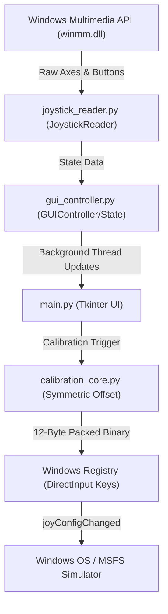

### Key Workflows
#### 1. Input Processing Loop
1. `GUIController` spawns a background polling thread running at ~50 Hz.
2. The loop calls `JoystickReader.read()`, invoking `joyGetPosEx` via ctypes.
3. Values are written into a thread-safe `JoystickState` structure.
4. The main Tkinter application queries state changes at 30 FPS (`after()` callback loop) and redraws visual cards.

#### 2. Calibration Registry Write Workflow
When the user clicks **Save to Windows Registry**:
1. The app sanitizes the current controller profile's name and spawns a registry backup of the DirectInput hardware key, saving it to `backups/` as a `.reg` file.
2. For each calibrated axis, the bounds (Min, Center, Max) are packed into a 12-byte binary block representing three signed 32-bit little-endian integers:
   `struct.pack("<iii", min, center, max)`
3. The block is written directly to the registry path:
   `HKCU\System\CurrentControlSet\Control\MediaProperties\PrivateProperties\DirectInput\<VID_PID>\Calibration\0\Type\Axes\<AXIS_INDEX>\Calibration`
4. The program calls `ctypes.windll.winmm.joyConfigChanged(0)`. This notifies Windows and running games/simulators to invalidate their DirectInput device caches, reloading the new calibration boundaries immediately.

#### 3. Symmetric Center Calculation Algorithm
To prevent uneven control sensitivity on either side of a physical center offset, the tool computes a symmetric scale around the center.
- The half-range is calculated as the maximum deviation from center to either limit:
  $$\text{half\_range} = \max(\text{raw\_center} - \text{raw\_min}, \quad \text{raw\_max} - \text{raw\_center})$$
- The final calibration bounds stored are:
  $$\text{Min} = \text{raw\_center} - \text{half\_range}$$
  $$\text{Center} = \text{raw\_center}$$
  $$\text{Max} = \text{raw\_center} + \text{half\_range}$$

## 6️⃣ Limitations & Constraints
- **Operating System Lock**: Windows only. The registry paths, `winreg` package, and `winmm.dll` do not exist on other operating systems.
- **Registry Permissions**: DirectInput keys under `HKEY_CURRENT_USER` can be read and written without administrative privileges. However, altering global hardware registry entries under `HKEY_LOCAL_MACHINE` (e.g. driver profiles or axis configurations) requires running the application with elevated administrator rights.
- **Saitek Hardware Target**: Layout configurations are optimized for standard Saitek flight hardware. Other gamepads or joysticks will load standard coordinate axes (X, Y, Z, Rx, Ry, Rz).
- **Simulators In-Game Cache**: While `joyConfigChanged(0)` forces the OS to re-read registry parameters, certain older simulation titles may cache controller settings during their boot sequence, requiring a simulator restart or USB controller reconnection to force reload.

================================================================================
### PROJECT: KAABAPASS.COM
File Path Source: C:\Users\Mi5a\.gemini\config\skills\kaabapass-com\SKILL.md
================================================================================

# KaabaPass Travel Platform

## 1️⃣ Purpose & Scope
- **Overview:** KaabaPass is an all-inclusive travel platform designed to make the sacred journey of Umrah effortless, transparent, and trustworthy for Muslim families and individuals in the United States. It handles all necessary logistics — flights, hotels near the Holy Haram in Makkah and Madinah, Umrah visa applications, ground transportation, and licensed guides — under a single "one-click" pricing and booking model.
- **Core Features:**
  - **All-in-One Package Search:** Supports departure airport code select, traveller count splits, flexible date windows, and customized durations.
  - **Dynamic Package Comparison:** Showcases curated tiers (Economy, Standard, Premium, and Elite) with standardized icon grids and side-sheet customization drawer (`SmartBuilderModal`).
  - **Automated Document MRZ Scanning:** Scans uploaded passport photos on the client side using ICAO 9303 7-3-1 weight algorithms to parse and pre-populate traveler fields (birthdate, gender, expiry, full names).
  - **Visa Rule Engine:** Validates age conditions (unaccompanied minors under 18), Mahram requirements (women under 45 traveling without group certificates), and health regulations (mandatory Meningococcal vaccination given within 3 years).
  - **Stripe Integration & FinTech:** Supports secure card checkouts, Apple Pay, Google Pay, and interest-free installment splitting (Klarna/Affirm integrations) with a fallback sandbox payment flow.
  - **Concierge Dashboard:** Assigns a dedicated scholar-qualified guide/concierge with 24/7 WhatsApp accessibility.

## 2️⃣ Technology Stack & Dependencies
- **Core Languages:** TypeScript, JavaScript, HTML, CSS (Tailwind v4 syntax properties).
- **Frameworks & UI Libraries:** Next.js 16.2.6 (using React 19 App Router), Radix UI (Accordion, Checkbox, Dialog, Select, Slider, Tabs, Tooltip), Lucide React, Framer Motion (used in coming soon toggle / minor transitions).
- **Styling:** Tailwind CSS v4 featuring container queries and CSS variable-driven design token inheritance (`@theme`).
- **Data Orchestration & Databases:**
  - **Local Development:** Double-fallback JSON database (`src/lib/mock/db.json` and `data/database.json`).
  - **Production Transition:** Appwrite Cloud SDK (`node-appwrite`) for sessions, storage buckets (`traveler-docs` for secure MRZ passport scans), and collections (`bookings`, `travelers`, `visas`, `payments`).
  - **Browser/SSR Auth:** Supabase Auth SDK (`@supabase/ssr` and `@supabase/supabase-js`) configurations.
- **Development/Build/Testing Tools:** ESLint, Prettier, Vitest (test suite execution).
- **Key APIs & Integrations:** Amadeus Travel API (live flight searches), Stripe API (checkout processing), Twilio SDK (WhatsApp Concierge and OTP verification), Nusuk Platform (visa status checks & client registrations).

## 3️⃣ Project Structure & Key Files
Summary of the folder hierarchy:
```
Kaabapass.com/
├── DECISIONS.md              # Documentation of key architecture and product decisions
├── DESIGN.md                 # Design system, tokens, brand guidelines, and UI flows
├── INTEGRATIONS.md           # Instructions for OAuth, Appwrite, Amadeus, Twilio & Stripe
├── index.html                # Outer public static landing/coming-soon page
└── webapp/                   # Next.js App Router root
    ├── src/
    │   ├── app/              # App Router routes (/, /search, /travelers, /review, /confirmation, /api)
    │   ├── components/       # UI Components (booking, layout, shared modules)
    │   ├── lib/              # SDK clients, mock data, and business logic rule engines
    │   └── types/            # TypeScript schemas & global definitions
```

Key source files and their responsibilities:
| File Path | Purpose / Description | Key Symbols (Classes, Functions, Constants) |
| --- | --- | --- |
| `webapp/src/lib/mrz-scanner.ts` | Client/server passport OCR/MRZ scanner and validator based on ICAO 9303. | `parseMRZText`, `parseTD3MRZ`, `calculateMRZCheckDigit`, `parseYYMMDD`, `parseMRZName` |
| `webapp/src/lib/visa-automation.ts` | Nusuk client API Client wrapping Saudi Hajj/Umrah validation rules, vaccine rules, age checks, and sandbox simulation. | `NusukVisaClient`, `NusukPilgrimRegistration`, `NusukMaritalStatus`, `NusukRelationshipType` |
| `webapp/src/lib/appwrite-db.ts` | Database abstraction layer bridging production Appwrite Cloud API and local JSON mock files. | `saveBooking`, `getBooking`, `getBookingById`, `getBookingBySessionId`, `createTraveler`, `createPayment` |
| `webapp/src/lib/db.ts` | Sync database helper for fallback filesystem storage read/writes (`db.json`). | `readDb`, `writeDb`, `getVisaRecordsByBooking`, `updateVisaRecord`, `createBooking` |
| `webapp/src/lib/amadeus.ts` | Amadeus SDK singleton client featuring auth 401 retry loops and token refresh logic. | `getAmadeusClient`, `resetAmadeusClient`, `executeWithRetry`, `amadeusConfigured` |
| `webapp/src/app/api/checkout/create-intent/route.ts` | Handles Stripe checkout payment intent setups with calculation and local database backup sync. | `POST` |
| `webapp/src/app/actions/visa.ts` | Next.js Server Action to list active traveler visa records. | `getActiveVisaRecordsAction` |
| `webapp/src/components/booking/SearchCard.tsx` | Front-end input dashboard for traveler criteria, airport selection, and date steppers. | `SearchCard` |
| `webapp/src/components/booking/PackageCard.tsx` | Compares and maps bundled features (Essential, Comfort, Premium, Elite) following token boundaries. | `PackageCard` |
| `webapp/src/components/booking/SmartBuilderModal.tsx` | Slide-out drawer displaying live bundle updates, add-ons, and pricing breakdowns. | `SmartBuilderModal` |
| `webapp/src/lib/mock/seed.ts` | Contains static database seeds for testimonials, FAQs, and concierge concierge profiles. | `CONCIERGE_PROFILES`, `FAQS`, `TESTIMONIALS` |

## 4️⃣ Setup, Commands & Scripts
Document how to install, build, run, and test the project:
- **Installation:**
  Navigate to the `webapp` folder and install NPM dependencies:
  ```bash
  cd webapp
  npm install
  ```
- **Running locally:**
  Start the Next.js development server:
  ```bash
  npm run dev
  ```
- **Testing:**
  Run the test suite using Vitest:
  ```bash
  npm run test
  ```
- **Environmental Configuration:**
  Ensure the following keys are set in `webapp/.env.local`:
  - `AMADEUS_CLIENT_ID`: Client ID for Amadeus Self-Service Workspace.
  - `AMADEUS_CLIENT_SECRET`: Client Secret for Amadeus.
  - `AMADEUS_HOSTNAME`: Hostname for Amadeus API (`test` for sandbox or `production` for live).
  - `NEXT_PUBLIC_APPWRITE_ENDPOINT`: Endpoint URL for Appwrite instance (e.g. `https://fra.cloud.appwrite.io/v1`).
  - `NEXT_PUBLIC_APPWRITE_PROJECT_ID`: Active Appwrite Project ID (`6a14dcf9002bce22ad14`).
  - `NEXT_PUBLIC_APPWRITE_DATABASE_ID`: Database identifier.
  - `APPWRITE_API_KEY`: Secret Admin API Key for Appwrite server actions.
  - `APPWRITE_TRAVELER_DOCS_BUCKET_ID`: Storage bucket name for traveler passport uploads (`traveler-docs`).
  - `STRIPE_SECRET_KEY`: Stripe payment API key. If absent, the app falls back to a mock sandbox client.

## 5️⃣ Architecture & Key Workflows
- **High-level design:**
  - **Authentication Flow:** Leverages Appwrite Cloud as an identity broker with Google OAuth2. Since Appwrite is deployed in the Frankfurt region (`fra.cloud.appwrite.io`), OAuth flows utilize the Frankfurt regional redirect URL callback (`https://fra.cloud.appwrite.io/v1/account/sessions/oauth2/callback/google/6a14dcf9002bce22ad14`) to prevent redirection handshake errors.
  - **Database Flow:** The application relies on `isMock` toggles inside `appwrite-db.ts` to coordinate dual-writes. If Appwrite configurations are absent, the application reads/writes local records to `data/database.json` and updates `src/lib/mock/db.json` asynchronously. In production mode, all reads and writes flow to the Appwrite Database collections via the Node-Appwrite SDK client.
- **Passport MRZ Parser Workflow:**
  The `mrz-scanner` parses ICAO TD3 and TD3-like 2-line/3-line passport MRZs. Check digits are evaluated by weighting each character (A-Z = 10-35, 0-9 = 0-9, `<` = 0) with a recurring sequence of weights `[7, 3, 1]`. The sum modulo 10 verifies the digit.
- **Nusuk Visa Validation Pipeline:**
  The `NusukVisaClient` validates:
  - Age check: Age calculated from parsed birthdate must be $\ge 18$ unless accompanied by an adult guardian's passport (`primaryPilgrimPassportNumber`).
  - Mandatory vaccine check: A record of type `MENINGOCOCCAL` (Meningococcal ACWY) is required, and its `dateAdministered` must be within the last 3 years from today.
  - Sandbox routing: Passport numbers ending in `555` trigger instant approval, `444` trigger rejection, `999` trigger group quota exceeded, and `777` trigger system downtime simulation.

## 6️⃣ Limitations & Constraints
- **Geolocations:** The Next.js landing page `prayer-strip` (prayer times notification bar) is hardcoded to a New York City placeholder in the prototype since geolocation services are disabled to improve speed.
- **Stripe payments:** Real card transactions require production `STRIPE_SECRET_KEY` credentials; in local development, it defaults to `sk_test_mock_stripe_key` sandbox mode, returning random transaction approvals.
- **Appwrite Web Origin checks:** Google Cloud OAuth callback and Appwrite platforms require whitelist domain matching for custom domains. Running locally requires `localhost` registered inside the Appwrite Platforms console page.
- **Images:** Real hotel photos are not bundled; the UI utilizes design system token colors (Warm Cream `#F5EFE0`, Forest Emerald `#193C31`, Soft Ivory `#FAF7F0`) as placeholders for card thumbnails.

================================================================================
### PROJECT: MATCHMAKING CRM
File Path Source: C:\Users\Mi5a\.gemini\config\skills\matchmaking-crm\SKILL.md
================================================================================

# PureMatch CRM: Secure Matchmaking Portal & CRM

## 1️⃣ Purpose & Scope
- **Overview**: PureMatch CRM is a modern, high-fidelity CRM system built specifically for matchmakers to coordinate connections while providing candidates with a secure, anonymous client portal.
- **Problem Solved**: Replaces legacy, fee-heavy, fitness-based gym CRMs with a streamlined, non-transactional matchmaking portal focusing on candidate safety, progress tracing, and activity analytics.
- **Core Features**:
  - **Dual-Context separation**:
    - **CRM Matchmaker Desk**: Staff interface to manage profiles, review leads, propose matches, configure milestones, and trace system audit logs.
    - **Candidate Portal (`/portal`)**: Secure client client-side dashboard to browse profiles, swap photos, exchange contact info, and communicate with matchmakers.
  - **Client-Side Privacy Engine**: Protects candidate details across three progressive handshake stages (Text Review, Photo Swap, and Contact Exchange).
  - **Transactional Email Swarm**: Employs isolated email dispatch mechanisms via Deno and Resend to prevent header email leaks.
  - **Post-Date Feedback & Task Scheduler**: Gathers date feedback (chemistry, safety) and automatically triggers follow-up check-ins (1-week, 1-month, 3-month) for staff.

## 2️⃣ Technology Stack & Dependencies
- **Core Languages**: TypeScript, JavaScript, SQL, HTML, CSS.
- **Frontend Frameworks & Libraries**:
  - **React 19 & React DOM**: Core UI application frame.
  - **Vite & React Router Dom v7**: Frontend build tool and path-based router.
  - **Tailwind CSS v4 & @tailwindcss/vite**: High-end styling compiler.
  - **Motion (fka Framer Motion)**: Smooth transitions and glassmorphic micro-animations.
  - **Recharts**: Data visualization for dashboard reports.
  - **Lucide React**: Vector icons.
  - **Radix UI & Shadcn UI**: Accessible base primitives (tabs, select, inputs, calendars, dialogs).
- **Backend Framework**:
  - **Express**: Node.js backend server handling static routing and configuration checkpoints.
  - **esbuild**: Server-side bundler.
- **Database & Storage Engines**:
  - **Supabase**: PostgreSQL database with Row-Level Security (RLS) rules and pgplsql triggers.
  - **Firebase Firestore**: Dynamic NoSQL fallback database.
  - **Appwrite**: Document database integration for realtime features (chats, broadcast announcements).
  - **LocalStorage**: Client-side sandbox fallback mode for offline testing.

## 3️⃣ Project Structure & Key Files
```text
Matchmaking CRM
├── strike-boxing-crm2-master/
│   ├── components/            # Shadcn UI primitives
│   ├── dist/                  # Built assets directory
│   ├── public/                # Static assets (favicons, logos)
│   ├── src/
│   │   ├── components/        # Feature components (AdminAnnouncements, AdminChatHub, NotificationCenter)
│   │   ├── utils/             # Helpers
│   │   ├── App.tsx            # Main router and CRM layout tabs
│   │   ├── Clients.tsx        # CRM client management board
│   │   ├── Dashboard.tsx      # CRM control panel and pipeline metrics
│   │   ├── Portal.tsx         # Candidate dashboard and portal routes
│   │   ├── context.tsx        # AppProvider, database sync engine, and email dispatches
│   │   └── types.ts           # Types and match statuses
│   ├── supabase/
│   │   ├── functions/         # Edge functions (send-email)
│   │   └── candidate_portal_schema.sql  # Portal RLS schemas
│   ├── Dockerfile             # Container configuration
│   ├── migrate_to_firestore.js # Supabase-to-Firestore migration script
│   ├── seed_appwrite.js       # Appwrite database seeding tool
│   ├── seed_admin.js          # Admin account seeder
│   └── supabase_schema.sql    # Base Postgres schemas
```

### Key Source Files & Responsibilities
| File Path | Purpose / Description | Key Symbols (Classes, Functions, Constants) |
| --- | --- | --- |
| [App.tsx](file:///H:/Matchmaking%20CRM/strike-boxing-crm2-master/src/App.tsx) | Main router, desktop layout tabs, theme toggling, and global navigation logic. | `App`, `AppContent`, `navigationItems` |
| [Portal.tsx](file:///H:/Matchmaking%20CRM/strike-boxing-crm2-master/src/Portal.tsx) | Handles candidate accounts, signup, login, candidate filtering, secure photo swap, contact unlock, feedback forms, and support chats. | `Portal`, `SecureEphemeralImage`, `convertGoogleDriveLink`, `handleSignUpSubmit`, `handleLogin`, `handleApproveTextProfile`, `handleApprovePhotoSwap`, `handleApproveContactShare` |
| [context.tsx](file:///H:/Matchmaking%20CRM/strike-boxing-crm2-master/src/context.tsx) | State management, database CRUD (Supabase, Firebase, Appwrite, LocalStorage), and transactional email triggers. | `AppContext`, `AppProvider`, `useAppContext`, `maskProfile`, `autoSeedAdmins`, `triggerEmailFunction`, `addClient`, `addMatch`, `updateMatch` |
| [Dashboard.tsx](file:///H:/Matchmaking%20CRM/strike-boxing-crm2-master/src/Dashboard.tsx) | CRM dashboard showing active matches, target metrics, funnel conversions, and system logs. | `Dashboard` |
| [Clients.tsx](file:///H:/Matchmaking%20CRM/strike-boxing-crm2-master/src/Clients.tsx) | Allows admins to view, edit, search, and delete client profiles and record candidate consultations. | `Clients` |
| [supabase_schema.sql](file:///H:/Matchmaking%20CRM/strike-boxing-crm2-master/supabase_schema.sql) | Declares DB schema tables (`users`, `profiles`, `matches`, `comments`, `interactions`, `tasks`, `audit_logs`). | SQL Table schemas, enums, indices, triggers |
| [candidate_portal_schema.sql](file:///H:/Matchmaking%20CRM/strike-boxing-crm2-master/supabase/candidate_portal_schema.sql) | Implements portal notifications table and row-level security (RLS) rules to keep candidate profiles masked. | SQL Policies (`select_own_profile`, `select_matched_partner_profile`, `update_own_matches`) |
| [index.ts](file:///H:/Matchmaking%20CRM/strike-boxing-crm2-master/supabase/functions/send-email/index.ts) | Deno edge function that dispatches isolated Resend email swarms to candidates and admins. | `Deno.serve`, email HTML templates |
| [migrate_to_firestore.js](file:///H:/Matchmaking%20CRM/strike-boxing-crm2-master/migrate_to_firestore.js) | Script to migrate active Supabase data schemas into Firebase Firestore, seeding schema-valid mock values as a fallback. | `runMigration`, `fallbackData` |

## 4️⃣ Setup, Commands & Scripts
### Installation
```bash
npm install
```

### Running Locally
To launch the esbuild backend compiler alongside Vite's frontend compilation:
```bash
npm run dev
```
- **Admin Desk**: `http://localhost:5173/` (Login with Sarah, Youssef, or Matchmaker Staff using offline sandbox logins).
- **Candidate Portal**: `http://localhost:5173/portal`

### Building for Production
Compiles production client assets and bundles server-side scripts:
```bash
npm run build
```

### Testing & Linting
Executes TypeScript type-check compilation:
```bash
npm run lint
```

### Database Seeding & Migration
- Seeding Appwrite collections:
  ```bash
  node seed_appwrite.js
  ```
- Syncing Firestore data from Supabase/PostgreSQL:
  ```bash
  node migrate_to_firestore.js
  ```

### Environment Configuration
Create a `.env` file in the project root:
```env
# Supabase Configuration
VITE_SUPABASE_URL=your_supabase_project_url
VITE_SUPABASE_ANON_KEY=your_supabase_anon_key

# Appwrite Integration (Optional)
VITE_APPWRITE_ENDPOINT=https://cloud.appwrite.io/v1
VITE_APPWRITE_PROJECT_ID=your_appwrite_project_id
VITE_APPWRITE_DATABASE_ID=guc-matchmaking

# Server Config
PORT=3000
NODE_ENV=development
```
- Provide a `firebase-applet-config.json` inside the project root for Firestore configurations.

## 5️⃣ Architecture & Key Workflows
### High-Level Design
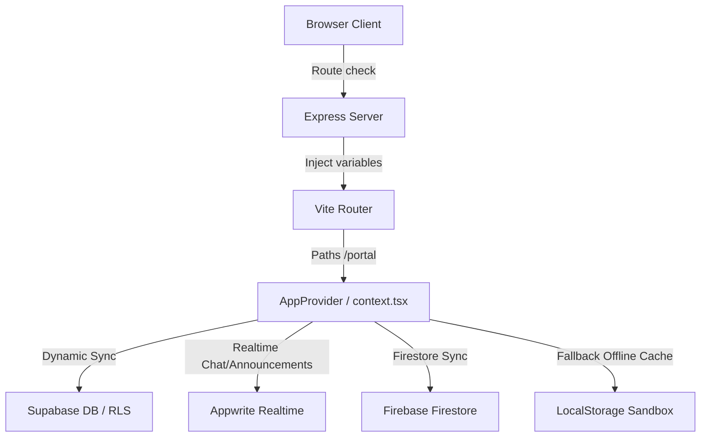

### Candidate Match Handshake Workflow
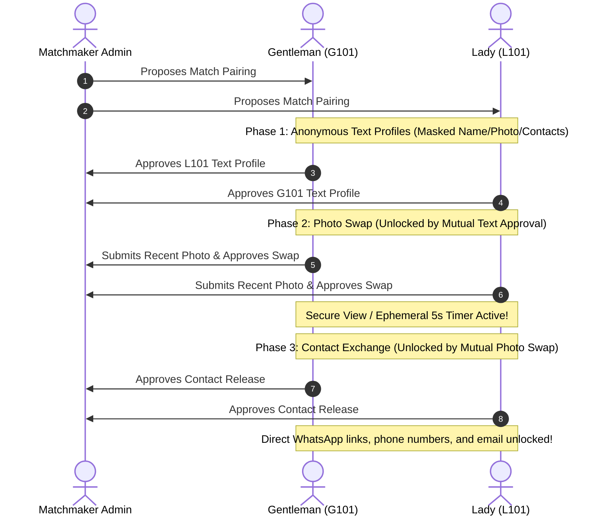

### Key Security Protocols
1. **Dynamic Property Masking (`maskProfile`)**: Enforces strict client-side encryption. Profile details (`name`, `fullName`, `email`, `phone`, `facebookLink`, `recentPhoto`) are scrubbed programmatically in real-time unless specific mutual milestones (`malePhotoApproved` and `femalePhotoApproved` or status-specific fields) have been checked.
2. **Ephemeral Secure view (`SecureEphemeralImage`)**: Rendered inside the portal, photos are decrypted in memory only while the mouse pointer is held down. Contains:
   - A 5-second countdown timer after which the photo is wiped.
   - Event listeners detecting window loss of focus (`blur`), document visibility changes, and keyboard combinations (`PrintScreen`, `Cmd+Shift+3/4`, `Ctrl+P`) to trigger instant image locking.
3. **Database RLS Policies**: Policies built directly on the database block unauthorized queries, ensuring candidates only fetch rows representing matches where they are named participants.

## 6️⃣ Limitations & Constraints
- **Screenshots Bypass**: Although `SecureEphemeralImage` registers system listeners to prevent screenshot capture events, it cannot prevent external camera photography.
- **Client-Side Storage Sandbox**: Offline testing relies heavily on browser local storage, meaning changes made in offline sandbox mode do not sync between distinct browsers or devices unless live backend APIs are populated.
- **Cross-Database Overhead**: Maintaining synchronization structures across Supabase, Firebase, and Appwrite adds multi-SDK footprint overhead to the application bundle size.

================================================================================
### PROJECT: MI5A.COM
File Path Source: C:\Users\Mi5a\.gemini\config\skills\mi5a-com\SKILL.md
================================================================================

# Michael Mitry Portfolio Site (mi5a.com)

## 1️⃣ Purpose & Scope
- **Purpose**: The project serves as the personal and professional portfolio of Michael Mitry, showing his multi-disciplinary work as an architect, licensed pilot, filmmaker, visual effects artist, and full-stack software engineer.
- **Problem Solved**: Provides a unified, aesthetic, and fast-loading portal for potential clients or employers to view and filter Michael's visual projects (like VFX, motion design, and photography) and software projects, learn about his credentials, see his service pricing, and hire him directly.
- **Core Features**:
  - **Dynamic Content Loading**: The React application reads biography details, services, skills, work experience, and education from a local JSON file (`site-content.json`) at runtime, allowing quick changes without rebuilds.
  - **Bento-style Portfolio Grid**: Displays projects with categorization filters, loading descriptions, and external links directly from a compiled project catalog (`catalog.json`).
  - **Inline Instagram Reel Playback**: Captures clicks on project links pointing to Instagram reels and plays them in-app using a custom, responsive embedded iframe modal overlay (`ReelModal`), maintaining visitor retention.
  - **Custom Loading Preloader**: Animates entrance with particles, scanlines, and high-tech glitch text resolving to "MITRY" while the page content is loaded.
  - **Intake & Contact Forms**: Integrates serverless message ingestion using Formspree on the contact page and the "Dream Website in 72h" promo section.

## 2️⃣ Technology Stack & Dependencies
- **Core Languages**: JavaScript (ES6+), HTML5, CSS3.
- **Frameworks & Core Libraries**:
  - `react` (v19.2.5): Component framework.
  - `react-dom` (v19.2.5): Document Object Model interaction.
  - `react-router-dom` (v7.15.0): Client-side path routing.
  - `@formspree/react` (v3.0.0): Handles form ingestion and processing.
- **Development Tools & Bundlers**:
  - `vite` (v6.4.2): Modern front-end build and hot module replacement tool.
  - `@vitejs/plugin-react` (v4.7.0): React support plugin for Vite.
  - `eslint` (v10.2.1) & plugins: Code standard verification.
  - `gh-pages` (v6.3.0): Deploys compiled assets directly to GitHub Pages branch.
- **Database & Asset Storage**:
  - Static JSON data files (`site-content.json`, `/projects/catalog.json`) served locally acting as a lightweight, read-only document database.
  - Formspree handles form data submission databases serverlessly.

## 3️⃣ Project Structure & Key Files
The project contains a legacy static dump of a WordPress site (built with Elementor) at the root level, alongside a modern React application nested in the `/mitry-visuals-react` folder.

### Repository Overview
- `wp-content/`, `wp-includes/`, `index.html`, `about/index.html`, etc.: Legacy static exports of the previous WordPress site.
- `mitry-visuals-react/`: The new React rewrite of the website.

### Key React Source Files
| File Path | Purpose / Description | Key Symbols (Classes, Functions, Constants) |
| --- | --- | --- |
| `mitry-visuals-react/package.json` | Manifest of project dependencies, metadata, and scripts. | `"scripts": { "dev", "build", "catalog", "deploy" }` |
| `mitry-visuals-react/vite.config.js` | Vite bundler settings, sets build base folder. | Default export config setting `base: '/'` |
| `mitry-visuals-react/scripts/catalog.js` | Script that scans `public/projects/` subdirectories for `meta.json` and cover photos, compiling them into a single `catalog.json` list. | `discoverProjects`, `allProjects`, `writeFileSync` |
| `mitry-visuals-react/public/site-content.json` | Read-only local database containing biography details, stats counters, services, categorized skills, and education history. | `profile`, `stats`, `services`, `skills`, `experience`, `education` |
| `mitry-visuals-react/src/App.jsx` | Base app structure defining page routes and loading screen toggle. | `App`, `AppRoutes` |
| `mitry-visuals-react/src/hooks/useContent.js` | Custom hooks that fetch static JSON databases asynchronously at runtime. | `useSiteContent`, `useProjects` |
| `mitry-visuals-react/src/hooks/useReveal.js` | Connects an `IntersectionObserver` with a `MutationObserver` to fade-in elements upon scrolling, even if the elements are rendered after JSON data finishes loading. | `useReveal`, `scanAndObserve` |
| `mitry-visuals-react/src/components/Preloader.jsx` | Performs particle animations and glitch text initialization sequences before app entry. | `Preloader`, `glitchText`, `particles` |
| `mitry-visuals-react/src/components/ReelModal.jsx` | Iframe overlay to render Instagram reels inline without redirecting users. | `ReelModal`, `getInstaEmbedUrl`, `isInstagramLink` |
| `mitry-visuals-react/src/components/DreamWebsite.jsx` | Displays promotional pitch copy and a modal intake form for a "72-hour website build" service. | `DreamWebsite`, `DreamModal` |
| `mitry-visuals-react/src/pages/Home.jsx` | The main dashboard combining statistics counters, services, selected project previews, and visual branding elements. | `Home`, `Counter` |
| `mitry-visuals-react/src/pages/Works.jsx` | Portfolio screen that sorts and displays works by design and VFX categories. | `Works`, `handleCardClick` |
| `mitry-visuals-react/src/pages/Services.jsx` | Page highlighting Michael's commercial services, prices, capabilities, and structured workflow steps. | `Services`, `ServiceCard`, `ServiceModal` |

## 4️⃣ Setup, Commands & Scripts
All development and build actions must be run from inside the `mitry-visuals-react/` directory:

- **Installation**:
  ```powershell
  cd mitry-visuals-react
  npm install
  ```
- **Running locally (Development Server)**:
  Runs the local catalog compiler to rebuild project lists, then starts the Vite hot reload server:
  ```powershell
  npm run dev
  ```
- **Building for Production**:
  Compiles project listings and bundles the application into optimized static assets in `/dist`:
  ```powershell
  npm run build
  ```
- **Rebuilding the Project Catalog**:
  Allows compiling projects without running a server or bundling:
  ```powershell
  npm run catalog
  ```
- **Deployment**:
  Bundles the site and uploads the output directory `/dist` directly to the `gh-pages` branch on GitHub:
  ```powershell
  npm run deploy
  ```
- **Testing**:
  No tests are implemented for this project.
- **Environmental & External Configuration**:
  - Formspree handles lead ingestion via hardcoded form target IDs:
    - `"mjgvewrz"`: Used in the Services and DreamWebsite modals.
    - `"xpwznnql"`: Specified in `site-content.json` (as `formspreeId`).
  - To change form submission destinations, these IDs must be replaced with a valid Formspree endpoint ID.

## 5️⃣ Architecture & Key Workflows

### High-Level Architectural Flow
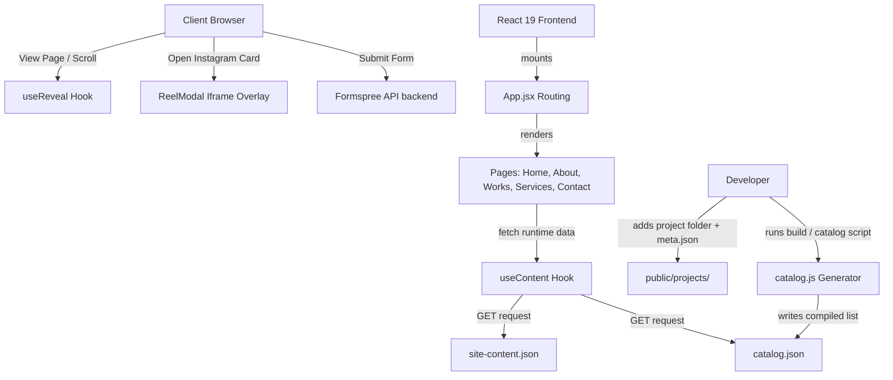

### Core Workflows

1. **Portfolio Catalog Compilation**:
   - The developer adds a new folder under `mitry-visuals-react/public/projects/` containing a `cover.jpg` (or png/webp) and a `meta.json` containing project details (title, category, link, featured, order).
   - Running `npm run catalog` triggers `catalog.js`.
   - The script reads every sub-folder, merges new items with manual listings, sorts them by `order`, and outputs a unified `catalog.json` in the projects folder.
   
2. **Page-Entry Reveal Animation**:
   - Pages register components to be faded-in by applying classnames `.reveal.invisible`.
   - The `useReveal` hook triggers when the element enters the viewport using an `IntersectionObserver`.
   - A `MutationObserver` works alongside it to re-run element scans whenever the DOM updates (e.g. after async JSON loads and populates elements).

3. **Instagram Reel Embed Inline Playback**:
   - In `Works.jsx`, clicking a project checks if the destination contains `instagram.com`.
   - If true, `ReelModal` intercepts the click. It extracts the reel ID and formats it as an embed endpoint (`https://www.instagram.com/reel/{id}/embed/`).
   - The reel modal loads a thumbnail placeholder while launching the iframe player, transitioning smoothly to the live player once loaded.

## 6️⃣ Limitations & Constraints
- **Subdirectory Containment**: The build scripts, catalog parser, and source files are contained within `/mitry-visuals-react`. They will not execute or install from the root folder of the repository.
- **Formspree Dependency**: The contact and custom pricing forms depend entirely on Formspree endpoint validity. If submission limits are reached or target IDs expire, inquiries will fail.
- **Embedded Reels Privacy Filters**: The inline video player uses standard Instagram embeds. Ad-blockers, tracking blockers, or strict browser cookie filters may block the iframe content, leaving users with just the thumbnail.
- **WordPress Integration/Coexistence**: The root folder contains a static dump of an Elementor WordPress site. The React app is stored in a subfolder and builds into its own `/dist` directory. The DNS/hosting must be configured to point to the compiled React assets (e.g., via GitHub Pages custom domain mappings) to serve the React application on the main `mi5a.com` domain.

================================================================================
### PROJECT: MI5AWEBSITE-GH-PAGES
File Path Source: C:\Users\Mi5a\.gemini\config\skills\mi5awebsite-gh-pages\SKILL.md
================================================================================

# Michael Mitry's Personal Portfolio & Visual Airspace

## 1️⃣ Purpose & Scope
This project is the personal portfolio website of **Michael Magdy Mitry**, a Cairo-based pilot, visual effects artist, architect, filmmaker, and full-stack software engineer. The website serves as a creative hub and portfolio showcase, highlighting his diverse interdisciplinary career, flight hours, selected client projects, and contact avenues.

Core features include:
- **Sci-Fi Preloader Sequence**: Custom canvas particle simulation, glitch text animations, and automated split panels transitioning into the app layout.
- **Dynamic Bento Grids**: Responsive grid configurations containing statistics, services, works, and profile content.
- **Drag-to-Explore Project Carousel**: Mouse-driven scrollable project strip with custom depth, tilt, saturation, and rotation animations computed on scroll.
- **3D Spatial Environment (`mitry-visuals-spatial`)**: Interactive CSS 3D perspective grids, flight path vectors, and floating planes that shift dynamically in response to cursor movement (`pointermove` events) and viewport scrolling.
- **Dynamic Runtime Content Loading**: The app loads bio details, flight hours, skills, and portfolio works dynamically at runtime from static JSON files, bypassing the need for rebuilds or redeployment.
- **Formspree Integration**: Contact forms linked directly to Formspree for handling client requests.

---

## 2️⃣ Technology Stack & Dependencies
- **Core Languages**: JavaScript (ES6+), HTML5, CSS3 (with Custom Properties for 3D parallax offsets).
- **Frontend Framework**: React 19 (specifically `react@19.2.5` & `react-dom@19.2.5`).
- **Routing**: React Router DOM (v7, `react-router-dom@7.15.0`).
- **Build System & Compiler**: Vite (`vite@5.4.21` with `@vitejs/plugin-react`).
- **Contact Handling**: `@formspree/react@3.0.0`
- **Linting**: ESLint v10.
- **Hosting / Deploy Engines**:
  - **GitHub Pages**: Static deployment hosted at custom domain `mi5a.com`.
  - **Google Cloud Run**: Containerized deployment serving static files through Nginx.
- **Web Server Configuration**: Nginx (configured with aggressive long-term caching for static assets, no-cache headers for runtime JSONs, and gzip compression).
- **Containerization**: Docker (multi-stage Node.js build to serve with Nginx Alpine).

---

## 3️⃣ Project Structure & Key Files
The workspace is structured into two main subprojects (`mitry-visuals-react` and `mitry-visuals-spatial`) along with root-level deployment assets mapping to the GitHub Pages (`gh-pages`) branch.

```
C:\Users\Mi5a\Desktop\Mi5aWebsite-gh-pages/
├── .nojekyll                   # Bypasses Jekyll processing on GitHub Pages
├── 404.html                    # GH Pages SPA routing redirect handler
├── CNAME                       # Maps gh-pages to custom domain (mi5a.com)
├── index.html                  # Built root index with SPA URL decoder script
├── site-content.json           # Runtime site data (bio, stats, experiences)
├── assets/                     # Main built JavaScript/CSS chunks
├── projects/
│   └── catalog.json            # Dynamic portfolio catalog loaded at runtime
├── mitry-visuals-react/        # React 19 project (Standard Theme)
└── mitry-visuals-spatial/      # React 19 project (3D Spatial Grid Theme)
```

Both `mitry-visuals-react/` and `mitry-visuals-spatial/` contain identical build scripts, directory setups, and JSON structures. However, `mitry-visuals-spatial` implements a global 3D interactive background.

### Key Files & Responsibilities

| File Path (relative to subproject root) | Purpose / Description | Key Symbols (Classes, Functions, Constants) |
| --- | --- | --- |
| `public/site-content.json` | Master data file controlling bio paragraphs, flight stats, experience timelines, skills, availability badges, and contact details. | `profile`, `stats`, `services`, `skills`, `experience`, `education`, `contact` |
| `public/projects/catalog.json` | Stores portfolio metadata loaded by Works and detail pages. Dynamically built or manually adjusted. | `generated`, `count`, `projects` |
| `scripts/catalog.js` | Node utility running before builds to scrape `public/projects/` directory folders, verify `meta.json` and cover image, and output to `catalog.json`. | `discoveredProjects`, `manualProjects` |
| `src/main.jsx` | React DOM initialization and StrictMode setup. | `createRoot` |
| `src/App.jsx` | App router layout setup mapping pages. Hooks up `ErrorBoundary` and `Preloader`. | `App`, `AppRoutes` |
| `src/components/Layout.jsx` | Global frame wrapper. Spawns magnetic cursor, film grain overlay, Header, Footer, and (for Spatial project) the `SpatialWorld` background. | `Layout` |
| `src/components/SpatialWorld.jsx` | *[Spatial Project Only]* Creates a fully responsive, hardware-accelerated CSS 3D viewport of coordinates, grid planes, and flight lines. | `SpatialWorld` (updates CSS variables like `--mx`, `--spot-x`, `--scroll-depth` based on mouse/scroll inputs) |
| `src/components/Preloader.jsx` | Renders a multi-phase landing animation using HTML5 Canvas particle physics, glitch title reveals, and sliding panel exits. | `Preloader`, `glitchText`, `draw` |
| `src/pages/Home.jsx` | Home layout rendering hero section, marquee strips, drag-scrollable project carousel, Selected Works, and call-to-actions. | `Home`, `Counter`, `SparkBar`, `HorizontalStrip`, `ShowreelPlayer` |
| `src/pages/Works.jsx` | Works page that lists portfolio items and filters them interactively by category tags. | `Works`, `CATEGORIES` |
| `src/pages/ProjectDetail.jsx` | Dynamic detail page displaying metadata, descriptive texts, technology lists, and previous/next carousel navigation links. | `ProjectDetail` |
| `src/hooks/useContent.js` | Fetch utilities loading `site-content.json` and `catalog.json` at client runtime. | `useSiteContent`, `useProjects` |
| `src/hooks/useMagneticCursor.js`| Triggers fluid coordinate shifts for cursor elements matching pointing positions. | `useMagneticCursor` |
| `src/hooks/useReveal.js` | Uses IntersectionObserver to trigger entry animations for elements marked as `reveal`. | `useReveal` |
| `Dockerfile` | Multi-stage Docker config targeting production Nginx image hosting built assets. | `builder`, `production` |
| `nginx.conf` | Web server parameters optimizing gzip, client routing fallbacks, and specific JSON cache-busting guidelines. | `server`, `gzip`, `Expires` configs |

---

## 4️⃣ Setup, Commands & Scripts
Navigate to either the `mitry-visuals-react` or `mitry-visuals-spatial` folders before running setup or execution commands.

### Installation
Install project dependencies using NPM:
```bash
npm install
```

### Running Locally
To launch a hot-reloading Vite dev server, run:
```bash
npm run dev
```
*Note: This automatically triggers `scripts/catalog.js` first to rebuild the project catalog.*

### Building the Project
Compile the production optimized bundle to the `dist/` directory:
```bash
npm run build
```

### Project Catalog Regeneration
To manually regenerate `public/projects/catalog.json` after inserting new assets:
```bash
npm run catalog
```

### Deployment

#### 1. Deploying to GitHub Pages
To build and publish the frontend bundle directly to the `gh-pages` branch (mapped to custom domain `mi5a.com`):
```bash
npm run deploy
```

#### 2. Deploying to Google Cloud Run (Containerized Docker)
To build and deploy the application within a Docker container on Google Cloud Run (listening on port `8080`):
1. Compile the production bundle:
   ```bash
   npm run build
   ```
2. Build and push the image using Google Cloud Build (replace `YOUR_PROJECT_ID` with the actual GCP project identifier):
   ```bash
   gcloud builds submit --tag gcr.io/YOUR_PROJECT_ID/mitry-visuals
   ```
3. Deploy the container live:
   ```bash
   gcloud run deploy mitry-visuals \
     --image gcr.io/YOUR_PROJECT_ID/mitry-visuals \
     --platform managed \
     --region us-central1 \
     --allow-unauthenticated \
     --port 8080
   ```

---

## 5️⃣ Architecture & Key Workflows

### Data & Content Architecture
The portfolio utilizes a client-side headless architecture designed for direct FTP deployment:

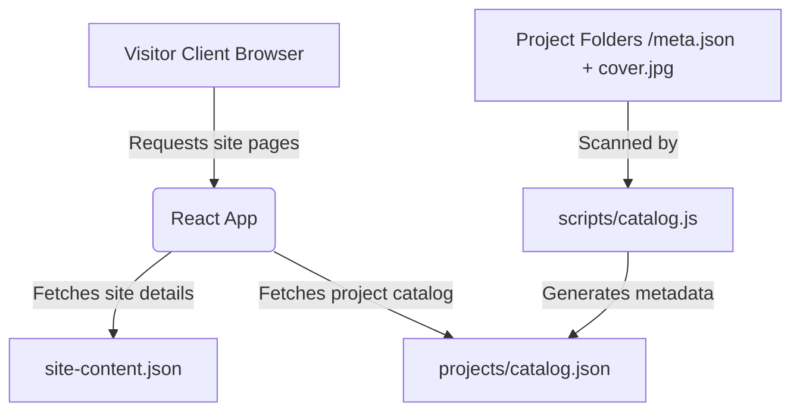

1. **Content Control**: The developer can edit statistics, availability status, experience listings, and contact coordinates inside `public/site-content.json` and upload the modified JSON straight to the static hosting root without rebuilding the app.
2. **Project Updates**:
   - **Method A (Quick)**: Edit `public/projects/catalog.json` directly and point towards any hosted image path.
   - **Method B (Automated)**: Create a new folder (e.g. `/public/projects/new-project/`), deposit a thumbnail named `cover.jpg` (or webp/png), write a standard `meta.json` file inside it, and run `npm run catalog` to auto-build catalog files.

### 3D Parallax & Spatial Viewport Workflows
The `SpatialWorld` environment operates by modifying global CSS variables on mouse coordinates and scroll depths:

```
[pointermove event] ---> Client coordinates mapped [-0.5 to 0.5] ---> Updates CSS vars (--mx, --my, --spot-x, --spot-y)
[scroll event]      ---> Viewport scroll depth computed [0 to 1]   ---> Updates CSS vars (--scroll-depth, --scroll-260)
```
These CSS variables are passed to 3D transforms (`rotateX`, `rotateY`, `translate3d`) mapped to multiple viewport grid planes (`.spatial-grid-back`, `.spatial-grid-front`) and polygon structures to yield coordinates shifting along a virtual flight path.

---

## 6️⃣ Limitations & Constraints
- **GitHub Pages Routing Fallback**: Since GitHub Pages does not natively support HTML5 pushState client routing out of the box, URL paths like `/works` or `/about` will fail with a 404 error if directly reloaded. The website works around this constraint by utilizing a custom `404.html` redirect page that encodes paths into a query parameter (`?p=...`), which is then decoded by a router script inside `index.html`.
- **JSON Cache Invalidation**: While Nginx caches static scripts and styles aggressively (`expires 1y`), JSON metadata files (`site-content.json`, `catalog.json`) are configured to bypass caching entirely (`expires -1` with `no-cache, no-store, must-revalidate`). If deployed onto servers without these custom headers, site content changes might not reflect immediately for repeat visitors.
- **Formspree Limit Restrictions**: Contact email delivery depends on Formspree. Ensure submission volumes remain within the free tier thresholds or scale the tier as client inquiry counts expand.
- **Hardware-Accelerated 3D Transforms**: The spatial view relies heavily on browser support for CSS 3D perspective and transforms. Devices with low-power GPUs or disabled hardware acceleration may experience lower frame rates. The implementation includes media query limits to disable taxing layers on smaller viewports and fully supports the `prefers-reduced-motion` browser accessibility standard.

================================================================================
### PROJECT: MITRIXIO.COM
File Path Source: C:\Users\Mi5a\.gemini\config\skills\mitrixio-com\SKILL.md
================================================================================

# MITRIXO Portal & SaaS Product Studio

## 1️⃣ Purpose & Scope
- **Overview**: MITRIXO is the landing page and portal for "MITRIXO — Enterprise Software House & SaaS Product Studio". It serves as a visual storefront, a "coming soon" landing page, and a waitlist registration platform for high-fidelity digital infrastructure, proprietary SaaS products, and custom CMS systems. It also incorporates the "Mitry Visuals" creative studio.
- **Core Features**:
  - **Cinematic Preloader**: Smooth non-linear progress counter (0 to 100% in 2.4s) using `requestAnimationFrame`, locking body scroll until entry animations complete, displaying the brand logo with pulsating glow.
  - **Coordinate/Blueprint Canvas Background**: A 2D canvas/CSS grid layout overlay combining ambient top-left sky blue and top-right violet breathing glows with a radial-mask-filtered structural grid background.
  - **Custom Cursor Engine**: System-wide custom cursor dot (instant follow) and animated ring with linear interpolation (lerp) via `requestAnimationFrame` that responds with an expanding glowing hover effect over interactive elements (`a`, `button`, input fields, etc.). Touch/mobile-friendly fallback media query to hide custom cursor on touch devices.
  - **Waitlist Form Capture**: Client-side interactive capture with email formatting checks, submittal status transitions (`idle`, `submitting`, `success`, `error`), and mocked API latency for a realistic database transaction feel.
  - **Database Interface**: Ready-to-snap architecture interface in `lib/database.ts` supporting potential Supabase and Firebase integration configurations with structural types for `SaaSApp` and `UserSubscription`.

## 2️⃣ Technology Stack & Dependencies
- **Core Languages**: TypeScript (TSX), JavaScript (MJS), CSS, HTML.
- **Frameworks & Libraries**:
  - **Next.js (v16.2.6)**: App Router paradigm, standalone build mode.
  - **React (v19.2.4)**: Client/server components.
  - **Framer Motion (v12.40.0)**: Smooth transitions, entry states, and page fade-out effects.
  - **Lucide React (v1.17.0)**: Technical icon set (Mail, CheckCircle2, ArrowRight).
- **Styling**:
  - **Tailwind CSS (v4)**: Modern CSS-first utility classes, custom themes, custom font families (Outfit, Inter), keyframe pulses, and gradient masks.
  - **Google Fonts**: Inter & Outfit imported dynamically.
- **Development & Compilation**:
  - **Node.js (v20)**: Alpine environment for production build.
  - **TypeScript (v5)**: Type-safety definitions.
  - **ESLint (v9)**: Code quality checks and standards.
  - **Docker**: Multi-stage lightweight builds (deps -> builder -> runner) using Next.js standalone server mode on port 8080.
- **Database / Storage Engines**:
  - **Mock / Database-Neutral Layer**: Standard interfaces defined in `src/lib/database.ts` representing expected PostgreSQL schema fields, ready for Supabase or Firebase configurations based on environment variables (`NEXT_PUBLIC_SUPABASE_URL` / `NEXT_PUBLIC_FIREBASE_API_KEY`).

## 3️⃣ Project Structure & Key Files
Provide a summary of the folder hierarchy and a table mapping key source files to their responsibilities:
| File Path | Purpose / Description | Key Symbols (Classes, Functions, Constants) |
| --- | --- | --- |
| `src/app/layout.tsx` | Configures the base HTML element, viewports, theme color, font families, and global styling wrappers (e.g., scroll-smooth, bg-brand-dark). | `RootLayout` |
| `src/app/page.tsx` | Server component entry point specifying page metadata (SEO/OpenGraph parameters) and mounting the client rendering tree. | `metadata`, `Home` |
| `src/app/globals.css` | Defines custom CSS root variables, Tailwind v4 theme bindings, custom scrollbar styles, mobile scaling media queries, custom utility classes (`glass-nav`, `glass-card`, `bg-grid-blueprint`), and cursor styles. | CSS root variables, Tailwind theme variables |
| `src/components/HomeClient.tsx` | Manages core page lifecycle state, waitlist submission event handlers, status animations, header/footer elements, and client-side interactions. | `HomeClient` |
| `src/components/CanvasGridBackground.tsx` | Leverages Framer Motion to animate breathing background glows and renders the grid mask overlay. | `CanvasGridBackground` |
| `src/components/CinematicPreloader.tsx` | Blocks standard navigation, counts loading progress non-linearly using `requestAnimationFrame`, and handles the brand intro before showing page content. | `CinematicPreloader`, `CinematicPreloaderProps` |
| `src/components/CustomCursor.tsx` | Renders the high-fidelity cursor using React state and requestAnimationFrame-based LERP. | `CustomCursor`, `CursorState` |
| `src/lib/database.ts` | Declares types for `SaaSApp` and `UserSubscription`, exports a static array of mock apps, and defines mock data APIs (`getProducts`, `getProductBySlug`, `checkConnection`) supporting Supabase/Firebase setup. | `SaaSApp`, `UserSubscription`, `MitrixoEngine`, `SaaSAppCatalog` |
| `Dockerfile` | Multi-stage compilation container (deps -> builder -> runner) using Next.js standalone server mode on port 8080. | Stage targets: `deps`, `builder`, `runner` |
| `next.config.ts` | Main Next.js configuration declaring `output: "standalone"`. | `nextConfig` |

## 4️⃣ Setup, Commands & Scripts
Document how to install, build, run, and test the project:
- **Installation**: `npm install`
- **Running locally**: `npm run dev`
- **Build / Compilation**: `npm run build`
- **Running in Production Mode**: `npm run start`
- **Linting**: `npm run lint` (uses eslint config next)
- **Environmental Configuration**:
  The application is pre-configured to detect and switch to real cloud database providers based on key client-side variables:
  - `NEXT_PUBLIC_SUPABASE_URL`: If defined, triggers Supabase mode in database queries.
  - `NEXT_PUBLIC_FIREBASE_API_KEY`: If defined (and Supabase is absent), switches to Firebase mode.
  - No environment variables: Defaults to high-fidelity simulated latency mock mode.

## 5️⃣ Architecture & Key Workflows
- **Visual Page Entry Flow**:
  1. Root HTML loads the main layout and injects global styles from `globals.css`.
  2. `page.tsx` renders `HomeClient`.
  3. `HomeClient` mounts `CinematicPreloader`, which locks body scrolling (`overflow: hidden`).
  4. The preloader runs a 2.4s non-linear progress counter (bezier-mode progress curve: rapid start, decelerating middle, accelerating finish) using `requestAnimationFrame`.
  5. When progress reaches 100%, scroll lock is released, `showPreloader` turns false, and the main UI is transition-mounted via Framer Motion's `AnimatePresence`.
  6. The `CustomCursor` starts tracking cursor coordinate variables and updates the ring's location using a LERP factor of 0.12.
- **Waitlist Pipeline Workflow**:
  1. User inserts email and clicks "Notify Me".
  2. Client-side validator applies regex tests (`/^[^\s@]+@[^\s@]+\.[^\s@]+$/`).
  3. Form status transitions: `idle` -> `submitting`.
  4. Submission waits for 1.2s (simulated backend latency) before transitioning to `success`.
  5. UI displays success confirmation block via Framer Motion, clearing email fields.
- **Database Connection Check Workflow**:
  1. `MitrixoEngine.checkConnection()` looks for env variables.
  2. Returns appropriate provider mapping (`supabase` / `firebase` / `mock`).
  3. Allows developers to easily swap the mocked Promise latency queries with dynamic Supabase or Firebase SDK data fetching.

## 6️⃣ Limitations & Constraints
- **Client-Side Dependency**: The preloader and custom cursor rely heavily on browser window contexts (`requestAnimationFrame`, `window.addEventListener`).
- **Touch / Mobile Limitation**: Custom cursor ring and dot are hidden on screens with no hover support (`@media (hover: none)`) to avoid layout jumps or broken behaviors.
- **Next.js Standalone Mode**: The output build mode `standalone` requires `.next/standalone` files to run in Node, meaning hosting must support standalone node execution or dockerized deployments.
- **Next.js Version Constraints**: Next.js 16.2 is used alongside React 19. Any updates to React/Next must align with the breaking architectural changes mentioned in `AGENTS.md`.

================================================================================
### PROJECT: PRESENTATION
File Path Source: C:\Users\Mi5a\.gemini\config\skills\presentation\SKILL.md
================================================================================

# Presentation Generator

## 1️⃣ Purpose & Scope
- **Overview**: The project is a document-to-presentation automation tool designed to convert clinical/study notes from a Word document (`.docx`) into a structured, professionally styled PowerPoint slide deck (`.pptx`).
- **Core Features**:
  - Automatically parses `.docx` files, analyzing XML drawing elements to extract and map images to paragraphs.
  - Automatically generates a 25+ slide PowerPoint presentation with custom styled layout elements.
  - Builds slide decks with a modern dark theme, custom headers, accent lines, text formatting, and multi-image rendering support.
  - Places and scales images side-by-side or stacked vertically next to bullet points when they are referenced in the source document.

## 2️⃣ Technology Stack & Dependencies
- **Core Languages**: Python 3.x
- **Frameworks & Libraries**:
  - `python-docx` (to parse and read text, runs, and images from MS Word documents)
  - `python-pptx` (to generate, design, and save MS PowerPoint presentations)
  - `lxml` (underlying library for XML parsing and namespace handling, e.g., `qn`, `nsmap`)
- **Development Tools**: Python standard libraries (`os`, `sys`, `copy`).

## 3️⃣ Project Structure & Key Files
The project directory is structured as follows:
```
presentation/
├── Deep bite.docx             # Source Word document containing orthodontic study notes and images.
├── doc_text.txt               # Extracted raw text from the source Word document.
├── build_pptx.py              # Main Python script that reads the docx and generates the presentation.
├── Deep_Bite_Presentation.pptx # The generated PowerPoint presentation.
└── extracted_images/          # Directory containing extracted images from the Word document.
```

| File Path | Purpose / Description | Key Symbols (Classes, Functions, Constants) |
| --- | --- | --- |
| `build_pptx.py` | Main script for converting Word document data into PowerPoint slides. It maps images to slide bullet points and designs the custom themed slides. | `slides_data` (list of slide models), `set_bg` (function), `add_text_box` (function), `add_slide` (function) |
| `doc_text.txt` | Text copy of the docx file containing structured paragraph and list styling markers. | N/A |
| `Deep bite.docx` | The source Word document containing orthodontics material. | N/A |
| `Deep_Bite_Presentation.pptx` | The final output presentation containing the generated slides. | N/A |

## 4️⃣ Setup, Commands & Scripts
- **Installation**:
  Install required dependencies via `pip`:
  ```powershell
  pip install python-docx python-pptx
  ```
- **Running locally**:
  Execute the Python script to build the presentation:
  ```powershell
  python build_pptx.py
  ```
- **Testing**:
  N/A (No testing framework configured).
- **Environmental Configuration**:
  The script utilizes hardcoded absolute file paths on the local machine:
  - `DOCX`: `c:\Users\Mi5a\Desktop\presentation\Deep bite.docx`
  - `IMG_DIR`: `c:\Users\Mi5a\Desktop\presentation\extracted_images`
  - `OUT`: `c:\Users\Mi5a\Desktop\presentation\Deep_Bite_Presentation.pptx`

## 5️⃣ Architecture & Key Workflows
- **High-level Design**:
  ```mermaid
  graph TD
      A[Deep bite.docx] -->|Read text & image relations| B(build_pptx.py)
      C[extracted_images/] -->|Check & retrieve image files| B
      B -->|Generate and style slides| D[Deep_Bite_Presentation.pptx]
  ```
- **Key Workflows**:
  1. **Document Analysis**: The script reads the Word document, iterates over its paragraphs, and parses relationship IDs (`rId`) using XML parsing of the `a:blip` element to associate images with specific paragraphs.
  2. **Slide Presentation Setup**: Creates a new blank `pptx.Presentation` with a 16:9 widescreen layout (13.33" x 7.5").
  3. **Theme Definition**: Colors are defined for backgrounds (`0x0D1B2A` Dark Blue), accents (`0x00A8E8` Cyan), titles (`0xFFFFFF` White), and body text (`0xE0F4FF` Light Blue).
  4. **Title Slide Creation**: Draws a centered title card layout with background shapes and subtitles.
  5. **Content Slide Generation**: Iterates through `slides_data` to draw solid backgrounds, header banner bars, custom cyan bullet points, and dynamic text blocks.
  6. **Image Layout & Scaling**: If a slide has associated images, the text width is reduced to make space on the right side. Images are loaded from `extracted_images/` and dynamically scaled to fit within a bounded height, stacking them vertically if there are multiple images on a single slide.
  7. **Save File**: Writes the resulting slide deck to `Deep_Bite_Presentation.pptx`.

## 6️⃣ Limitations & Constraints
- **Hardcoded Paths**: The script contains absolute file paths (`c:\Users\Mi5a\Desktop\presentation\...`) which limits portability. Running on different setups requires manually changing these strings.
- **Static Content Model**: The slide content (`slides_data`) is hardcoded in the Python script itself rather than dynamically generated from the Word document text at runtime.
- **Image Dependency**: The script depends on images being pre-extracted and saved to the `extracted_images` directory; it does not perform raw image extraction from `.docx` directly into files.

================================================================================
### PROJECT: SAVE TAREK
File Path Source: C:\Users\Mi5a\.gemini\config\skills\save-tarek\SKILL.md
================================================================================

# Save Tarek (French Document Humanizer)

## 1️⃣ Purpose & Scope
- **Overview**: **Save Tarek** (commercialized as *SAVEYOURDOCUMENT*) is a specialized web service and pipeline engineered to humanize French text documents, making them completely undetectable to AI content detectors (e.g., GPTZero, Turnitin, Copyleaks) and plagiarism checkers.
- **Target Audience**: Designed for students, researchers, and professionals writing French essays, reports, and academic papers.
- **Core Features**:
  - **In-Place .docx Ingestion**: Parses Microsoft Word documents recursively, retaining full layout structure, list bullet indices, embedded drawings, tables, and style properties.
  - **Gemini API Integration**: Employs `gemini-3.5-flash` with structured JSON output configurations to perform contextual rephrasing, clause reordering, and syntactic inversion.
  - **Linguistic Style Presets**: Supports four output styles:
    - `balanced`: Default mode balancing flow and structural diversity.
    - `burstiness`: High rhythmic contrast, placing extremely short sentences next to long ones.
    - `academic`: formal, rich vocabulary targeting graduate-level precision.
    - `creative`: Conversational, highly expressive human flow with rhetorical questions and parenthetical notes.
  - **Local Rule Post-Processors**: Cleanses text offline using a local dictionary of over 80 French clichés ("Cliché Killer"), injects natural-sounding contractions and informal syntax markers, and introduces punctuation variations.
  - **Plagiarism N-gram Shield**: Recursively identifies repeated multi-word patterns and scrambles them to destroy signatures flagged by checkers like Turnitin.
  - **Linguistic Diagnostics Dashboard**: A before-and-after dashboard tracking Flesch-like Kandel & Moles readability, vocabulary type-token ratio (TTR), passive voice percentage, and an 8-signal composite AI probability score.
  - **Interactive Side-by-Side Editor**: Allows users to manually refine rephrased text with real-time metric updates.

## 2️⃣ Technology Stack & Dependencies
- **Core Languages**: Python (3.11) for backend services, JavaScript (ES6+) for the frontend SPA.
- **Backend Architecture**:
  - **FastAPI (0.111.0)**: Asynchronous REST and Server-Sent Events (SSE) router.
  - **Uvicorn (0.30.1)**: ASGI server.
  - **python-docx (1.2.0)**: Document reader and XML layout manipulator.
  - **requests (2.32.3)**: Handles communications with Google Gemini developer API.
- **Frontend SPA**:
  - **React 19 (19.2.6)**: Component-driven user interface.
  - **Vite (5.4.21)**: Asset packager and dev server.
  - **Recharts (3.8.1)**: Visualization graphs showing readability and AI risk radar charts.
  - **Lucide React (1.17.0)**: Clean, interactive status iconography.
  - **es-toolkit (1.47.0)**: Modern utility library.
- **Infrastructure & Deployment**:
  - **Docker & Cloud Build**: Multi-stage Dockerfile packaging Vite's static build into FastAPI's static assets folder.
  - **Google Cloud Run**: Highly scalable serverless container execution.
- **Storage**:
  - Relies on local file-system buffer storage (`backend/temp_uploads`) for processing operations. Includes an automated background clean-up task that deletes uploads older than 1 hour.

## 3️⃣ Project Structure & Key Files

### Project Hierarchy
```
├── backend/
│   ├── temp_uploads/         # Buffer folder for uploaded files
│   ├── docx_processor.py     # XML-safe Word file manipulator
│   ├── humanizer.py          # Gemini API wrapper & presets
│   ├── metrics.py            # French readability & AI scoring metrics
│   ├── post_processor.py     # Local anti-detection rules & Cliché Killer
│   ├── main.py               # FastAPI router and server entrypoint
│   └── requirements.txt      # Python dependencies
├── frontend/
│   ├── src/
│   │   ├── components/
│   │   │   ├── Dashboard.jsx # Metric comparisons (Recharts graphs)
│   │   │   ├── FileUpload.jsx# Drag-and-drop file uploader
│   │   │   ├── ProgressBar.jsx# Progress stage steps
│   │   │   └── TextPreview.jsx# Side-by-side editing interface
│   │   ├── App.jsx           # Core app state & SSE reader
│   │   └── App.css           # Styling rules (modern dark palette)
│   └── package.json          # Node dependencies
├── tests/
│   ├── test_docx_processor.py# DocxProcessor unit tests
│   ├── test_humanizer.py     # FrenchHumanizer mock API tests
│   └── test_backend_routes.py# End-to-end FastAPI endpoint tests
├── Dockerfile                # Production Docker configuration
├── cloudbuild.yaml           # Google Cloud Build definition
├── deploy-cloudrun.ps1       # Cloud Run deployment script
├── start-backend.ps1         # Local backend uvicorn loader
└── start-frontend.ps1        # Local frontend Vite loader
```

### Key Source Files Map
| File Path | Purpose / Description | Key Symbols (Classes, Functions, Constants) |
| --- | --- | --- |
| `backend/main.py` | FastAPI application serving endpoints, managing files, and running cleanup routines. | `app`, `clean_old_uploads_daemon`, `upload_file`, `humanize_endpoint`, `update_document_endpoint`, `download_document` |
| `backend/docx_processor.py` | Handles low-level OOXML structures, text extraction, grouping, and styling preservation. | `DocxProcessor`, `load`, `get_paragraphs`, `group_into_chunks`, `replace_paragraph_text`, `save` |
| `backend/humanizer.py` | Orchestrates rewrite requests targeting Gemini API with retries and presets. | `FrenchHumanizer`, `UNIFIED_HUMANIZATION_SYSTEM_PROMPT`, `humanize_paragraphs`, `humanize_text`, `RateLimitError` |
| `backend/metrics.py` | Analyzes readability, syntax, and counts syllables specifically for French text. | `calculate_french_docx_metrics`, `calculate_readability_french`, `calculate_ai_likelihood_score`, `count_syllables_french` |
| `backend/post_processor.py` | Local rules engine implementing French cliché removal, rhythm, and Turnitin scrambling. | `FrenchPostProcessor`, `CLICHE_DICTIONARY`, `post_process`, `_kill_cliches`, `_scramble_ngrams` |
| `frontend/src/App.jsx` | Coordinates files, settings, and parses SSE events stream into UI states. | `App`, `handleFileUpload`, `handleStartHumanize`, `handleSaveEdits`, `API_BASE` |
| `frontend/src/components/Dashboard.jsx` | Shows visual comparisons of readability, AI score, grade level, and counts. | `Dashboard`, `MetricCard` |
| `frontend/src/components/TextPreview.jsx` | Side-by-side comparison screen providing edit fields for inline modification. | `TextPreview` |

## 4️⃣ Setup, Commands & Scripts

### Environment Configuration
Create a `.env` file inside the `backend/` directory based on `backend/.env.template`:
```ini
PORT=8000
HOST=0.0.0.0
ENVIRONMENT=development
GEMINI_API_KEY=your_gemini_api_key_here
```
*Note: The Gemini API Key can also be entered directly in the frontend UI, which saves it to localStorage.*

### Development Server Setup

#### 1. Backend Server
Navigate to the root folder, install dependencies, and run uvicorn:
```powershell
pip install -r backend/requirements.txt
# Launch local server (runs on port 8000)
.\start-backend.ps1
```

#### 2. Frontend SPA
Open a separate terminal window, navigate to the `frontend/` directory, install Node packages, and launch:
```powershell
cd frontend
npm install
# Launch React dev server (runs on port 5173)
..\start-frontend.ps1
```

### Running Tests
Execute the Python test runner to verify docx extraction, API mock responses, and routes:
```powershell
# Run all unit and integration tests
python -m unittest discover -s tests -p "test_*.py"
```

### Production Deployment (Google Cloud Run)
Run the script to package, compile, build and deploy the container to Google Cloud Run:
```powershell
.\deploy-cloudrun.ps1 -ProjectId "your-gcp-project-id" -GeminiApiKey "your-gemini-key"
```

---

## 5️⃣ Architecture & Key Workflows

### Text Humanization Sequence
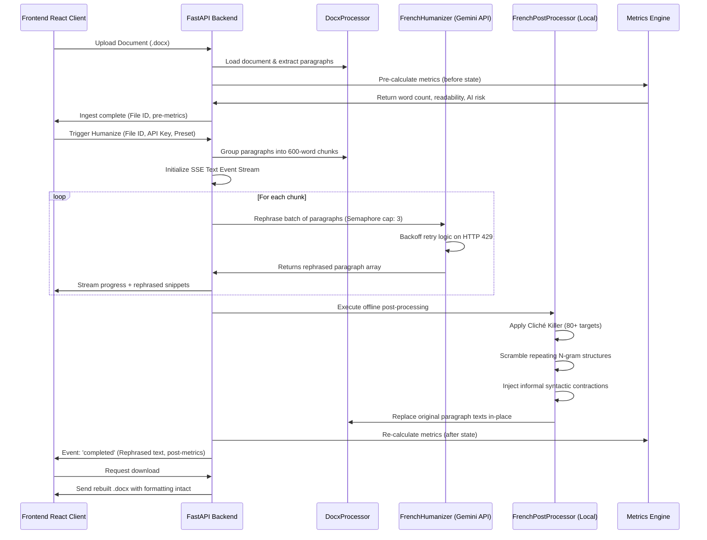

### Styling Preservation Mechanism
To maintain visual formatting when replacing text, `DocxProcessor.replace_paragraph_text` uses a proportional run-level replacement heuristic:
1. It records all individual "runs" (text elements carrying bold, italic, font, or color styling) inside a paragraph.
2. The replacement text is split into chunks of words.
3. Chunks are distributed into the existing runs, filling them up proportionally.
4. Any excess runs are cleared, while styles are preserved. This prevents formatting loss when replacing large text structures.

---

## 6️⃣ Limitations & Constraints
- **File Format Constraints**: Restricts uploads strictly to XML-based Microsoft Word documents (`.docx`). Text, PDF, and `.doc` files are not supported.
- **Language Boundaries**: Metrics (burstiness patterns, syllable counters) and post-processors (clichés, connectors lists) are calibrated specifically for the French language and will produce inaccurate scores on other languages.
- **Gemini API Limits**: Rapid processing can trigger Gemini API rate limit restrictions. The application uses a semaphore of size 3 to throttle API requests and includes exponential backoff retry algorithms to mitigate 429 errors.
- **Dynamic Formatting Loss**: Complex nested drawings, overlapping table structures, or heavily sectioned page breaks can occasionally experience minor shift adjustments due to the proportional run text mapping.
- **Temporary Upload Lifespan**: Rephrased documents are stored strictly in volatile server buffers and are permanently deleted after one hour.

================================================================================
### PROJECT: STRIKE-BOXING-CRM
File Path Source: C:\Users\Mi5a\.gemini\config\skills\strike-boxing-crm\SKILL.md
================================================================================

# Strike Boxing CRM

## 1️⃣ Purpose & Scope
Strike Boxing CRM is a customized gym management platform and Customer Relationship Management (CRM) tool developed specifically for the Strike Boxing Club. The system supports gym administrators, managers, and sales representatives in their daily operations.

### Core Features
- **Lead Tracking Pipeline**: Handles lead stages (`New`, `Contacted`, `Visited`, `Negotiating`, `Converted`, `Lost`), interest levels (1-5 stars), sales rep assignment, and activities/comments logging. A conversion wizard turns leads into active members.
- **Active Member Management**: Tracks active client statuses (`Active`, `Expired`, `Nearly Expired`), session balances, package types, and membership start/expiry dates.
- **Member ID Generation**: Auto-generates unique sequential Member IDs starting from `112` via a transactional Firestore counter, guaranteeing no duplicate IDs.
- **Private Sessions & Scheduling**: Integrated date-picker calendar to schedule private sessions. Deducts sessions from members' remaining balances upon attending or not showing up.
- **Payments & Billing**: Logs cash, credit card, bank transfer, and Instapay payments. Validates Instapay transaction references (must be 12 digits). Generates printer-friendly invoice receipts.
- **Role-Based Access Control (RBAC)**: Supports `super_admin`, `crm_admin`, `manager`, `admin`, and `rep` roles:
  - Admins and Managers have global read access. Admins can manage packages, invite users, and alter permissions.
  - Sales Representatives only see leads and clients assigned to them.
  - Role Previewer allows admins to simulate other roles instantly in the UI.
- **Smart Data Import & Rollback**: Imports clients or leads directly from local CSV files or Google Sheets URLs (published as CSV). Auto-maps columns using fuzzy matching and allows one-click batch rollbacks.
- **Audit Logs**: Automatically records administrative actions (creation, deletion, role changes, target modifications, imports/rollbacks) for accountability.

## 2️⃣ Technology Stack & Dependencies
- **Core Languages**: TypeScript, JavaScript, HTML, CSS.
- **Frameworks and Libraries**: React 19 (TypeScript), Vite (build tool), date-fns (date management), PapaParse (CSV parser), Recharts (graphs and charts), Lucide React (icons).
- **Styling**: Tailwind CSS with Shadcn UI components (Radix UI primitives).
- **Backend & Middleware**: Node.js Express server (`server.ts`) acting as a proxy and production host wrapping Vite's runtime middleware.
- **Database & Auth**: Firebase Firestore (real-time data synchronization, transactions, batched writes) and Firebase Authentication (Google Sign-In).
- **Security Rules**: Dedicated Firestore security rules (`firestore.rules`) enforcing document schemas, roles, and write constraints.

## 3️⃣ Project Structure & Key Files
The structure organizes component templates, layout containers, configurations, and core context functions:

### Key Directories
- `src/components/ui/`: Contains Shadcn primitives (Dialog, Button, Input, Table, etc.).
- `src/components/`: Reusable components (e.g. `AlertDialog`, `ConfirmDialog`).
- `src/lib/`: Firebase initialization and setup.

### Key Source Files Map
| File Path | Purpose / Description | Key Symbols (Classes, Functions, Constants) |
| --- | --- | --- |
| `server.ts` | Custom Express server that serves production assets and acts as a Vite dev server wrapper in local environments. | Express instance, Vite dev server middleware setup |
| `firestore.rules` | Security rules for Firebase Firestore. Restricts client, payment, task, package, and user read/write privileges based on authentications and roles. | `service cloud.firestore`, rules matches, custom check helpers |
| `src/types.ts` | Core TypeScript interfaces and type declarations for CRM models. | `Client`, `Payment`, `Package`, `Task`, `PrivateSession`, `UserRole`, `LeadStage`, `AuditLog`, `BrandingSettings` |
| `src/context.tsx` | App State Context; initializes Firestore connection, runs live subscriptions, handles auth, and manages CRUD transaction utilities. | `AppProvider`, `useAppContext`, `generateMemberId`, `addClient`, `bulkAddClients`, `updateClient`, `rollbackImport`, `cleanData` |
| `src/App.tsx` | Main application shell containing routing structure, layout shell, auth checks, and navigation. | `App`, `Header`, navigation tabs configuration |
| `src/Dashboard.tsx` | Displays statistics dashboard, revenue metrics, conversion funnels, and branch revenue breakdowns. | `Dashboard`, metrics calculations, charts components |
| `src/Clients.tsx` | Member listing page including searching, branch/status filtering, activity logging, and bulk operations. | `Clients`, `ClientRow`, Client Edit Drawer |
| `src/Leads.tsx` | Pipeline board and leads management list. Supports stage/rep batch re-assignments and conversion to active members. | `Leads`, bulk actions, `confirmConversion` dialog |
| `src/Payments.tsx` | Record client payments, reference available packages, validate Instapays, and render printable invoices. | `Payments`, `handleAddPayment`, `printInvoice` |
| `src/PrivateSessions.tsx` | Interactive session scheduler calendar. Logs session attendance and deducts package balances. | `PrivateSessions`, `handleUpdateStatus` |
| `src/ImportData.tsx` | Handles CSV uploading and fuzzy-alias matching for headers. Performs Firestore chunk write batches. | `ImportData`, fuzzy alias mappings, `Papa.parse`, `performImport` |
| `src/ImportHistory.tsx` | Lists batch import events with batch-wide rollback deletion. | `ImportHistory`, `handleRollback` |
| `src/Users.tsx` | Admin management panel to invite new emails and assign roles. | `Users`, role selectors, email invite triggers |
| `src/Packages.tsx` | Defines gym packages specifying prices, expiry durations, session allowances, and branch limits. | `Packages`, `handleAdd`, `handleEdit`, `confirmDelete` |
| `src/AuditLogs.tsx` | Displays live chronological logs of all database actions recorded under `auditLogs`. | `AuditLogs`, action filters, pagination |

## 4️⃣ Setup, Commands & Scripts
Follow these steps to initialize, configure, and execute the application:

### Installation
Install the project dependencies locally:
```bash
npm install
```

### Environmental Configuration
Ensure your Firebase project is set up and add the appropriate configuration object in `src/lib/firebase.ts`. Set up your environment variables if needed or copy the Firebase configuration keys directly into:
- `src/lib/firebase.ts`

### Running Locally
To launch the Vite development server locally:
```bash
npm run dev
```
Alternatively, to start the application with the custom Express server script:
```bash
npx ts-node server.ts
```

### Building for Production
To bundle assets for production hosting:
```bash
npm run build
```

## 5️⃣ Architecture & Key Workflows

### Data Flow Overview
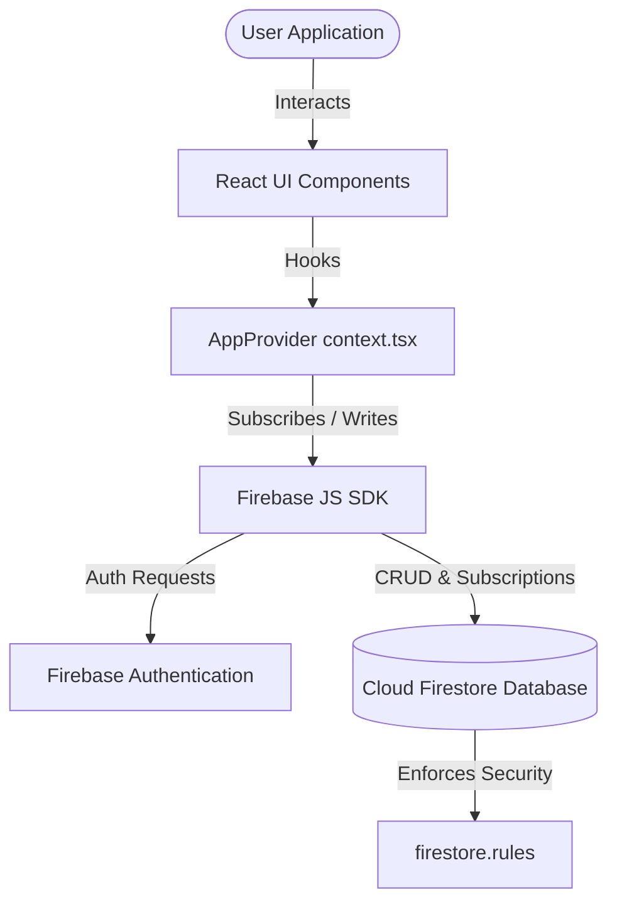

### Key Administrative Workflows
1. **Google Auth & Role Matching**:
   Upon authentication via Google Sign-In, the application matches the authenticated email with an existing document in the `users` collection to retrieve the assigned role. If no record is found, the user remains in a restricted unauthorized state.
2. **Sequential Member ID Transaction**:
   When client conversion occurs or a new Active client is registered, `generateMemberId()` is executed. It performs a transaction (`runTransaction`) on `counters/clients` to retrieve `lastId`, increment it, set the new counter value, and return the unique sequential ID.
3. **Data Import & Rollback Correlation**:
   CSV data is mapped automatically. Upon import, a new `importBatches` document is generated with a unique ID. All created clients are tagged with this `importBatchId`. If rollback is triggered, a database query retrieves all clients matching the batch ID and deletes them, then updates the batch status to `Rolled Back`.

## 6️⃣ Limitations & Constraints
- **Google Sheets CORS Restrictions**: When using the URL import feature, the Google Sheet MUST be published to the web as a CSV (`File > Share > Publish to web > CSV`) to bypass CORS blocks. Standard sharing links will fail to fetch.
- **Client-Side Filtering**: Client visibility filtering based on role assignment (e.g. Sales Reps only viewing assigned records) is computed in the React `useMemo` layer (`visibleClients`). Ensure your Firestore Security Rules (`firestore.rules`) match these access controls to prevent direct database queries from bypassing UI restrictions.
- **Instapay String Validation**: The Instapay reference validator accepts exactly 12 digits (`/^\d{12}$/`). If the reference length is changed by the payment network, this validation regex in `Payments.tsx` must be updated.

================================================================================
### PROJECT: STRIKE-BOXING-CRM2
File Path Source: C:\Users\Mi5a\.gemini\config\skills\strike-boxing-crm2\SKILL.md
================================================================================

# Strike Boxing CRM

## 1️⃣ Purpose & Scope
Strike Boxing CRM is a customized CRM and management system designed specifically for the operations of Strike Boxing Club. The application facilitates member relationship management, lead ingestion/tracking, staff/coach authorization, payment tracking, attendance check-ins, and task assignments across multiple branches. It provides a secure, role-based dashboard for managers, sales representatives, coaches, and clients.

### Core Features:
- **Lead Ingestion & Management:** Automated lead capture from external platforms (Meta Ads via Zapier/Make.com webhooks) and manual pipeline stage updates (New, Trial, Follow Up, Converted, Lost).
- **Payment & Upgrade Tracking:** Secure payment recording with support for discounts, payment methods (Cash, Credit, Instapay, Bank Transfer), and package upgrading. It features a transaction-level upgrade flow to transfer old payments and prevent package duplication.
- **Attendance & Public Kiosk:** Members can check in by scanning their member IDs or entering their phone numbers. The kiosk mode supports daily PIN validation and auto-decrements remaining sessions.
- **Role-Based Permissions:** Permissions are dynamically governed (e.g., global dashboard views, settings configuration, payment deletion, lead assignment) according to a role hierarchy (`crm_admin` > `super_admin` > `admin` > `manager` > `rep`).
- **Data Portability:** Supports smart column mapping for CSV imports, automated database backups to JSON, and full system restore functions.
- **Contracts Generation:** PDF contract templates are filled automatically using client details and payment information.
- **Multi-Tenant Sharing:** The Firebase database rules accommodate multiple projects simultaneously (Matchmaking, ATPL Vector, GAMÉN) by isolating data collections using paths and prefix matches.

## 2️⃣ Technology Stack & Dependencies
- **Core Languages:** TypeScript, HTML/CSS
- **Frameworks & Libraries:**
  - **React 19:** View layer and context state management.
  - **Vite 6:** Frontend builder and development server.
  - **Firebase SDK (v12):** Authentication, Firestore (NoSQL DB), Storage, and Cloud Functions.
  - **Express:** Core server router configuration.
  - **Tailwind CSS (v4):** Styling engine with CSS-first configuration.
  - **Lucide React:** Icon set.
  - **Recharts:** Analytics charts.
  - **PapaParse:** CSV parsing library for imports.
  - **PDF-Lib:** PDF generation and contract filling.
  - **Date-Fns:** Date operations and formatting.
- **Development & Packaging:**
  - **Esbuild:** Backend bundle compilation.
  - **Vite Plugin PWA:** Configured to support offline and Progressive Web App functionality.
- **Database/Storage:**
  - **Firebase Firestore:** Core database.
  - **Firebase Auth:** User directory.
  - **Firebase Storage:** Logo and avatar uploads.
  - **Local Offline Cache:** Configured in Firestore with multiple-tab persistent local cache managers.

## 3️⃣ Project Structure & Key Files
### Directory Summary:
- `/src`: Application source code (React UI, context, hooks, and services).
- `/public`: Static assets including contract PDF template.
- `/functions`: Firebase Cloud Functions backend.
- `/dist` / `/dist-server`: Build outputs for frontend and node server respectively.

### Key Source Files & Responsibilities:
| File Path | Purpose / Description | Key Symbols (Classes, Functions, Constants) |
| --- | --- | --- |
| `src/firebase.ts` | Firebase Client Initialization & secondary app instance helpers | `auth`, `db`, `storage`, `createFirebaseUser`, `getExistingUserUID` |
| `src/context.tsx` | Main application context, aggregating hooks & Kiosk logic | `AppProvider`, `useAppContext`, `selfCheckIn`, `wipeSystem` |
| `src/contexts/AuthContext.tsx` | Manages role hierarchy, user sessions, and permission checks | `AuthProvider`, `useAuth`, `effectiveRole`, `ADMIN_ROLES` |
| `src/contexts/SettingsContext.tsx` | Handles gym settings, branch registrations, and branding properties | `SettingsProvider`, `useSettings`, `branding`, `branches` |
| `src/types.ts` | Type definitions for clients, payments, audit logs, and configurations | `Client`, `Payment`, `User`, `UserRole`, `isSuperAdmin`, `isAdmin` |
| `src/services/transactionService.ts` | Database transactions for payments & package upgrades | `processPaymentTransaction`, `PaymentTransactionParams` |
| `src/services/clientService.ts` | Handles client modifications, member ID generators, and attendance updates | `addClient`, `generateMemberId`, `recordSessionAttendance` |
| `src/services/userService.ts` | Manages user accounts creation, invitation, and activation | `inviteUser`, `activatePendingUser`, `updateUser` |
| `src/utils/pdfGenerator.ts` | Modifies PDF form fields dynamically to compile contracts | `generateClientContract` |
| `src/ImportData.tsx` | UI for file mapping, column parsing, and smart bulk uploads | `ImportData`, `performImport` |
| `firestore.rules` | Security rules for Strike CRM, Matchmaking, ATPL, and GAMÉN databases | `isStrikeAdmin`, `canStrikeDeletePayments`, `isValidClient`, `isValidMatch` |
| `functions/src/index.ts` | Cloud Functions endpoints, webhooks, and firestore triggers | `forcePasswordReset`, `metaWebhook`, `onLeadCreated`, `onClientAssigned` |
| `functions/src/utils/mailer.ts` | Formulates templates and dispatches SMTP emails via Nodemailer | `sendEmail`, `sendNewLeadEmail`, `sendAssignmentEmail` |

## 4️⃣ Setup, Commands & Scripts
### Installation:
```bash
npm install
cd functions
npm install
```

### Running Locally:
```bash
# Start frontend dev server
npm run dev

# Start functions emulator (inside functions directory)
npm run serve
```

### Building:
```bash
# Compiles frontend assets and bundles server.ts with esbuild
npm run build
```

### Starting (Production Node Server):
```bash
npm start
```

### Linting:
```bash
npm run lint
```

### Environmental Configuration:
- **`firebase-applet-config.json`**: Located in the root directory. Required for client-side Firebase initialization.
  - Fields: `projectId`, `appId`, `apiKey`, `authDomain`, `storageBucket`, `messagingSenderId`, `measurementId`.
- **`.env`**: Located in the root directory (optional overrides).
  - Variables: `PORT`, `NODE_ENV`, and `VITE_FIREBASE_*` variables.
- **Firebase Functions Secrets**:
  - `SMTP_HOST`, `SMTP_PORT`, `SMTP_USER`, `SMTP_PASS`, `FROM_EMAIL`: Nodemailer email configuration.
  - `STRIKE_WEBHOOK_SECRET`: Secure webhook verification key for the meta webhook.

## 5️⃣ Architecture & Key Workflows
### High-Level Data Flow:
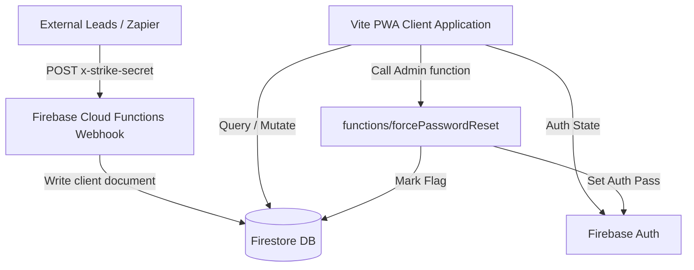

### Key Workflows:
1. **Lead Webhook Ingestion (`metaWebhook`):** Receives leads from Zapier/Make.com. Verifies token payload against `STRIKE_WEBHOOK_SECRET`. Creates a new document in the `clients` collection with `status: "Lead"`. This triggers `onLeadCreated` which notifies sales representatives via email.
2. **Member Package Upgrading (`processPaymentTransaction`):** Implemented using a Firestore Transaction to guarantee database read-write isolation. If a member upgrades their package, it:
   - Queries previous payment candidates under the older package name.
   - Updates old payment category/name and tracks them with a `wasTransferredDueToUpgrade` flag.
   - Marks the older package status to `Expired` and appends the new `Active` package.
   - Creates a transaction log / comment and updates client stats.
3. **Daily Kiosk Check-In (`selfCheckIn`):** Public-facing portal checks member credentials anonymously. Checks PIN against settings, locates member profile, verifies expiration date and session availability. Writes to the `attendance` collection and decrements the client's `sessionsRemaining` count.

## 6️⃣ Limitations & Constraints
- **Hardcoded Admins:** High-level admin checks are hardcoded to specific emails (`michaelmitry13@gmail.com`, `magd.gallab@gmail.com`, `admin@strike.eg`) both inside `firestore.rules` and `AuthContext.tsx` to handle authentication override and initial system setup.
- **Cross-Origin Imports:** Importing from Google Sheets via URL in the browser requires the sheet to be explicitly "Published to the web" as CSV, otherwise browser CORS policy will reject the request.
- **Anonymous Sign-In:** The check-in kiosk runs on an anonymous Firebase authentication session. The security rules are configured to permit anonymous reads/writes strictly on the `clients` (limited field verification) and `attendance` tables.
- **Project Co-existence:** Multiple distinct project collections (e.g. `match_*` for Matchmaking, `atpl_*` for ATPL Vector) share the same Firebase Firestore instance. Extra caution is required when modifying global configuration indices or rules to prevent breaking cross-app dependencies.
- **PWA Precache Limits:** PWA caching has been forced to 5MB (`maximumFileSizeToCacheInBytes: 5 * 1024 * 1024` in `vite.config.ts`) because client-side split vendor bundles easily exceed standard PWA sizes.

================================================================================
### PROJECT: SYNCWAVE
File Path Source: C:\Users\Mi5a\.gemini\config\skills\syncwave\SKILL.md
================================================================================

# SyncWave

## 1️⃣ Purpose & Scope
- **SyncWave** is a C++ Windows GUI application designed for simultaneous multi-device audio playback. It captures system audio (via loopback) or microphone inputs and streams it to up to two playback devices at the same time.
- **Core Features**:
  - **Multi-Device Playback**: Stream captured or loopback audio to multiple output devices (e.g., separate headphones or Bluetooth speakers).
  - **Real-Time Latency Alignment**: Adjust delay independently for each output channel (0–1000 ms) using thread-safe ring buffers to compensate for hardware or connection latency.
  - **Crossover & Audio Filtering**: Apply Low-Pass (Bass) or High-Pass (Tweeter) Butterworth filters to each output channel with an adjustable crossover frequency (50 Hz to 10 kHz).
  - **Audio Modifiers**: Independent controls for volume (0.0 to 1.0), mute status, and phase inversion.
  - **Speaker Sync Tools**:
    - *Acoustic Auto-Sync (Auto-Mic)*: Emits a 20 ms 1 kHz sine pulse through each speaker sequentially, captures it with a calibration mic, estimates the arrival peak differences, and suggests delay parameters.
    - *Phase Nulling*: Generates a 400 Hz tone played in-phase on one device and out-of-phase on the other. Perfect alignment is achieved manually by minimizing the volume (destructive interference).
    - *Metronome*: Plays click pulses every 500 ms to assist manual, ear-based sync calibration.

## 2️⃣ Technology Stack & Dependencies
- **Core Language**: C++ (uses C++20 standard properties)
- **Audio Engine**: [miniaudio](https://miniaud.io/) (header-only, low-level audio backend interface; utilizes WASAPI on Windows for loopback capture and rendering).
- **GUI Library**: [Dear ImGui](https://github.com/ocornut/imgui) (customized dark theme with rounded window frames, slider grabs, and buttons).
- **Graphics & Windows API**: DirectX 11 (D3D11) & Win32 API for rendering and window management.
- **Logging Library**: [spdlog](https://github.com/gabime/spdlog) (asynchronous logger configured with a stdout console sink).
- **Development Tools**: CMake (>= 3.12), MSVC (Visual Studio compiler tools), or MinGW compiler.

## 3️⃣ Project Structure & Key Files
### Key Source Files & Responsibilities
| File Path | Purpose / Description | Key Symbols (Classes, Functions, Constants) |
| --- | --- | --- |
| `src/main.cpp` | Main entry point; initializes engine/GUI and boots the message pump. | `wWinMain`, `main` |
| `include/AudioEngine.hpp` | Header declaring the `AudioEngine` controller, state types, and device configurations. | `AudioEngine`, `DeviceInfo`, `FilterMode`, `SyncToolMode`, `CalibrationState` |
| `src/AudioEngine.cpp` | Implements device enumeration, capture loopback, ring buffers, Butterworth filters, and sync tool generators. | `AudioEngine::init`, `AudioEngine::start`, `AudioEngine::stop`, `AudioEngine::captureCallback`, `AudioEngine::processPlayback` |
| `include/gui.hpp` | Declares UI parameters, state cache, layout callbacks, and widget configurations. | `GUI` |
| `src/gui.cpp` | Configures the Win32 window, DirectX 11 render target, and builds the ImGui dashboard interface. | `GUI::init`, `GUI::renderLoop`, `GUI::drawUI`, `WndProc`, `CreateDeviceD3D` |
| `include/cleanup.hpp` | RAII helper utilities to safely release miniaudio contexts, devices, and pointers on scope exit. | `UninitDeviceOnExit`, `UninitContextOnExit`, `FreePointerOnExit`, `DeletePointerOnExit` |
| `include/logger.hpp` | Logger interface configuring asynchronous thread pools and stdout pattern formats using `spdlog`. | `Logger`, `trace`, `debug`, `info`, `warn`, `err`, `crit` |
| `include/constants.hpp` | Constants defining command statuses and terminal colors. | `ALL_OK`, `NOK`, `END`, `GREEN` |
| `include/callbacks.hpp` | Function declarations for legacy non-engine audio streaming. | `playback`, `loopback` |
| `CMakeLists.txt` | Coordinates compilers, flags static runtime configuration (`/MT`), and links Windows graphics SDK libraries. | - |

## 4️⃣ Setup, Commands & Scripts
- **Build Requirements**:
  - Windows Operating System
  - CMake (version 3.12 or newer)
  - Visual Studio (MSVC) with C++ Desktop Development workloads, or a MinGW build environment.

- **Compiling SyncWave**:
  ```powershell
  # Create a build directory
  mkdir build
  cd build

  # Generate build files and build debug targets
  cmake ..
  cmake --build .

  # Build optimized release targets (highly recommended for audio DSP stability)
  cmake --build . --config Release
  ```

- **Running locally**:
  ```powershell
  # Execute the compiled GUI binary
  .\build\Release\SyncWave.exe
  ```

- **Environmental Configuration**:
  - No `.env` or external config files are required. All hardware configurations, volume indices, and delays are configured live via the ImGui dashboard window.

## 5️⃣ Architecture & Key Workflows
### System Architecture Diagram
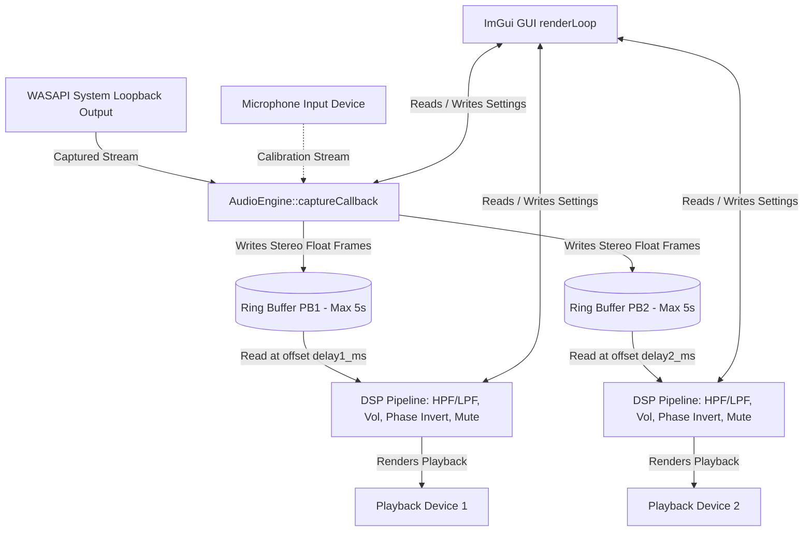

### Key Workflows
1. **Loopback & Playback Routing**:
   - The user selects a loopback device (representing Windows desktop audio).
   - `AudioEngine` boots a WASAPI capture stream on that device.
   - For every block of input audio, `captureCallback` processes the samples and writes them to two concurrent ring buffers (`m_pb1Ctx.delayBuffer` and `m_pb2Ctx.delayBuffer`).
   - The playback devices pull samples from their respective circular buffers based on the configured delay offset (shifting the read pointers backward relative to the write pointer).
2. **Audio Calibration (Auto-Mic)**:
   - When the user starts "Auto-Measure" with a selected calibration microphone, `AudioEngine` restarts with the microphone as the capture device.
   - A short 1 kHz pulse is sent through speaker 1. The engine calculates the microphone input root-mean-square (RMS) energy to identify the peak response frame.
   - Following a brief cool-down phase, speaker 2 plays the same pulse, and its arrival frame peak is logged.
   - The delta duration is evaluated (`delta_ms = (peak2 - peak1) / SAMPLE_RATE * 1000`). The faster device is configured with a latency equal to this difference.

## 6️⃣ Limitations & Constraints
- **Windows Only**: Relies directly on Win32 window callbacks, DirectX 11 graphics pipelines, and WASAPI capture loopback hooks.
- **Audio Feedback Loop Prevention**: To avoid infinite feedback loops and audio doubling, if a playback device is selected as the loopback source and also specified as an output, the loopback path is muted internally.
- **Format Constraints**: SyncWave operates strictly with stereo (`2` channels) float32 audio at `48000 Hz`. miniaudio manages resampling for devices using other formats, though extreme mismatches might impact quality.
- **Buffer Limits**: The maximum buffer length is capped at 5 seconds, limiting the maximum adjustable delay.

================================================================================
### PROJECT: UPDATE MAGDY CV
File Path Source: C:\Users\Mi5a\.gemini\config\skills\update-magdy-cv\SKILL.md
================================================================================

# Update Magdy CV Portfolio

## 1️⃣ Purpose & Scope
- **Overview**: An interactive, dynamic web-based CV and portfolio dashboard designed for Magdy S. Mitry, an accomplished Architectural Engineer, General Manager, and Design Director with over 40 years of experience in the GCC and Egypt.
- **Problem Solved**: Instead of maintaining separate static resumes for different roles, this portfolio bundles 10 distinct job-specific profiles/personas into a single unified web experience. Recruiters and clients can switch between different professional versions of the CV dynamically.
- **Key Features**:
  - **Persona-Based Layout**: 10 tailored CV versions (Executive & GM, Design Director, Mega-Projects, Technical & Contracts, Government Specialist, Hospitality & Commercial, Client Representative, ATS-Optimized, Senior Advisor, and Chronological Master).
  - **Dynamic Filtering & Search**: In-page live search and category chips to filter the selected projects list dynamically (e.g. Government, Hospitality, Residential, etc.).
  - **Light/Dark Mode Toggle**: Persistent theme choice using local storage.
  - **Print & PDF Optimization**: Clean CSS print overrides (`@media print`) that format the page as a clean, dual-column paper resume when printed or saved as a PDF.
  - **Embedded Video Link**: Clickable link to a televised segment showcasing his architectural work.

## 2️⃣ Technology Stack & Dependencies
- **Core Languages**: HTML5, CSS3, Vanilla JavaScript (ES6+).
- **Libraries & Icons**: FontAwesome icons (v6.4.0) loaded via CDN.
- **Fonts**: Google Fonts (`Outfit` for sans-serif UI, `Playfair Display` for serif headings).
- **Development Tools**: None (pure static frontend, requires no build engines).
- **Data & Storage**: Static client-side JavaScript database (`cv_data.js`) and browser `localStorage` for theme caching.

## 3️⃣ Project Structure & Key Files
The project structure consists of the primary page assets and a database folder of raw profile structures:
```text
update magdy cv/
├── cv_data/                      # Folder containing raw JSON data files for each CV persona
│   ├── ats_optimized.json        # ATS-Optimized Clean Text CV
│   ├── chronological_master.json # Chronological Master CV
│   ├── client_representative.json# Client / Owner Representative CV
│   ├── design_director.json      # Design Director & Lead Architect CV
│   ├── executive_gm.json         # Executive Director & General Manager CV
│   ├── government_specialist.json# Federal & Municipal Projects CV
│   ├── hospitality_commercial.json# Hotels, Retail & Commercial CV
│   ├── mega_projects.json        # Mega-Projects Director CV
│   ├── senior_advisor.json       # Senior Consultant CV
│   └── technical_contracts.json  # Compliance & FIDIC Specialist CV
├── Magdy CV 2024.pdf             # Static PDF version of the 2024 CV
├── Magdy Mitry CV 2026.pdf       # Static PDF version of the 2026 CV
├── app.js                        # Main application logic for rendering and UI state
├── cv_data.js                    # Compiled master JavaScript data containing all CV personas
├── index.html                    # Main HTML entry point
└── styles.css                    # Custom CSS stylesheet with dark/light themes and print layouts
```

| File Path | Purpose / Description | Key Symbols (Classes, Functions, Constants) |
| --- | --- | --- |
| `index.html` | Page layout structure, navigation sidebar, dynamic section wrappers. | HTML5 semantic tags, FontAwesome CDN |
| `styles.css` | Custom theme HSL variables, responsive layout design, and CSS printing overrides. | `:root`, `[data-theme="dark"]`, `@media print` |
| `app.js` | Main client-side script managing UI interactivity, theme selection, persona-based rendering, search, and category filtering. | `cvData` validation, `updateThemeIcon()`, `renderCV()`, `filterAndRenderProjects()` |
| `cv_data.js` | Merged JavaScript representation of the ten CV personas, acting as the local client-side database. | `cvData` object constant |
| `cv_data/*.json` | Individual JSON files defining each of the ten persona versions of the CV for data isolation. | `persona`, `title`, `profile_summary`, `core_competencies`, `experience`, `key_projects`, `education`, `memberships`, `languages` |
| `Magdy Mitry CV 2026.pdf` | Static compiled PDF document of the CV for the year 2026. | Static document |

## 4️⃣ Setup, Commands & Scripts
- **Installation**:
  - The project is a static site with no third-party package dependencies. No installation commands (e.g. `npm install`) are necessary.
- **Running Locally**:
  - You can open the site directly by double-clicking `index.html` in your file explorer.
  - Alternatively, serve it with any simple HTTP server:
    - **Python**: `python -m http.server 8000` (Access at `http://localhost:8000`)
    - **NodeJS**: `npx serve .` (Access at `http://localhost:3000`)
- **Testing**:
  - Testing is performed manually by opening the browser and validating that CV switching, project filtering, text searches, and dark/light modes behave as expected.
- **Environmental Configuration**:
  - No environment files (`.env`) or variables are used. User theme configuration is stored in client `localStorage`.

## 5️⃣ Architecture & Key Workflows
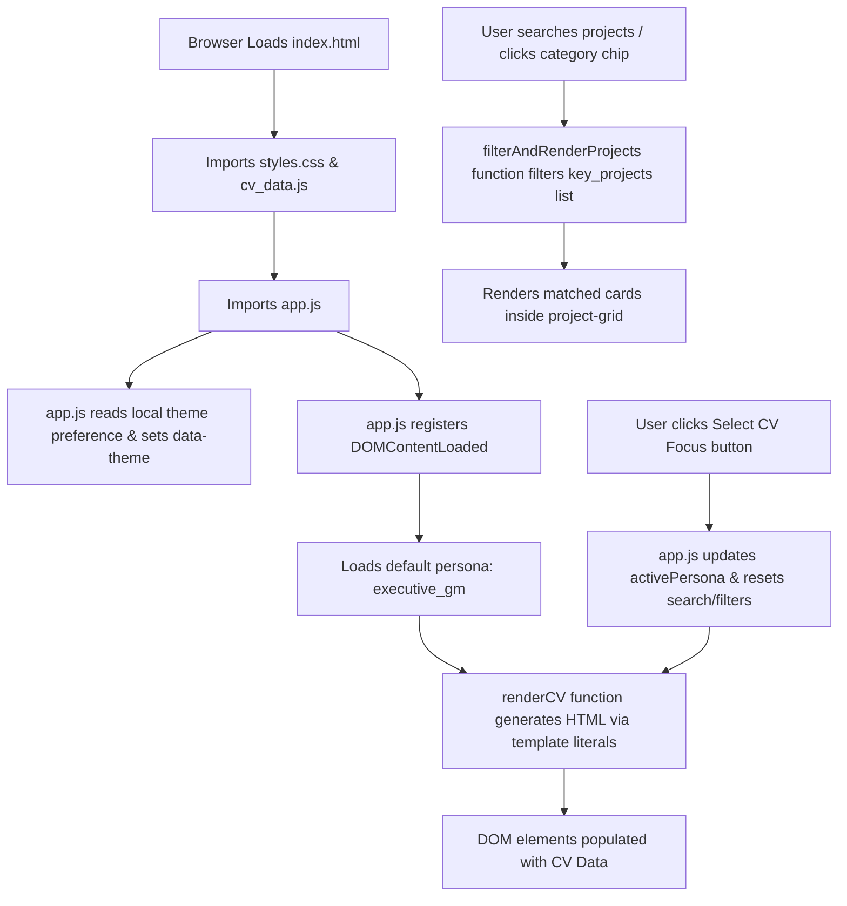

### Key Workflows:
- **Rendering Dynamic Content**: `app.js` extracts profile summaries, experience items, key projects, and credentials from `cvData[activePersona]`. It generates HTML lists and structural blocks dynamically using Javascript template literals and injects them into elements.
- **Searching and Categorization**: Projects are dynamically filtered via `filterAndRenderProjects()` which validates both `searchQuery` and `activeCategory` filters.
- **Print Execution**: Clicking "Print CV / PDF" invokes `window.print()`. The page hides non-essential elements (such as the sidebar, video cards, and action buttons) using `@media print` directives in `styles.css`, shifting the dual-column layout to fill the printable page and adjusting margins and colors for standard paper output.

## 6️⃣ Limitations & Constraints
- **Lack of Compilation Build Pipeline**: The raw data in the `cv_data/*.json` files are isolated from the application's runtime code. The portfolio dashboard renders data strictly from `cv_data.js`. If updates are made to the `.json` files, the developer must manually keep `cv_data.js` synchronized, as no build/merge pipeline script currently exists.
- **No Backend Persistence**: Theme preferences are browser-specific (`localStorage`). There is no login, database storage, or server analytics.
- **Online CDN Dependencies**: FontAwesome and Google Fonts are linked to external CDNs. The website requires an internet connection to display fonts and icons correctly, though the raw CV data and page structure will render offline.

================================================================================
### PROJECT: WORKOUT MITRIXO
File Path Source: C:\Users\Mi5a\.gemini\config\skills\workout-mitrixo\SKILL.md
================================================================================

# MITRIXO Workout (Health & Fitness Coach MCP)

## 1️⃣ Purpose & Scope
- **Overview**: MITRIXO Workout is a comprehensive AI-powered fitness tracking ecosystem that integrates a visual Next.js frontend with an intelligent Model Context Protocol (MCP) server. It bridges the gap between traditional manual tracking apps and conversational AI assistants (such as Cursor or Claude Desktop) by enabling seamless, bi-directional sharing of fitness history, metrics, and coaching targets.
- **Core Features**:
  - **Conversational AI Coach**: Real-time natural language interaction with an OpenAI-backed virtual coach to log activities, query progress, and seek guidance.
  - **MCP Integration**: Standardized Server-Sent Events (SSE) and HTTP endpoints exposing 7 protocol-compliant tools for external AI clients to read/write fitness records.
  - **Dynamic Activity & Nutrition Logging**: Visual interfaces to track workout sessions (cardio vs. strength), detailed nutrition macronutrients, subjective feedback, and daily steps.
  - **Offline Synchronization Engine**: Resilient client-side caching that queues user activities during network drops and automatically flushes logs on reconnection.
  - **Readiness-Based Scaling**: A startup questionnaire calculating readiness scores to scale workout volume and weights dynamically.
  - **PDF Handout Exporter**: A Python-based document generator compiling customized training regimens into multi-page PDFs.

## 2️⃣ Technology Stack & Dependencies
- **Core Languages**: TypeScript, Python, HTML/JS, Shell Scripting.
- **Frontend & App Framework**: Next.js 15 (App Router), React 19, Tailwind CSS.
- **State Management & Server Stores**: In-memory file-backed stores (`.tmp/*.json`) and singleton instances on the server; client-side caching in `localStorage`.
- **Database (Conceptual)**: PostgreSQL schema (documented in `database-schema.sql`) supporting multi-user configurations, exercise libraries, template splits, and progressive overload logs.
- **AI Stack & Protocols**: `@modelcontextprotocol/sdk` (Model Context Protocol), OpenAI Node SDK (`gpt-4o-mini`).
- **Dependencies & Tools**: `@clerk/nextjs` (Authentication), `@upstash/redis` (Redis/Upstash caching for SSE transport layer scaling), `@radix-ui` primitives, FPDF (Python library for PDF report generation).

## 3️⃣ Project Structure & Key Files
### Summary of Folder Hierarchy
- `app/`: Next.js pages, layout templates, and API endpoints (chat, log tracking, context viewing, plan generator, MCP server routes).
- `components/`: UI modules, including trackers (workouts/meals), sidebar navigation, readiness checks, settings panels, and chat layout.
- `lib/`: Library abstractions for mock authentication, API routing fetch utilities, Redis configuration, and file stores.
- `tools/`: MCP tool implementations (`log-workout`, `log-nutrition`, `log-feedback`, `generate-plan`, `view-context`, `set-weekly-target`, `echo`).
- `utils/`: Core utilities for singleton memory mapping and OpenAI LLM completions.
- `scripts/`: Verification scripts for HTTP streaming, stdio remote debugger, and deeplinks.

### Key File Mapping
| File Path | Purpose / Description | Key Symbols (Classes, Functions, Constants) |
| --- | --- | --- |
| `app/page.tsx` | Main Fitness Dashboard orchestrator containing layout tabs and hooks integration. | `FitnessApp` |
| `app/mcp/route.ts` | MCP server entry route setting up Vercel MCP handler and registering tools. | `handler` |
| `app/api/chat/route.ts` | Process user prompts, detects specific intent patterns, and maps responses via MCP or fallback. | `POST`, `detectUserIntent`, `handleActivityLogging` |
| `app/api/context/route.ts` | Combined context fetcher that blends local storage progress metrics with backend MCP data. | `GET`, `transformMcpContextToFrontend` |
| `app/api/log/route.ts` | Input validator routing logged metrics both locally and to corresponding MCP handlers. | `POST`, `storeDataLocally` |
| `hooks/useFitnessData.ts` | Client sync engine handling offline queueing, cache backups, and auto-sync triggers. | `useFitnessData`, `flushOfflineQueue` |
| `utils/memoryStore.ts` | Map-based user cache interface used as the primary data persistence layer for the MCP server. | `MemoryStore`, `memoryStore` |
| `utils/llmClient.ts` | Integrates OpenAI SDK to construct detailed prompts and generate plans with standard fallbacks. | `generatePlan`, `openai` |
| `lib/stores.ts` | Server-side backup store maintaining workout and meal states in the `.tmp/` sandbox. | `workoutStore`, `nutritionStore`, `mirnaPlan` |
| `lib/auth.tsx` | Auto-detection fallback wrapper mock for Clerk auth to prevent startup crashes when keys are missing. | `ClerkProvider`, `useUser`, `Show` |
| `generate_pdf.py` | Standalone Python script utilizing FPDF to output a formatted workout handout. | `WorkoutPDF`, `create_workout_pdf` |

## 4️⃣ Setup, Commands & Scripts
### Installation
1. Install project dependencies:
   ```bash
   npm install
   # or
   pnpm install
   ```
2. Set up Python environment for PDF generation:
   ```bash
   pip install fpdf
   ```

### Running Locally
- Run the Next.js development server:
  ```bash
  npm run dev
  # or
  pnpm dev
  ```
  The web app loads at `http://localhost:3000` and the MCP server exposes endpoints at `http://localhost:3000/mcp` or `http://localhost:3000/sse`.

### PDF Handout Generation
- Run the PDF script:
  ```bash
  python generate_pdf.py
  ```
  Generates `mirna_workout_plan.pdf` in the root workspace folder.

### Testing & Verification
- Test standard MCP fitness tools:
  ```bash
  npm run test:fitness
  ```
- Test SSE transport connectivity:
  ```bash
  npm run test:sse
  ```
- Test HTTP streamable connection:
  ```bash
  npm run test:http
  ```

### Environmental Configuration
Configure a `.env.local` file with the following variables:
- `OPENAI_API_KEY`: API token for GPT-4o-mini plan generation.
- `NEXT_PUBLIC_CLERK_PUBLISHABLE_KEY`: Clerk publisher key (omitting activates Mock Auth).
- `UPSTASH_REDIS_REST_URL`: Upstash URL (optional, enables production SSE).
- `UPSTASH_REDIS_REST_TOKEN`: Upstash security token (optional).
- `REDIS_URL`: Local redis client string (optional fallback).
- `DEFAULT_USER_ID`: Override identifier (default: `default-user`).

## 5️⃣ Architecture & Key Workflows
### High-Level Data Flow
```
[ User Chat Prompt ] ──> [ /api/chat (Intent Match) ]
                                 │
                   ┌─────────────┴─────────────┐
                   ▼                           ▼
          [ Local Store Cache ]       [ MCP Server /mcp POST ]
                   │                           │
                   │                           ▼
                   │                  [ utils/memoryStore ]
                   │                           │
                   └─────────────┬─────────────┘
                                 ▼
                     [ Combined Context Response ]
```

### Key Workflows
1. **Offline Queueing & Sync**:
   - When a user logs an activity (workout/meal/steps) and `navigator.onLine` is false, `useFitnessData.ts` serializes the payload, generates a temporary `mock-id`, and stashes it in the `fwp-offline-queue` localStorage key.
   - The UI optimistically increases today's totals using the offline state.
   - Once a window `online` event fires, the sync engine sequentializes POST calls to `/api/log` to upload the queued logs and refreshes the unified true state.
2. **Readiness Adjustments**:
   - The startup readiness checklist scores user stats. If indicators suggest fatigue, the UI applies a `shouldScale` flag that scales down target exercises, reps, or estimated durations dynamically to prevent training overload.

## 6️⃣ Limitations & Constraints
- **Ephemeral Sandbox Environment**: The local server storage is configured to always clear previous JSON log files (`workouts.json`, `nutrition.json`, etc.) in `.tmp/` on startup. Data is not preserved permanently across server restarts.
- **Mock Auth Vulnerabilities**: Bypassing Clerk using mock logic defaults user IDs to `default-user`. While highly useful for development, admin pages (`/admin` and `/api/debug`) will expose raw parameters if run in production without valid keys.
- **OpenAI Key Dependency**: Weekly plan generation completely relies on OpenAI completion endpoints. If keys are missing, the client falls back to static hardcoded recommendations.

================================================================================
## 5. GITHUB REPOSITORIES INDEX
================================================================================
Repo: alpha-calesthenics-new-website
URL: https://github.com/michaelmagdy15/alpha-calesthenics-new-website
Language: TypeScript | Stars: 0
Description: No description provided.
----------------------------------------
Repo: ArchLand
URL: https://github.com/michaelmagdy15/ArchLand
Language: HTML | Stars: 0
Description: Prototype
----------------------------------------
Repo: Astronomy-Club-Website
URL: https://github.com/michaelmagdy15/Astronomy-Club-Website
Language: N/A | Stars: 0
Description: This is  the source code of my current project
----------------------------------------
Repo: ATPL-STUDY-GUIDE
URL: https://github.com/michaelmagdy15/ATPL-STUDY-GUIDE
Language: HTML | Stars: 0
Description: QB vs Actual 
----------------------------------------
Repo: atplvector
URL: https://github.com/michaelmagdy15/atplvector
Language: TypeScript | Stars: 0
Description: No description provided.
----------------------------------------
Repo: Autodesk-windows-fixer
URL: https://github.com/michaelmagdy15/Autodesk-windows-fixer
Language: PowerShell | Stars: 0
Description: No description provided.
----------------------------------------
Repo: bootstrap
URL: https://github.com/michaelmagdy15/bootstrap
Language: N/A | Stars: 0
Description: My Boostrap Journey!
----------------------------------------
Repo: ChordMiniApp (Forked)
URL: https://github.com/michaelmagdy15/ChordMiniApp
Language: TypeScript | Stars: 0
Description: Music Analysis, Chord Recognition, Beat Tracking, Guitar Diagrams, Piano Visualizer, Lyrics Transcription Application, context-aware LLM inference for analysis from uploaded audio and YouTube video
----------------------------------------
Repo: core-juno
URL: https://github.com/michaelmagdy15/core-juno
Language: TypeScript | Stars: 0
Description: No description provided.
----------------------------------------
Repo: cyprus-aeromedical-easa-certificate-generator
URL: https://github.com/michaelmagdy15/cyprus-aeromedical-easa-certificate-generator
Language: TypeScript | Stars: 0
Description: No description provided.
----------------------------------------
Repo: DarAlKhalij
URL: https://github.com/michaelmagdy15/DarAlKhalij
Language: CSS | Stars: 0
Description: Dec.net
----------------------------------------
Repo: DEC-2026-WEBSITE
URL: https://github.com/michaelmagdy15/DEC-2026-WEBSITE
Language: TypeScript | Stars: 0
Description: No description provided.
----------------------------------------
Repo: DEC-MILESTONE-TRACKER
URL: https://github.com/michaelmagdy15/DEC-MILESTONE-TRACKER
Language: TypeScript | Stars: 0
Description: No description provided.
----------------------------------------
Repo: Dento-Digital-NAVLOG
URL: https://github.com/michaelmagdy15/Dento-Digital-NAVLOG
Language: HTML | Stars: 0
Description: hey im trying to make my navlogs look neat and precise so i made this small app
----------------------------------------
Repo: System Logs-analysis
URL: https://github.com/michaelmagdy15/System Logs-analysis
Language: HTML | Stars: 0
Description: No description provided.
----------------------------------------
Repo: EGYGRAFX
URL: https://github.com/michaelmagdy15/EGYGRAFX
Language: HTML | Stars: 0
Description: No description provided.
----------------------------------------
Repo: EgyptParkingLocator
URL: https://github.com/michaelmagdy15/EgyptParkingLocator
Language: TypeScript | Stars: 0
Description: test
----------------------------------------
Repo: FAA-TEST-GUIDE-QUESTION-BANK
URL: https://github.com/michaelmagdy15/FAA-TEST-GUIDE-QUESTION-BANK
Language: TypeScript | Stars: 0
Description: No description provided.
----------------------------------------
Repo: FreeWorkoutPlanner
URL: https://github.com/michaelmagdy15/FreeWorkoutPlanner
Language: TypeScript | Stars: 0
Description: No description provided.
----------------------------------------
Repo: GamenEG-Brand
URL: https://github.com/michaelmagdy15/GamenEG-Brand
Language: TypeScript | Stars: 0
Description: No description provided.
----------------------------------------
Repo: Inzan-Atheltics-2.0
URL: https://github.com/michaelmagdy15/Inzan-Atheltics-2.0
Language: TypeScript | Stars: 0
Description: No description provided.
----------------------------------------
Repo: inzan-athletics-platform
URL: https://github.com/michaelmagdy15/inzan-athletics-platform
Language: TypeScript | Stars: 0
Description: No description provided.
----------------------------------------
Repo: inzanlockerbootstrap
URL: https://github.com/michaelmagdy15/inzanlockerbootstrap
Language: HTML | Stars: 0
Description: IoT Locker Middleware connecting client PWAs on cellular data to local gym MQTT brokers via Cloud Run and Cloudflare secure TCP tunnels.
----------------------------------------
Repo: jointeamhuman
URL: https://github.com/michaelmagdy15/jointeamhuman
Language: CSS | Stars: 0
Description: No description provided.
----------------------------------------
Repo: JTH
URL: https://github.com/michaelmagdy15/JTH
Language: JavaScript | Stars: 0
Description: No description provided.
----------------------------------------
Repo: Kaabapass.com
URL: https://github.com/michaelmagdy15/Kaabapass.com
Language: TypeScript | Stars: 0
Description: kaabapass.com  prototype web app   this app will help muslims to book flights from usa to mecca 
----------------------------------------
Repo: MatchMakingCRM
URL: https://github.com/michaelmagdy15/MatchMakingCRM
Language: TypeScript | Stars: 0
Description: MatchMakingCRM
----------------------------------------
Repo: MD
URL: https://github.com/michaelmagdy15/MD
Language: TypeScript | Stars: 0
Description: Secret
----------------------------------------
Repo: Mi5aWebsite
URL: https://github.com/michaelmagdy15/Mi5aWebsite
Language: JavaScript | Stars: 0
Description: website
----------------------------------------
Repo: Mi5aWebsite-gh-pages
URL: https://github.com/michaelmagdy15/Mi5aWebsite-gh-pages
Language: N/A | Stars: 0
Description: No description provided.
----------------------------------------
Repo: Mi5aWebsite2027
URL: https://github.com/michaelmagdy15/Mi5aWebsite2027
Language: JavaScript | Stars: 0
Description: No description provided.
----------------------------------------
Repo: Mitrixo
URL: https://github.com/michaelmagdy15/Mitrixo
Language: TypeScript | Stars: 0
Description: Mitrixo
----------------------------------------
Repo: mitryQuotation
URL: https://github.com/michaelmagdy15/mitryQuotation
Language: HTML | Stars: 0
Description: mitryQuotation
----------------------------------------
Repo: payment-link
URL: https://github.com/michaelmagdy15/payment-link
Language: TypeScript | Stars: 0
Description: No description provided.
----------------------------------------
Repo: PPL-TRAINER
URL: https://github.com/michaelmagdy15/PPL-TRAINER
Language: TypeScript | Stars: 0
Description: Trainer
----------------------------------------
Repo: proxy-list (Forked)
URL: https://github.com/michaelmagdy15/proxy-list
Language: N/A | Stars: 0
Description: A list of free, public, forward proxy servers. UPDATED DAILY!
----------------------------------------
Repo: SaadMitry.com
URL: https://github.com/michaelmagdy15/SaadMitry.com
Language: HTML | Stars: 0
Description: No description provided.
----------------------------------------
Repo: saveyourdocument
URL: https://github.com/michaelmagdy15/saveyourdocument
Language: Python | Stars: 0
Description: saveyourdocument
----------------------------------------
Repo: strike-boxing-crm2
URL: https://github.com/michaelmagdy15/strike-boxing-crm2
Language: TypeScript | Stars: 0
Description: No description provided.
----------------------------------------
Repo: strike-quote-generator
URL: https://github.com/michaelmagdy15/strike-quote-generator
Language: HTML | Stars: 0
Description: No description provided.
----------------------------------------
Repo: supreme-palm-tree
URL: https://github.com/michaelmagdy15/supreme-palm-tree
Language: TypeScript | Stars: 0
Description: supreme-palm-tree
----------------------------------------
Repo: SyncWave (Forked)
URL: https://github.com/michaelmagdy15/SyncWave
Language: C++ | Stars: 0
Description: A command line utility for simultaneous audio playback through multiple devices on windows
----------------------------------------
Repo: Theory
URL: https://github.com/michaelmagdy15/Theory
Language: HTML | Stars: 0
Description: No description provided.
----------------------------------------
Repo: travelly
URL: https://github.com/michaelmagdy15/travelly
Language: N/A | Stars: 0
Description: Project 1 Of Web Development
----------------------------------------
Repo: VBTCAMP2026
URL: https://github.com/michaelmagdy15/VBTCAMP2026
Language: HTML | Stars: 0
Description: VBTCAMP2026
----------------------------------------

================================================================================
## 6. INSTAGRAM LAUNCH MARKETING ASSETS
================================================================================

### Launch Copy (Copy-Paste)
```text
The Next Evolution of Digital Systems is officially HERE. 

🚀 Welcome to MITRIXO. 

We engineer high-fidelity software, proprietary SaaS products, and custom digital infrastructure that bridges hardware, low-latency code, and AI.

💡 What we deliver:
• Custom Enterprise CRMs & Portals
• IoT-Enabled Hardware Systems
• Immersive 3D Visual Storefronts (via Mitry Visuals)
• Context-Aware AI-Native Utilities

Ready to scale your digital capacity? 
👇 Get on the queue:
mitrixo.com
```

### Elevator Pitch for DMs & Inquiries
> "At MITRIXO, we build software that doesn't compromise on speed or aesthetics. Whether you need an IoT hardware controller system, an advanced AI pipeline, or a premium client portal, we build custom solutions tailored for enterprise reliability. Let's build your next digital asset."
